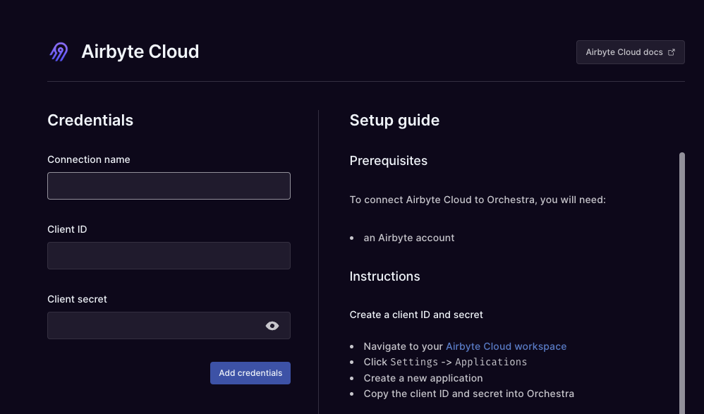
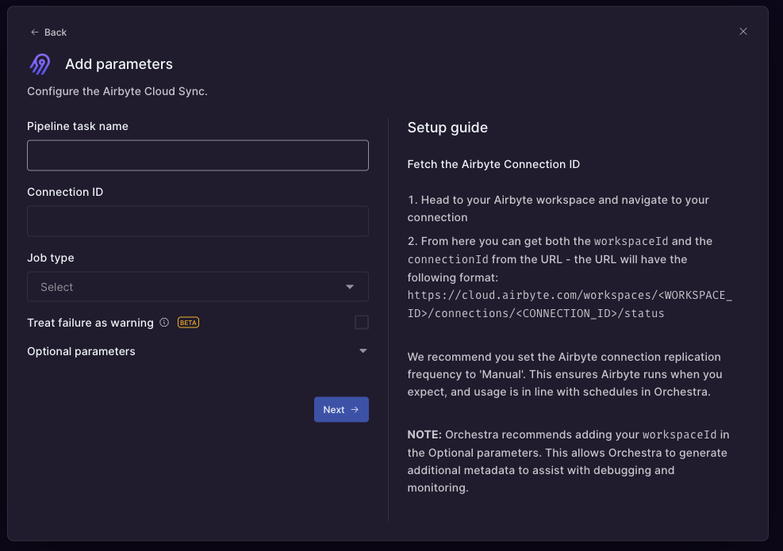
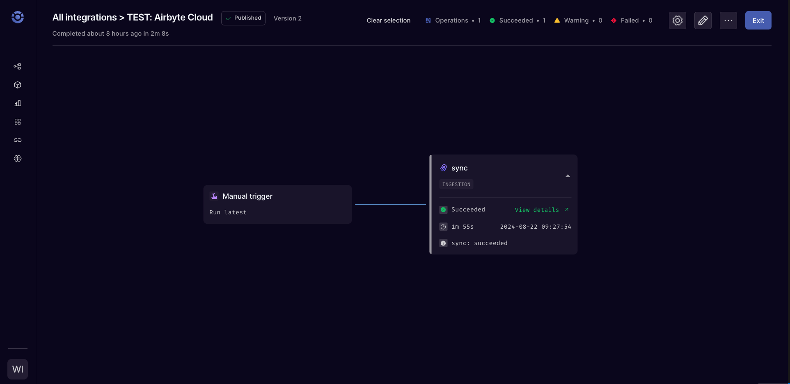

# Using an Orchestra Task

[Orchestra](https://getorchestra.io) supports both Airbyte Cloud and Airbyte server instances. This guide will show you how to trigger Airbyte jobs with Orchestra in seconds.

## 1. Connect to Airbyte

Navigate to [Orchestra](https://app.getorchestra.io/integrations) and create a new integration credential. Select Airbyte Cloud or Airbyte Server, depending on your setup. You will need to create a Client ID and Client Secret to authenticate with Airbyte. Instructions for this can be found [here](/using-airbyte/configuring-api-access).

## 2. Create an Orchestra Task

Create an Orchestra pipeline containing an Airbyte task. You can trigger both 'Sync' and 'Reset' jobs with the Airbyte task. The task requires the following parameters:

- **Connection ID**: The ID of the connection you want to trigger.
- **Job Type**: The type of job you want to trigger. This can be either 'Sync' or 'Reset'.

## 3. Run the Pipeline

You can manually run your pipeline from the Orchestra UI. Alternatively, you can trigger the pipeline on a cron schedule or via an API call. Once the job is triggered, you can monitor the status of the job in the Orchestra UI.

## Next Steps

You can now trigger Airbyte jobs using Orchestra. For more information on using Orchestra, check out the [Orchestra documentation](https://orchestra-1.gitbook.io/orchestra-portal/integrations/ingestion-elt/airbyte-cloud).
