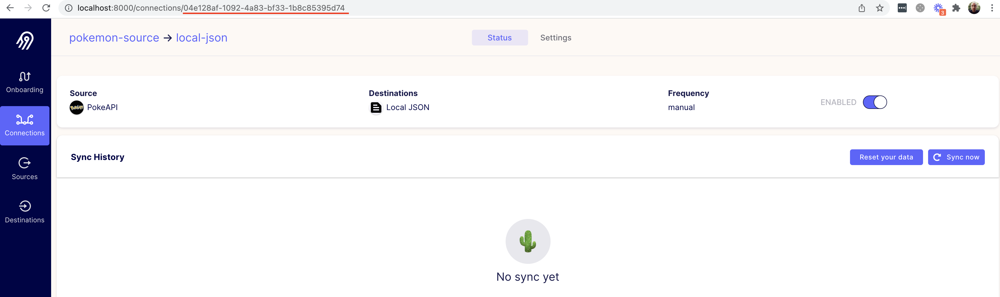
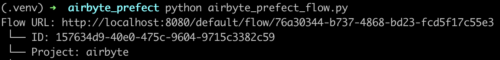
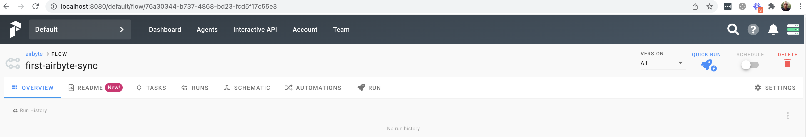
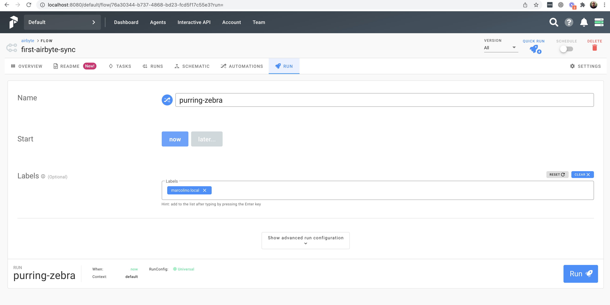
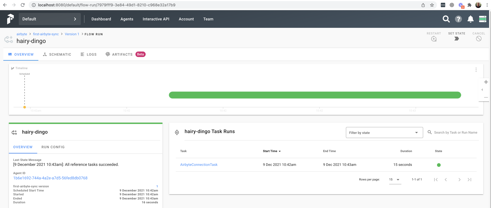

# Using the Prefect Airbyte Task

Airbyte is an official integration Task in the Prefect project. The Airbyte Task allows you to trigger synchronization jobs in Prefect, and this tutorial will walk through configuring your Prefect Flow to do so.

The Airbyte Task documentation on Prefect project can be found [here](https://docs.prefect.io/api/latest/tasks/airbyte.html#airbyteconnectiontask) and the [Prefect 2.0 community guide can be found here](https://www.prefect.io/guide/community-posts/orchestrating-airbyte-with-prefect-2-0/).

## 1. Set up the tools

First, make sure you have Docker installed. We'll be using the `docker-compose` command, so your install should contain `docker-compose`.

### **Start Airbyte**

If this is your first time using Airbyte, we suggest going through our [Basic Tutorial](https://github.com/airbytehq/airbyte/tree/e378d40236b6a34e1c1cb481c8952735ec687d88/docs/quickstart/getting-started.md). This tutorial will use the Connection set up in the basic tutorial.

For the purposes of this tutorial, set your Connection's **sync frequency** to **manual**. Prefect will be responsible for manually triggering the Airbyte job.

### **Start Prefect**

If you don't have a Prefect instance, we recommend following this [guide](https://docs.prefect.io/core/getting_started/install.html) to set one up.

## 2. Create a Flow in Prefect to trigger your Airbyte job

### Create a new Prefect Project

```bash
prefect create project "airbyte"
```

### Retrieving the Airbyte Connection ID

We'll need the Airbyte Connection ID so our Prefect Flow knows which Airbyte Connection to trigger.



This ID can be seen in the URL on the connection page in the Airbyte UI. The Airbyte UI can be accessed at `localhost:8000`.

### Creating a simple Prefect DAG to run an Airbyte Sync Job

Create a new folder called `airbyte_prefect` and create a file `airbyte_prefect_flow.py`.

```python
from prefect import Flow
from prefect.tasks.airbyte.airbyte import AirbyteConnectionTask

airbyte_conn = AirbyteConnectionTask(
        airbyte_server_host="localhost",
        airbyte_server_port=8000,
        airbyte_api_version="v1",
        connection_id="04e128af-1092-4a83-bf33-1b8c85395d74"
)

with Flow("first-airbyte-task") as flow:
    flow.add_task(airbyte_conn) 

# Register the flow under the "airbyte" project
flow.register(project_name="airbyte")
```

The Airbyte Prefect Task accepts the following parameters:

* `airbyte_server_host`: The host URL to your Airbyte instance.
* `airbyte_server_post`: The port value you have selected for your Airbyte instance.
* `airbyte_api_version`: default value is `v1`.
* `connection_id`: The ID of the Airbyte Connection to be triggered by Prefect.

After running the file, `python3 airbyte_prefect_flow.py` this will register the Flow in Prefect Server.



Access the link from the output from the previous command to see the Flow in Prefect Server, or you can navigate in Prefect UI to find the new Flow -> Access the link from the output from the previous command to see the Flow in the Prefect Server. Alternatively, you can go to the Prefect UI to find the new Flow.



Click on the button `Run` and configure your first run.


After a few moments you should see the finished run.



After that you have the option to configure a more complex Schedule to your Flow. See the [Prefect Schedule docs.](https://docs.prefect.io/core/concepts/schedules.html)

## That's it!

Don't be fooled by our simple example of only one Prefect Flow. Airbyte is a powerful data integration platform supporting many sources and destinations. The Airbyte Prefect Task means Airbyte can now be easily used with the Prefect ecosystem - give it a shot!

We love to hear any questions or feedback on our [Slack](https://slack.airbyte.io/). We're still in alpha, so if you see any rough edges or want to request a connector, feel free to create an issue on our [Github](https://github.com/airbytehq/airbyte) or thumbs up an existing issue.

