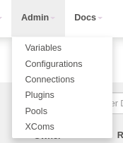
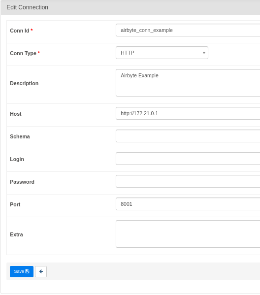
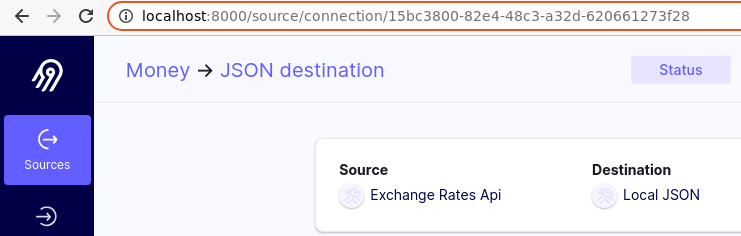
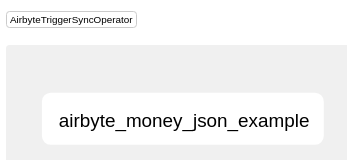
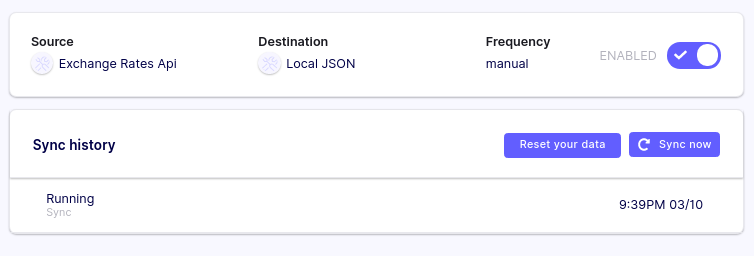

# Using the Airflow Airbyte Operator

Airbyte is an official community provider for the Apache Airflow project. The Airbyte operator allows you to trigger synchronization jobs in Apache Airflow, and this tutorial will walk through configuring your Airflow DAG to do so.

:::caution

Due to some difficulties in setting up Airflow, we recommend first trying out the deployment using the local example [here](https://github.com/airbytehq/airbyte/tree/master/resources/examples/airflow), as it contains accurate configuration required to get the Airbyte operator up and running.

:::

The Airbyte Provider documentation on Airflow project can be found [here](https://airflow.apache.org/docs/apache-airflow-providers-airbyte/stable/index.html).

## 1. Set up the tools

First, make sure you have Docker installed. \(We'll be using the `docker-compose` command, so your install should contain `docker-compose`.\)

### **Start Airbyte**

If this is your first time using Airbyte, we suggest going through our [Basic Tutorial](https://github.com/airbytehq/airbyte/tree/e378d40236b6a34e1c1cb481c8952735ec687d88/docs/quickstart/getting-started.md). This tutorial will use the Connection set up in the basic tutorial.

For the purposes of this tutorial, set your Connection's **sync frequency** to **manual**. Airflow will be responsible for manually triggering the Airbyte job.

### **Start Apache Airflow**

If you don't have an Airflow instance, we recommend following this [guide](https://airflow.apache.org/docs/apache-airflow/stable/start/docker.html) to set one up. Additionally, you will need to install the `apache-airflow-providers-airbyte` package to use Airbyte Operator on Apache Airflow. You can read more about it [here](https://airflow.apache.org/docs/apache-airflow-providers-airbyte/stable/index.html)

## 2. Create a DAG in Apache Airflow to trigger your Airbyte job

### Create an Airbyte connection in Apache Airflow

Once Airflow starts, navigate to Airflow's `Connections` page as seen below. The Airflow UI can be accessed at [http://localhost:8080/](http://localhost:8080/).



Airflow will use the Airbyte API to execute our actions. The Airbyte API uses HTTP, so we'll need to create a HTTP Connection. Airbyte is typically hosted at `localhost:8001`. Configure Airflow's HTTP connection accordingly - we've provided a screenshot example.



Don't forget to click save!

### Retrieving the Airbyte Connection ID

We'll need the Airbyte Connection ID so our Airflow DAG knows which Airbyte Connection to trigger.



This ID can be seen in the URL on the connection page in the Airbyte UI. The Airbyte UI can be accessed at `localhost:8000`.

### Creating a simple Airflow DAG to run an Airbyte Sync Job

Place the following file inside the `/dags` directory. Name this file `dag_airbyte_example.py`.

```python
from airflow import DAG
from airflow.utils.dates import days_ago
from airflow.providers.airbyte.operators.airbyte import AirbyteTriggerSyncOperator

with DAG(dag_id='trigger_airbyte_job_example',
         default_args={'owner': 'airflow'},
         schedule_interval='@daily',
         start_date=days_ago(1)
    ) as dag:

    money_to_json = AirbyteTriggerSyncOperator(
        task_id='airbyte_money_json_example',
        airbyte_conn_id='airbyte_conn_example',
        connection_id='1e3b5a72-7bfd-4808-a13c-204505490110',
        asynchronous=False,
        timeout=3600,
        wait_seconds=3
    )
```

The Airbyte Airflow Operator accepts the following parameters:

* `airbyte_conn_id`: Name of the Airflow HTTP Connection pointing at the Airbyte API. Tells Airflow where the Airbyte API is located.
* `connection_id`: The ID of the Airbyte Connection to be triggered by Airflow.
* `asynchronous`: Determines how the Airbyte Operator executes. When true, Airflow will monitor the Airbyte Job using an **AirbyteJobSensor**. Default value is `false`.
* `timeout`: Maximum time Airflow will wait for the Airbyte job to complete. Only valid when `asynchronous=False`. Default value is `3600` seconds.
* `wait_seconds`: The amount of time to wait between checks. Only valid when `asynchronous=False`. Default value is `3` seconds.

This code will produce the following simple DAG in the Airbyte UI:



Our DAG will show up in the Airflow UI shortly after we place our DAG file, and be automatically triggered shortly after.

Check Airbyte UI's Sync History tab to see if the job started syncing!



### Using the `asynchronous` parameter

If your Airflow instance has limited resources and/or is under load, setting the `asynchronous=True` can help. Sensors do not occupy an Airflow worker slot, so this is helps reduce Airflow load.

```python
from airflow import DAG
from airflow.utils.dates import days_ago
from airflow.providers.airbyte.operators.airbyte import AirbyteTriggerSyncOperator
from airflow.providers.airbyte.sensors.airbyte import AirbyteJobSensor 

with DAG(dag_id='airbyte_trigger_job_example_async',
         default_args={'owner': 'airflow'},
         schedule_interval='@daily',
         start_date=days_ago(1)
    ) as dag:

    async_money_to_json = AirbyteTriggerSyncOperator(
        task_id='airbyte_async_money_json_example',
        airbyte_conn_id='airbyte_conn_example',
        connection_id='1e3b5a72-7bfd-4808-a13c-204505490110',
        asynchronous=True,
    )

    airbyte_sensor = AirbyteJobSensor(
        task_id='airbyte_sensor_money_json_example',
        airbyte_conn_id='airbyte_conn_example',
        airbyte_job_id=async_money_to_json.output
    )

    async_money_to_json >> airbyte_sensor
```

## That's it!

Don't be fooled by our simple example of only one Airflow task. Airbyte is a powerful data integration platform supporting many sources and destinations. The Airbyte Airflow Operator means Airbyte can now be easily used with the Airflow ecosystem - give it a shot!

We love to hear any questions or feedback on our [Slack](https://slack.airbyte.io/). We're still in alpha, so if you see any rough edges or want to request a connector, feel free to create an issue on our [Github](https://github.com/airbytehq/airbyte) or thumbs up an existing issue.

