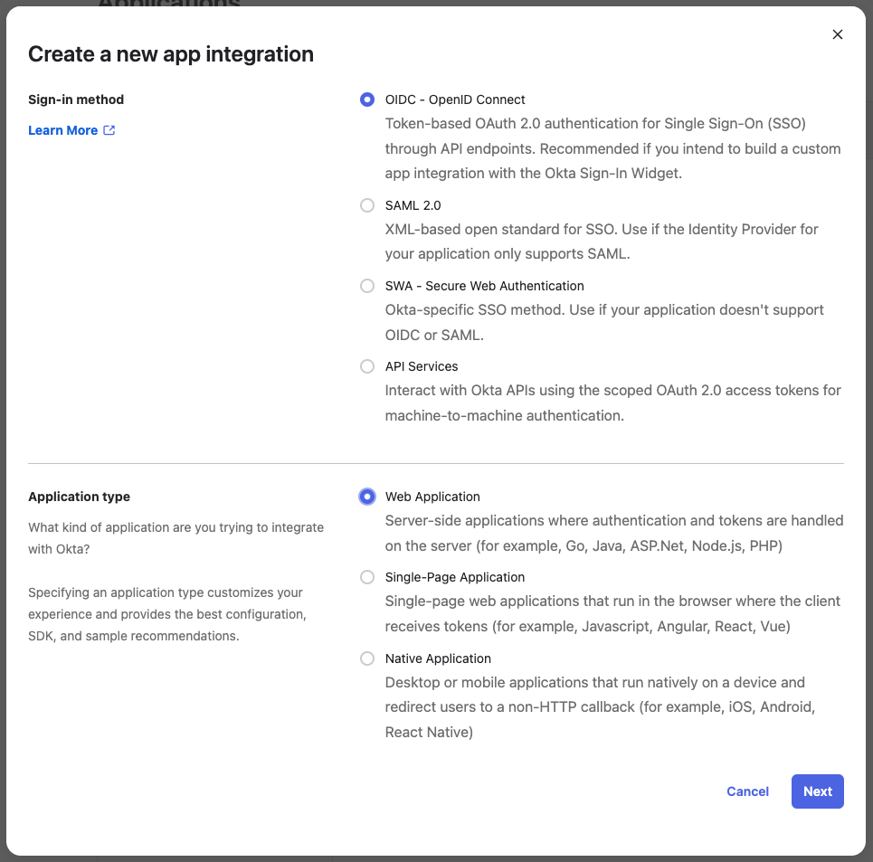

# Set up single sign on using Okta

This guide shows you how to set up Okta and Airbyte so your users can log into Airbyte using your organization's identity provider (IdP).

## Overview

This guide is for administrators. It assumes you have:

- Basic knowledge of Okta, OpenID Connect (OIDC), and Airbyte
- The permissions to manage Okta in your organization
- Organization admin permissions for Airbyte

The steps below cover Cloud with Okta OIDC.

## Cloud with Okta OIDC

:::warning
For security purposes, when a user who owns [applications](/platform/using-airbyte/configuring-api-access) logs in with SSO for the first time, Airbyte disables their existing applications. Those users must replace any application secrets that were previously in use to ensure API and Terraform integrations don't break.
:::

### Part 1: Create a new Okta application

1. In Okta, create a new Okta OIDC App Integration for Airbyte. For help, see [Okta's documentation](https://help.okta.com/en-us/content/topics/apps/apps_app_integration_wizard_oidc.htm). Create an app integration with the following options.

    - **Sign-in method**: OIDC - OpenID Connect

    - **Application type**: Web application

      

2. Click **Next**.

3. Set the following parameters for your app integration.

    - **App integration name**: `Airbyte` (or something similar)

    - **Grant type**: `Authorization code`

    - **Sign-in redirect URIs**: `https://cloud.airbyte.com/auth/realms/<your-company-identifier>/broker/default/endpoint`

        Replace `<your-company-identifier>` with a unique identifier for your organization. This is often your organization name or domain (for example, `airbyte`). You'll use this same identifier when configuring SSO in Airbyte.

        :::tip
        To avoid coming back later to change this, check if this company identifier is available now by trying to log into Airbyte with it. If the company identifier is already claimed, Airbyte tries and fails to log you into another organization's IdP.
        :::

    - **Sign-out redirect URIs**: `https://cloud.airbyte.com/auth/realms/<your-company-identifier>/broker/default/endpoint/logout_response`

    - **Trusted origins**: Leave empty.

    - **Assignments > Controlled access**: Depending on your needs, choose either `Limit access to selected groups` or `Allow everyone in your organization to access`.

    - Leave other values as defaults unless you have a reason to change them.

4. Click **Save**.

5. (Optional) To allow users to access Airbyte directly from their Okta dashboard, configure IdP-Initiated Login. In the **General** tab of your Airbyte application, scroll to **Login initiated by** and configure the following settings:

    - **Login initiated by**: `Either Okta or App`

    - **Application visibility**: Check `Display application icon to users`

    - **Login flow**: `Redirect to app to initiate login (OIDC Compliant)`

    - **Initiate login URI**: `https://cloud.airbyte.com`

    Click **Save**. After this configuration, users see an Airbyte tile in their Okta dashboard and can click it to sign into Airbyte.

### Part 2: Domain verification

Before you can enable SSO, you must prove to Airbyte that you or your organization own the domain on which you want to enable SSO. You can enable as many domains as you need.

1. In Airbyte, click **Organization settings** > **SSO**.

2. Click **Add Domain**.

3. Enter your domain name (`example.com`, `airbyte.com`, etc.) and click **Add Domain**. The domain is added to the Domain Verification list with a "Pending" status and Airbyte shows you the necessary DNS record.

4. Add the DNS record to your domain. You might need help from your IT team to do this. Generally, you follow a process like this:

    1. Sign into the website where you manage your domain.

    2. Look for something like **DNS Records**, **Domain Management**, or **Name Server Management**. Click it to go to your domain's DNS settings.

    3. Find TXT records.

    4. Add a new TXT record using the record type, record name, and record value that Airbyte gave you.

    5. Save the new TXT record.

5. Wait for Airbyte to verify the domain. This process can take up to 24 hours, but typically it happens faster. If nothing has happened after 24 hours, verify that you entered the TXT record correctly.

### Part 3: Configure and test SSO in Airbyte

1. In Airbyte, click **Organization settings** > **SSO**.

2. Click **Set up SSO**, then input the following information.

    - **Company identifier**: The unique identifier you used in the redirect URI in Okta. For example, `airbyte`.

    - **Client ID**: In Okta's administrator panel, **Applications** > **Applications** > **Airbyte** > **General** tab > **Client ID**.

    - **Client secret**: Your client secret from your Okta application.

    - **Discovery URL**: Your OpenID Connect (OIDC) metadata endpoint. It's similar to `https://<yourOktaDomain>/.well-known/openid-configuration`.

3. Click **Test your connection** to verify your settings. Airbyte forwards you to your identity provider. Log in to test that your credentials work.

    - If the test is successful, you return to Airbyte and see a "Test Successful" message.

    - If the test wasn't successful, either Airbyte or Okta show you an error message, depending on what the problem is. Verify the values you entered and try again.

4. Click **Activate**.

Once you activate SSO, users with your email domain must sign in using SSO.

#### If users can't log in

If you successfully set up SSO but your users can't log into Airbyte, verify that they have access to the Airbyte application you created in Okta.

### Update SSO credentials

To update SSO for your organization, [contact support](https://support.airbyte.com).

### Domain verification statuses

Airbyte shows one of the following statuses for each domain you add:

**Pending**: Airbyte created the DNS record details and is waiting to find the record in DNS. You see this status after you add a domain. DNS propagation can take time. If the status is still Pending after 24 hours, verify that the record name and value exactly match what Airbyte shows.

**Verified**: Airbyte found a TXT record with the expected value. The domain is verified and can be used with SSO. Users with email addresses on this domain must sign in with SSO.

**Failed**: Airbyte found a TXT record at the expected name, but the value doesn't match. This usually means the TXT record was created with a typo or wrong value. Update the TXT record to match the value shown in Airbyte, then click **Reset** to retry verification.

**Expired**: Airbyte couldn't verify the domain within 14 days, so it marked the verification as expired. After you've fixed your DNS configuration, click **Reset** to move it back to Pending, or delete it and start over.

### Remove a domain from SSO

If you no longer need a domain for SSO purposes, delete its verification.

1. In Airbyte, click **Organization settings** > **SSO**.

2. Next to the domain you want to stop using, click **Delete**.

<!-- Organization admins can log in using your email and password (instead of SSO) to update SSO settings. If your client secret expires or you need to update your SSO configuration, follow these steps.

1. In Airbyte, click **Organization settings** > **General**.

2. Click **Set up SSO** > **Re-test your connection**.

3. Update the form fields as needed.

4. Click **Test your connection** to verify the updated credentials work correctly.

5. Click **Activate SSO**. -->
