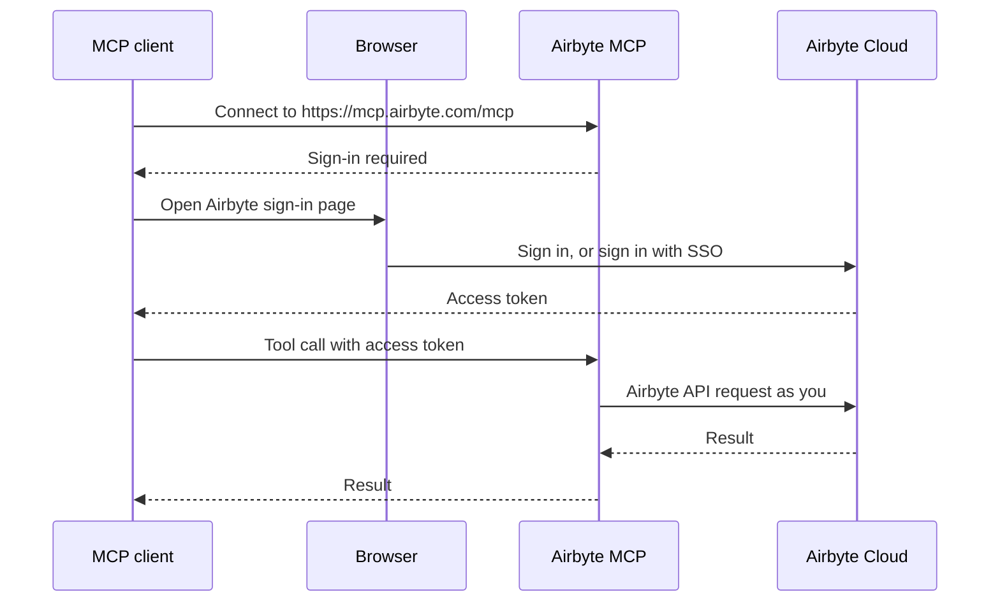

# Airbyte MCP

:::info Private beta
The Airbyte MCP is in private beta. Features and tools may change. It's available to Airbyte Cloud organizations enrolled in the beta. You can also [run the Airbyte MCP with self-managed Airbyte Core](self-managed.md), with known issues.
:::

The Airbyte MCP is a [Model Context Protocol](https://modelcontextprotocol.io/) server that connects AI agents, like Claude, ChatGPT, and VS Code Copilot, to your Airbyte organization. Your agent works with Airbyte on your behalf, using the same permissions you have in Airbyte.

With the Airbyte MCP, your agent can:

- **Build and manage data pipelines**: deploy sources and destinations, create connections, select streams, and start syncs.
- **Troubleshoot and maintain pipelines**: check sync status, read job logs, check connector configurations, and explain failures.
- **Read data directly from sources and destinations**: when your organization enables the [context layer](../context-layer/readme.md), your agent can read live data from supported sources and query supported destinations without waiting for a sync.
- **Learn how each connector works**: connector skills describe the entities, actions, and parameters each connector supports, so your agent knows how to request data correctly.
- **Answer questions about Airbyte**: your agent can search Airbyte's documentation and the source code for the platform and connectors to answer questions about how Airbyte works.

To start, [connect the Airbyte MCP to your agent](install.md). For a complete list of what your agent can do, see [Airbyte MCP tools](tools.md).

## Example prompts

After you connect the Airbyte MCP, ask your agent to do things in plain language. For example:

- "List the connections in my Airbyte workspace and tell me which ones failed in the last day."
- "Why did my last Salesforce sync fail? Read the logs and suggest a fix."
- "Create a connection from my Postgres source to my BigQuery destination that syncs every 6 hours."
- "Show me the 10 most recently updated HubSpot contacts." This requires agent access to be enabled in your organization's context layer.
- "In Snowflake, how many orders arrived last week?" This requires agent access to be enabled in your organization's context layer.

## Usage limits

During the private beta, each organization can make up to 100,000 direct reads per month at no cost. Other Airbyte MCP tools, like the ones that manage connections or read job logs, don't count toward this limit and are free to use.

Direct reads also count toward the API rate limits of the source you read from, and can incur compute costs from your destination.

## Limitations

- The hosted Airbyte MCP server only works with Airbyte Cloud. You can [run the Airbyte MCP locally with self-managed Airbyte Core](self-managed.md), but there are known issues with local deployments.
- Direct reads are read-only. Your agent can list and get records, but it can't create, update, or delete records in a source or destination through direct reads.
- Direct reads only work with [supported connectors](../context-layer/readme.md#supported-connectors), and only after an organization admin [enables the context layer](../context-layer/manage-access.md).

## Feedback

The Airbyte MCP is in active development. To report a problem or request a feature, [open an Airbyte MCP beta issue](https://github.com/airbytehq/PyAirbyte/issues/new?template=airbyte-mcp-beta.yml) on GitHub. Don't include secrets or credentials in these issues, because they're publicly viewable.

## Appendix

How authentication works

The Airbyte MCP never asks for your password or API keys in the chat. It uses [OAuth 2.0](https://oauth.net/2/) to sign you in to Airbyte Cloud, then acts with your Airbyte permissions.

1. Your MCP client connects to `https://mcp.airbyte.com/mcp`. The server responds that sign-in is required.
2. Your client opens the Airbyte Cloud sign-in page in a browser. If your organization uses [single sign-on](/platform/access-management/sso), you sign in with your company identifier.
3. Airbyte Cloud returns an access token to your client.
4. Your client sends that token with each tool call. The Airbyte MCP uses it to call the Airbyte API as you.

Because the Airbyte MCP acts as you, your agent can only see and change the workspaces, connectors, and connections your Airbyte [role](/platform/access-management/rbac) allows. When the token expires, your client asks you to sign in again.

Automated agents that can't open a browser can authenticate with an Airbyte application instead. See [Connect without a browser](install.md#connect-without-a-browser).

Third-party credentials, like your Salesforce password or a database key, stay in the source or destination you configured in Airbyte. Direct reads use those stored credentials, so the agent never sees them.

When your agent reads directly from a source or destination, Airbyte uses the credentials saved in that connector in that workspace, not your own credentials for the third-party system. What the agent can read depends on the permissions of those stored credentials. This means it's possible for an Airbyte user to see records they aren't ordinarily permitted to see in that system, or to not see records they can usually see.

What connectors do

A connector is the component Airbyte uses to talk to a third-party system. A connector can have one or both of these capabilities:

- **Data replication**: extract data from a source or load data into a destination. This powers connections and syncs.
- **Agent access**: call the source or destination in real time and return only the records an agent asks for. This powers direct reads.

When the context layer is on, a single connector you configured in Airbyte can do both: sync data through a connection, and directly call the source or destination from your agent. Airbyte uses the same stored credentials for both actions. To learn more, see [Sources, destinations, and connectors](../move-data/sources-destinations-connectors.md).

