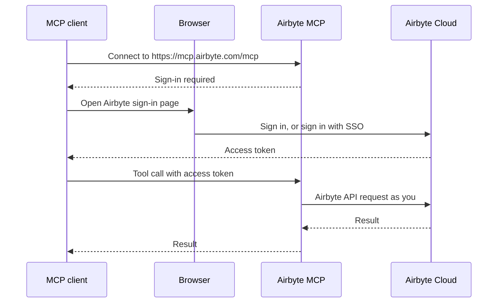

# Airbyte MCP

:::info Private beta
Airbyte MCP is in private beta. Features and tools may change. It's available to Airbyte Cloud organizations enrolled in the beta. Self-managed versions of Airbyte aren't supported during the beta.
:::

Airbyte MCP is a [Model Context Protocol](https://modelcontextprotocol.io/) server that connects AI agents, like Claude, ChatGPT, and VS Code Copilot, to your Airbyte Cloud organization. Your agent works with Airbyte on your behalf, using the same permissions you have in Airbyte.

With Airbyte MCP, your agent can:

- **Build and manage data pipelines**: deploy sources and destinations, create connections, select streams, and start syncs.
- **Troubleshoot and maintain pipelines**: check sync status, read job logs, check connector configurations, and explain failures.
- **Read data directly from sources and destinations**: when your organization enables the [Context layer](../context-layer/readme.md), your agent can read live data from supported sources and query supported destinations without waiting for a sync.
- **Learn how each connector works**: connector skills describe the entities, actions, and parameters each connector supports, so your agent knows how to request data correctly.

To start, [connect Airbyte MCP to your agent](install.md). For a complete list of what your agent can do, see [Airbyte MCP tools](tools.md).

## Data replication and direct reads

Airbyte has always been a data replication platform. It extracts data from sources and loads it into destinations on a schedule, so your warehouse holds a complete, historical copy of your data. That copy is the foundation of a context layer for agents: one place where all your business data is joined, cleaned, and ready to query.

Replicated data isn't always fresh enough, though. Sometimes an agent needs the current state of a single record, like the latest status of a support ticket. **Direct reads** fill that gap. With direct reads, Airbyte MCP asks a source's API for current data at the moment your agent needs it, without creating a connection or running a sync. Direct reads also let your agent query a destination like Snowflake or BigQuery directly.

Together, replicated data and direct reads make up the [Context layer](../context-layer/readme.md).

## Example prompts

After you connect Airbyte MCP, ask your agent to do things in plain language. For example:

- "List the connections in my Airbyte workspace and tell me which ones failed in the last day."
- "Why did my last Salesforce sync fail? Read the logs and suggest a fix."
- "Create a connection from my Postgres source to my BigQuery destination that syncs every 6 hours."
- "Show me the 10 most recently updated HubSpot contacts." This requires direct reads.
- "In Snowflake, how many orders arrived last week?" This requires direct reads.

## Usage limits

During the private beta, each organization can make up to 100,000 Airbyte MCP tool calls per month at no cost. Direct reads also count toward the API rate limits of the source you read from.

## Limitations

- Airbyte MCP is only available for Airbyte Cloud.
- Direct reads are read-only. Your agent can list and get records, but it can't create, update, or delete records in a source or destination through direct reads.
- Direct reads only work with [supported connectors](../context-layer/readme.md#supported-connectors), and only after an organization admin [enables the Context layer](../context-layer/manage-access.md).

## Feedback

Airbyte MCP is in active development. To report a problem or request a feature, [open an Airbyte MCP beta issue](https://github.com/airbytehq/PyAirbyte/issues/new?template=airbyte-mcp-beta.yml) on GitHub. Don't include secrets, credentials, or workspace identifiers in public issues.

## Appendix

How authentication works

Airbyte MCP never asks for your password or API keys in the chat. It uses [OAuth 2.0](https://oauth.net/2/) to sign you in to Airbyte Cloud, then acts with your Airbyte permissions.

1. Your MCP client connects to `https://mcp.airbyte.com/mcp`. The server responds that sign-in is required.
2. Your client opens the Airbyte Cloud sign-in page in a browser. If your organization uses [single sign-on](/platform/access-management/sso), you sign in with your company identifier.
3. Airbyte Cloud returns an access token to your client.
4. Your client sends that token with each tool call. Airbyte MCP uses it to call the Airbyte API as you.

Because Airbyte MCP acts as you, your agent can only see and change the workspaces, connectors, and connections your Airbyte [role](/platform/access-management/rbac) allows. When the token expires, your client asks you to sign in again.

Automated agents that can't open a browser can authenticate with an Airbyte application instead. See [Connect without a browser](install.md#connect-without-a-browser).

Third-party credentials, like your Salesforce password or a database key, stay in the source or destination you configured in Airbyte. Direct reads use those stored credentials, so the agent never sees them. What an agent can read from a source is limited by the permissions of the credentials you used to set up that source.

What connectors do

A connector is the component Airbyte uses to talk to a third-party system. Airbyte has two kinds:

- **Data replication connectors** extract data from a source or load data into a destination. They power connections and syncs.
- **Agent connectors** call a source's API in real time and return only the records an agent asks for. They power direct reads.

When the Context layer is on, a single source you configured in Airbyte can do both: sync data to your warehouse through a connection, and answer direct reads from your agent. Airbyte uses the same stored credentials for both. To learn more, see [Sources, destinations, and connectors](../move-data/sources-destinations-connectors.md).

