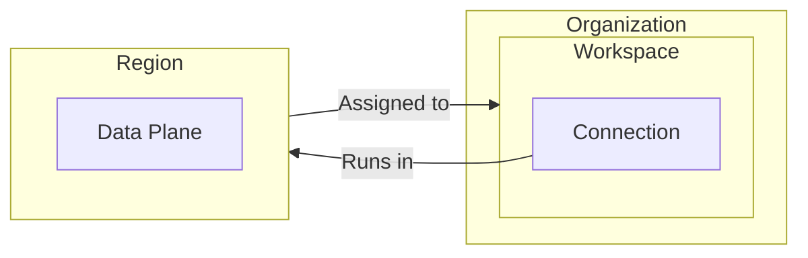

# Set data residency

Your connections can run in the managed or self-managed region of your choice.

## How it works

You set data residency by assigning a region to a workspace. All connections that run in that workspace run in that region. Changes to data residency do not affect syncs that are already in progress, but affect future syncs.

### Capabilities by plan

- **Cloud**: If you're a cloud customer, you can choose from Airbyte's managed regions. If you're an [Enterprise Flex](../../enterprise-flex/) customer, you can also choose one of your own self-managed regions.

- **Self-Managed**: If you're a [Self-Managed Enterprise](../../enterprise-setup/) customer, you can choose one of your own self-managed regions.

### Connector Builder data residency

The Connector Builder processes all data through Airbyte's control plane, regardless of your workspace's default data residency settings. This limitation applies to the development and testing of connectors within the Connector Builder interface. It doesn't apply to actual connections using that connector, which use the region you set for that workspace.

### Cursor and primary key data residency

While Airbyte processes data in a data plane from your chosen region, it runs cursor and primary key data through the control plane. Airbyte Cloud's control plane is in the United States. If you have data you can't process in the United States, don't use it as a cursor or primary key.

### IP addresses for managed data planes

If you're a Cloud customer using one of Airbyte's managed data planes, you might need to add [these IP addresses](/platform/operating-airbyte/ip-allowlist) to your allow list.

## Assign a region to a workspace

When you assign a region to a workspace, all connections in that workspace run in that region, except for the preceding limitations. Follow the steps below to assign a region to a workspace.

1. Switch to the workspace you want to change data residency on.

2. Click **Workspace settings**.

3. Under **Region**, select the region you want that workspace to use.

4. Click **Save changes**.
