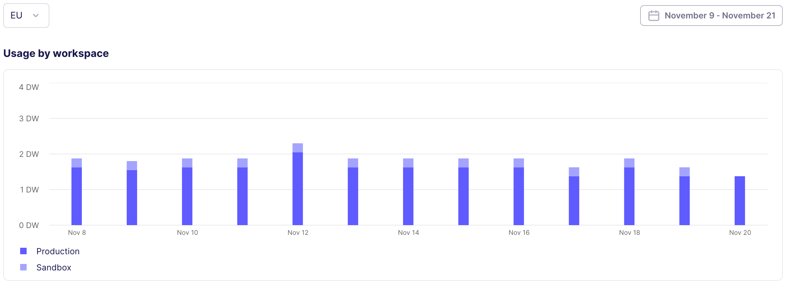

# Monitor data worker usage

If you are on a capacity-based plan, you can monitor your data worker usage across your organization. To view data worker usage, you need the **organization admin** role.

## Open the usage chart

From the navigation bar, click **Organization settings** > **Usage**.

## How to interpret the chart

The chart shows daily maximum concurrent data worker usage, from all workspaces in a region, over a period of time. Each bar represents one day. The chart stacks all workspaces in that region so you can see which workspace uses the most data workers each day.

Hover on a day to see more details about it.

## Filter the chart

- To change the region, click the region dropdown in the chart's upper left corner and choose a different region.

- To change the date range, click the date dropdown in the chart's upper right corner and choose a new date range.

## What to do if you hit your data worker limit

An infrequent instance of maximum usage probably isn't a problem. If you're regularly hitting your data worker limit, you have three options.

- Accept that Airbyte may queue or throttle your connections.

- Reschedule some connections so they run at different times of the day, week, or month.

- Buy more data workers to increase capacity.

### Optimize data worker usage

If you can, it's preferable to optimize Airbyte by rescheduling connections outside of busy periods.

- **If your usage has peaks and valleys**, find connections that run on busy days and move them to lower-usage days.

- **If your usage looks consistently high**, examine your scheduling patterns within a day. If a large number of connections start at the same time, data worker usage spikes.

    - Stagger start times over a longer period to allow some connections to finish before others begin.

    - Avoid starting all your syncs at the top of the hour. Starting them at :15, :30, and :45 can more evenly distribute work.

    - If a large number of connections run overnight, data workers might look fully utilized, but sit unused during daylight hours.

- **If sandbox/staging workspaces consume too much capacity**, consider reducing the frequency of syncs in less critical workspaces.

### Buy more data workers

If you've tried to optimize scheduling and still need more data workers, contact your Airbyte representative or [talk to sales](https://www.airbyte.com/talk-to-sales).
