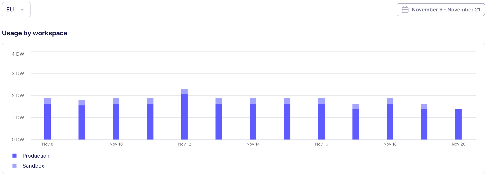

# Monitor data worker usage

If you are on a capacity-based plan, you can monitor your data worker usage across your organization and understand how capacity enforcement affects your syncs. When all committed data workers are in use, newly triggered sync jobs are queued until capacity becomes available. To view data worker usage, you need the **organization admin** role.

## Open the usage chart

From the navigation bar, click **Organization settings** > **Usage**.

## How to interpret the chart

The chart shows daily maximum concurrent data worker usage, from all workspaces in a region, over a period of time. Each bar represents one day. The chart stacks all workspaces in that region so you can see which workspace uses the most data workers each day.

Hover on a day to see more details about it.

## Filter the chart

- To change the region, click the region dropdown in the chart's upper left corner and choose a different region.

- To change the date range, click the date dropdown in the chart's upper right corner and choose a new date range.

## Workspace-level data worker usage

In addition to the organization-level chart, workspace editors can view data worker usage for their workspace.

1. Click **Workspace Settings** > **Usage**.

2. Review the line graph, which shows hourly data worker usage over a 7-day period for the current workspace.

This helps you understand your workspace's contribution to overall organization capacity usage.

## What to do if you hit your data worker limit

An infrequent instance of maximum usage probably isn't a problem. If you're regularly hitting your data worker limit, you have four options.

- Accept that Airbyte may queue your connections. Queued syncs run in the order they were triggered. If a connection already has a queued sync and its next scheduled run arrives, the newer run replaces the older queued one so the most recent data syncs when capacity frees up.

- Reschedule some connections so they run at different times of the day, week, or month.

- Buy more data workers to increase capacity.

- Enable [on-demand capacity](#on-demand-capacity) for critical connections so they always run, even when committed capacity is exhausted.

Manually triggered syncs that remain queued for 8 hours are automatically cancelled.

### Optimize data worker usage

If you can, it's preferable to optimize Airbyte by rescheduling connections outside of busy periods.

- **If your usage has peaks and valleys**, find connections that run on busy days and move them to lower-usage days.

- **If your usage looks consistently high**, examine your scheduling patterns within a day. If a large number of connections start at the same time, data worker usage spikes.

    - Stagger start times over a longer period to allow some connections to finish before others begin.

    - Avoid starting all your syncs at the top of the hour. Starting them at :15, :30, and :45 can more evenly distribute work.

    - If a large number of connections run overnight, data workers might look fully utilized, but sit unused during daylight hours.

- **If sandbox/staging workspaces consume too much capacity**, consider reducing the frequency of syncs in less critical workspaces.

### Buy more data workers

If you've tried to optimize scheduling and still need more data workers, contact your Airbyte representative or [talk to sales](https://www.airbyte.com/talk-to-sales).

## On-demand capacity

For critical data pipelines that must always run on time, you can enable on-demand capacity on individual connections. When committed capacity is available, the sync uses it at no extra cost. When committed capacity is exhausted, the sync consumes organization credits at a premium rate so it runs immediately instead of being queued.

On-demand capacity must be part of your signed contract. Contact your Airbyte representative or [talk to sales](https://www.airbyte.com/talk-to-sales) if you're interested. Once your organization administrator enables on-demand capacity at the organization level, workspace editors can enable it per connection.

If your organization runs out of credits, syncs are queued even if on-demand capacity is enabled. For more information about credit consumption, see [Manage billing and credits](./manage-credits.md).

### Enable on-demand capacity on a connection

1. Click **Connections** and select the connection you want to configure.

2. Click **Settings**.

3. Toggle **Use on-demand capacity**. The toggle description reads: "Enable connection to use credits to always run syncs on demand. Syncs for this connection will never be queued, and only consume credits if no capacity is available."

When you enable on-demand capacity on a connection, Airbyte automatically applies a "Burst" tag with an orange gradient background and a star icon. You can filter connections by the Burst tag to see all on-demand connections at a glance. If you disable on-demand capacity, Airbyte removes the Burst tag automatically. For more information about tags, see [Tagging connections](/platform/using-airbyte/tagging).

### Identify queued connections

When your committed capacity is fully utilized, connections waiting for capacity display an orange hourglass icon and a "Queued" status. You can filter the Connections page by "Queued" status to find all queued connections. A dismissable yellow banner also appears at the top of the Connections page: "Maximum capacity currently reached, additional jobs will be queued until capacity is available."

For more information about connection statuses, see [Connection status](./review-connection-status.md).
