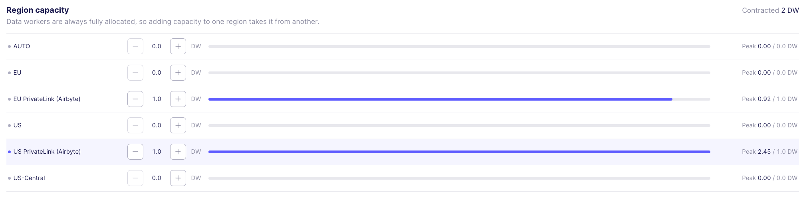
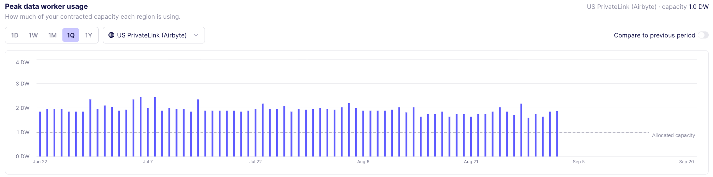

# Manage and monitor data workers

If you are on a capacity-based plan, your organization has a contracted number of data workers. Airbyte allocates those data workers across the regions your organization uses, and enforces capacity per region. When all committed data workers in a region are in use, newly triggered sync jobs in that region are queued until capacity becomes available there. You can move data workers between regions at any time to match where your syncs run.

To view usage and manage capacity, you need the **organization admin** role.

## How regional capacity works

Data workers are allocated to regions, not to your organization as a whole. Your contracted capacity is the total across all regions, and each region has its own allocation. A sync consumes capacity only from the region its workspace runs in.

Keep the following in mind.

- **Data workers are always fully allocated.** Every contracted data worker belongs to exactly one region. Adding capacity to one region takes it from another. To increase your total, you need to [buy more data workers](#buy-more-data-workers).

- **Capacity is enforced per region.** A region can be out of capacity while another region has plenty. Syncs in the full region queue; syncs in the other region run normally.

- **Allocations can be fractional.** You can move capacity in 0.5 data worker increments. Because most syncs use less than one data worker, this lets you fine-tune each region.

- **A region with no allocation has zero capacity.** If your workspaces run in a region you haven't allocated data workers to, every sync in that region queues (or uses [on-demand capacity](#on-demand-capacity), if enabled) until you move capacity there.

## How data workers map to syncs {#data-worker-consumption-by-source-type}

Each running sync consumes a fraction of one data worker. The exact amount is derived from the job's resolved CPU requirements and divided by a platform-defined factor. Different source types have different resource profiles, so the capacity consumed per sync varies. The capacity per sync may also differ if your organization has custom resource overrides.

The following table shows approximate data worker consumption based on current default resource profiles. These values are not contractual and may change as resource profiles are updated. Use the [usage chart](#open-the-usage-page) as the authoritative view of your actual capacity consumption.

| Source type | Default data workers per sync |
| ----------- | ----------------------------- |
| Database    | ~0.5                          |
| File        | ~0.2                          |
| API         | ~0.2                          |
| Custom      | ~0.2                          |

## Open the Usage page

From the navigation bar, click **Organization settings** > **Usage**. This page shows your region capacity table and your usage chart.

## Manage region capacity

The **Region capacity** table lists your contracted total and, for each region, its current allocation and its peak usage against that allocation. Regions your organization can use but hasn't allocated capacity to show **0.0 DW**.

### Move capacity between regions

1. In the **Region capacity** table, find the region you want to change.

2. To move capacity out of that region, click its **-** button. To move capacity into it, click its **+** button.

3. Choose how much to move. Use the amount stepper to pick a value in 0.5 data worker steps, or click a preset: **0.5**, **1**, **2**, or **All**.

4. Under **Move to…** or **Move from…**, click the other region. The move takes effect immediately, and both regions' allocations update in the table.

You can't move more capacity than the source region holds, and you can't move capacity into a region your organization isn't set up to use.

### What happens to running syncs when you move capacity

Moving capacity changes each region's limit, not the syncs already running. Airbyte never cancels, pauses, or reclassifies a running sync because you moved capacity away from its region.

- **In the region you moved capacity from**, running syncs finish normally. If the region is now using more capacity than it has allocated, new syncs in that region queue until enough running syncs finish and usage drops below the new allocation.

- **In the region you moved capacity to**, the extra capacity is available right away. Syncs already queued there recheck for capacity about once per minute and start as soon as they find room.

## How to interpret the usage chart

The **Peak data worker usage** chart shows maximum concurrent data worker usage, from all workspaces in one region, over a period of time. Each bar represents one interval in the selected time range, for example one day. The chart stacks all workspaces in that region so you can see which workspace uses the most data workers. A dashed **Contracted capacity** line shows the region's current allocation.

Hover on a bar to see more details about it.

Usage that came from on-demand capacity isn't shown separately. If a connection with on-demand capacity ran when the region was full, the bar for that day can rise above the **Contracted capacity** line. To see which connections use on-demand capacity, filter the Connections page by the [Burst tag](#on-demand-capacity).

## Filter the chart

- To change the region, click the region dropdown above the chart and choose a different region. The chart's header shows that region's current capacity.

- To change the time range, click **1D**, **1W**, **1M**, **1Q**, or **1Y**.

- To overlay the preceding period of the same length, turn on **Compare to previous period**.

## Workspace-level data worker usage

On capacity-based plans with data worker entitlements, the workspace Usage page shows data worker usage instead of credit usage. Users with access to workspace settings can view data worker usage for their workspace.

1. Click **Workspace Settings** > **Usage**.

2. Review the line graph, which shows hourly data worker usage over a 7-day period for the current workspace.

This helps you understand your workspace's contribution to overall organization capacity usage.

## What to do if you hit a region's data worker limit

An infrequent instance of maximum usage probably isn't a problem. If you're regularly hitting the limit in a region, you have five options.

- Accept that Airbyte may queue your connections. If a connection already has a queued sync and its next scheduled run arrives, the newer run replaces the older queued one so the most recent data syncs when capacity frees up.

- [Move capacity](#move-capacity-between-regions) from a region with spare capacity into the busy region.

- Reschedule some connections so they run at different times of the day, week, or month.

- Buy more data workers to increase your total capacity.

- Enable [on-demand capacity](#on-demand-capacity) for critical connections so they always run, even when committed capacity is exhausted.

On connections with a manual schedule type, syncs that remain queued for 8 hours are automatically cancelled. On scheduled or cron connections, a queued sync waits until the next scheduled run arrives, at which point the older queued sync is replaced.

### How queued syncs start

Syncs have no queue order. Each queued sync independently checks about once per minute whether its region has enough free capacity for it. The first sync whose check succeeds starts. A sync that needs less capacity can start ahead of a sync that has been waiting longer. Queued syncs don't consume capacity while they wait.

### Manually queue a sync when capacity is exhausted

If all committed data workers are in use and you click **Sync now** on a connection, Airbyte shows an **Insufficient capacity** confirmation before it queues the sync. To queue the sync until enough committed capacity is available, click **Queue sync**. To leave the connection unchanged, click **Cancel**.

### Optimize data worker usage

If you can, it's preferable to optimize Airbyte by rescheduling connections outside of busy periods. Look at each region separately, since capacity is enforced per region.

- **If one region is consistently full while another has headroom**, move capacity into the busy region. Compare each region's peak usage to its allocation in the **Region capacity** table.

- **If your usage has peaks and valleys**, find connections that run on busy days and move them to lower-usage days.

- **If your usage looks consistently high**, examine your scheduling patterns within a day. If a large number of connections start at the same time, data worker usage spikes.

  - Stagger start times over a longer period to allow some connections to finish before others begin.

  - Avoid starting all your syncs at the top of the hour. Starting them at :15, :30, and :45 can more evenly distribute work.

  - If a large number of connections run overnight, data workers might look fully utilized, but sit unused during daylight hours.

- **If sandbox/staging workspaces consume too much capacity**, consider reducing the frequency of syncs in less critical workspaces.

### Buy more data workers

If you've tried to optimize scheduling and still need more data workers, contact your Airbyte representative or [talk to sales](https://www.airbyte.com/talk-to-sales). Once the new data workers are added to your organization, you can [move them](#move-capacity-between-regions) to whichever region needs them.

## On-demand capacity

For critical data pipelines that must always run on time, you can enable on-demand capacity on individual connections. When committed capacity is available in the connection's region, the sync uses it at no extra cost. When that region's committed capacity is exhausted, the sync runs immediately on on-demand capacity instead of being queued.

Airbyte decides which kind of capacity a sync uses when the sync starts, and that decision doesn't change while the sync runs. A sync that started on committed capacity stays on committed capacity even if the region fills up afterward. A sync that started on on-demand capacity is billed at the on-demand rate for its whole run, even if committed capacity frees up later.

Once your organization administrator enables on-demand capacity at the organization level, organization admins and workspace admins can enable it per connection. Other roles can view the toggle but cannot change it.

### Enable on-demand capacity on a connection

1. Click **Connections** and select the connection you want to configure.

2. Click **Settings**.

3. Toggle **Use on-demand capacity**. The toggle description reads: "Enable on demand capacity for this connection. Syncs for this connection will never be queued. Syncs that run when committed data worker is exhausted will be charged a premium rate." You must have the organization admin or workspace admin role to change this toggle.

When you turn on **Use on-demand capacity**, Airbyte asks you to authorize the additional paid service before enabling it. Click **Authorize & Enable** to confirm that on-demand capacity is an additional paid service that can incur charges, you're authorized to approve the expense on behalf of your organization, and your organization agrees to pay the associated fees under Airbyte's billing terms. Click **Cancel** to leave on-demand capacity off. Turning off on-demand capacity doesn't require confirmation.

You can also enable on-demand capacity when first creating a connection. The toggle appears in the connection configuration during setup and uses the same authorization confirmation.

When you enable on-demand capacity on a connection, Airbyte automatically applies a "Burst" tag with an orange gradient background and a star icon. You can filter connections by the Burst tag to see all on-demand connections at a glance. If you disable on-demand capacity, Airbyte removes the Burst tag automatically. For more information about tags, see [Tagging connections](/platform/using-airbyte/tagging).

### Identify queued connections

When your committed capacity is fully utilized, connections waiting for capacity display an orange hourglass icon and a "Queued" status. You can filter the Connections page by "Queued" status to find all queued connections. A dismissible yellow banner also appears at the top of the Connections page: "Maximum capacity currently reached, additional jobs will be queued until capacity is available."

For more information about connection statuses, see [Connection status](./review-connection-status.md).
