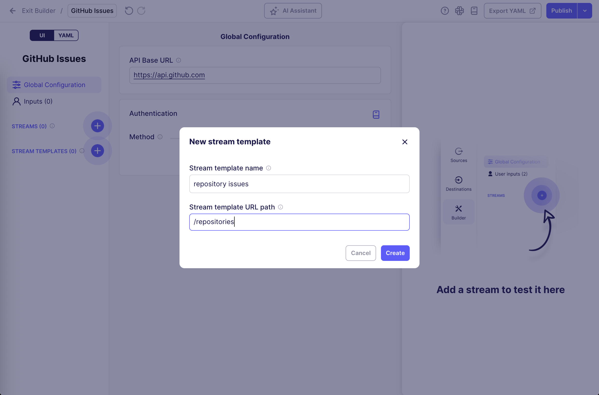
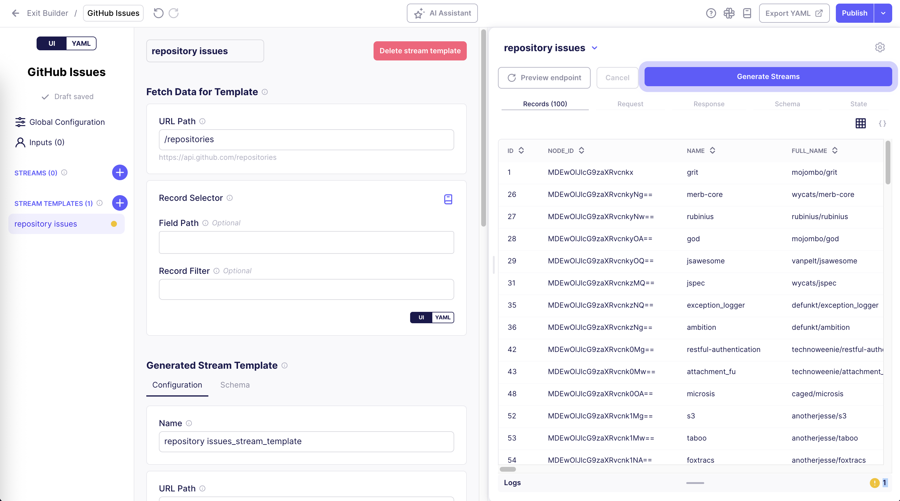

# Stream Templates

## Overview

Stream Templates allow you to generate multiple similar streams from a single template configuration.

## When to use Stream Templates

Stream templates are ideal for scenarios like:

- APIs that have similar endpoint structures for multiple resources.
- APIs where you need to fetch data from multiple regions or geographical areas using the same endpoint pattern.
- APIs that provide the same data structure for different resources (e.g. metrics for different entities).
- APIs that require a request to determine which endpoints or resources can be fetched dynamically.

Not everyone needs to use stream templates, but people who are comfortable with the Connector Builder can use them to save a lot of time building and maintaining connectors.

## How Stream Templates work

A stream template consists of two main sections:

1. **Produce Data for Template** - Fetches a list of items from an API endpoint or other data source.
2. **Generated Stream Template** - Defines how each generated stream will behave, using values from the items fetched in the first section.

## How Stream Templates Work

Stream templates use different approaches to produce data for generating multiple streams:

### HTTP-based Data Fetching

The most common approach fetches data via HTTP requests to determine what streams to generate. This uses the same request configuration interface as regular streams.

**Example use case:** Fetching a list of repositories from GitHub API to generate individual issue streams for each repository.

### Configuration-based Stream Generation

Generate streams based on values specified in the connector's configuration. This is useful when users can specify what data they want to sync through the connector setup.

**Example use case:** A connector where users specify a list of database tables in the configuration, and each table becomes a separate stream.

### Predefined Stream Variations

Generate a fixed set of streams based on predefined parameters in the connector. This approach creates consistent streams across all connector instances.

**Example use case:** A connector that always creates streams for a fixed set of data types or regions.

## Components Mapping

The Components Mapping configuration defines how data from the resolver is mapped to variables that can be used in the Generated Stream Template. This is configured through the UI form and includes:

### Field Path
A list of potentially nested fields indicating the full path where the value will be added or updated in the template. Supports:
- Simple field names: `["data"]`
- Nested fields: `["data", "records"]`
- Dynamic field names using interpolation: `["data", "{{ components_values.name }}"]`
- Wildcard patterns: `["*", "**", "name"]`

### Value
The dynamic or static value to assign to the field path. Can use interpolation to reference:
- `{{ components_values.field_name }}` - Data from the resolver
- `{{ config.field_name }}` - Values from the connector configuration
- `{{ stream_slice.field_name }}` - Stream slice information
- `{{ stream_template_config.field_name }}` - Stream template configuration

### Value Type
Optional specification of the expected data type (string, integer, boolean, etc.). If omitted, the type is inferred from the provided value.

### Create or Update
Boolean flag determining whether to create new paths if they don't exist (true) or only update existing paths (false). Defaults to false.

## Step-by-Step Setup Guide - GitHub Issues API

To demonstrate how stream templates work, we'll build a connector that fetches issues from multiple GitHub repositories.

To make this work, we need to fetch a list of repositories from the GitHub API, then use their IDs to fetch the issues for each repository.

### 0. Create a new connector in the Connector Builder

1. Start a new connector from scratch in the Connector Builder UI.
2. Set a name for your connector (e.g. `GitHub Issues`).
3. Set the **API Base URL** to `https://api.github.com`.

### 1. Create a new Stream Template

1. In the Connector Builder UI, click the `+` button next to **STREAM TEMPLATES**.
2. Enter a name for your template (e.g. `repository issues`).
3. Enter the URL path for fetching the repositories, which will be used to generate individual streams: `/repositories`.
4. Click **Create**.

### 2. Configure Produce Data for Template

In the **Produce Data for Template** section, define the endpoint that fetches the list of items that will be used to generate individual streams.

The URL path was already set to `/repositories` in the previous step, so we can click **Preview endpoint** in the right-hand testing panel to see what data is returned:

As shown in the **Records** tab, we get a list of repositories back, which we can use to generate individual streams in the next step.

### 3. Configure Generated Stream Template

In the **Generated Stream Template** section, define how each generated stream will be configured.

One stream will be generated for each record returned in the previous step. The record's values can be referenced using `{{ components_values.field_name }}`, where `field_name` is the name of any field in the record. This interpolation syntax allows you to dynamically configure each generated stream based on the data from the **Produce Data for Template** section.

1. In the **Name** input, enter `{{ components_values.full_name }} issues`, to name each generated stream after the repository it is fetching issues for.
2. In the **URL Path** input, enter `/repositories/{{ components_values.id }}/issues` to construct the correct URL path for fetching issues for the given repository.

### 4. Generate Streams

1. Now that both sections are configured, click **Generate Streams** to generate the streams from the template.
2. After generating the streams, you can expand the stream template in the left-hand sidebar to see the list of generated streams.
3. Click on one of the generated streams to see its configuration and test it to verify that it works as expected.

:::info

The generated stream configurations are read-only; to make changes to them, you must modify the parent Stream Template configuration, and re-generate the streams.

:::

<iframe width="800" height="464" src="https://www.loom.com/embed/38420a6e4c7c44a799abc3574e72ed28" frameborder="0" webkitallowfullscreen mozallowfullscreen allowfullscreen></iframe>

## Advanced Configuration Options

### Available UI Fields

The Connector Builder UI provides access to commonly used configuration fields for the **Produce Data for Template** section:

- **URL Path** - The API endpoint path for fetching template data
- **HTTP Method** - Request method (GET, POST, etc.)
- **Authentication** - Authentication configuration for the request
- **Record Selector** - How to extract records from the API response
- **Components Mapping** - Define how resolver data maps to template variables (available in advanced configurations)

Additional fields are available through the form interface, organized into logical sections like request configuration, response handling, and data mapping.

### YAML Mode for Advanced Features

For more complex configurations, you can switch to YAML mode to access the full range of declarative component schema options, including:

- Custom request headers and parameters
- Advanced pagination strategies
- Complex authentication flows
- Custom record filtering and transformation
- Error handling configuration
- Rate limiting and retry policies

### Interpolation Contexts

When using interpolation in your stream templates, you have access to several contexts:

- `{{ components_values.field_name }}` - Access fields from the **Produce Data for Template** records
- `{{ config.field_name }}` - Access connector configuration values
- `{{ stream_slice.field_name }}` - Access stream slice information
- `{{ stream_template_config.field_name }}` - Access stream template configuration

## Important Notes

- **Testing**: Always test both Preview endpoint and at least one of the generated streams before publishing.
- **Changes**: If you modify the stream template, you'll need to regenerate the streams to see the changes and test them again.
- **Generated streams limit**: You can limit the number of streams that the Builder generates in the settings at the top-right of the right-hand testing panel.
- **Troubleshooting**: If generated streams show warnings, fix issues in the template, regenerate, and test again.
- **References**: Use `{{ components_values.field_name }}` to access fields from the **Produce Data for Template** records.

## Limitations

- The UI provides access to commonly used configuration fields, but the full range of declarative component schema options is available only in YAML mode.
- Complex authentication flows, advanced pagination, and custom transformations may require switching to YAML mode.
- Generated streams inherit the template configuration and cannot be individually customized without modifying the parent template.
