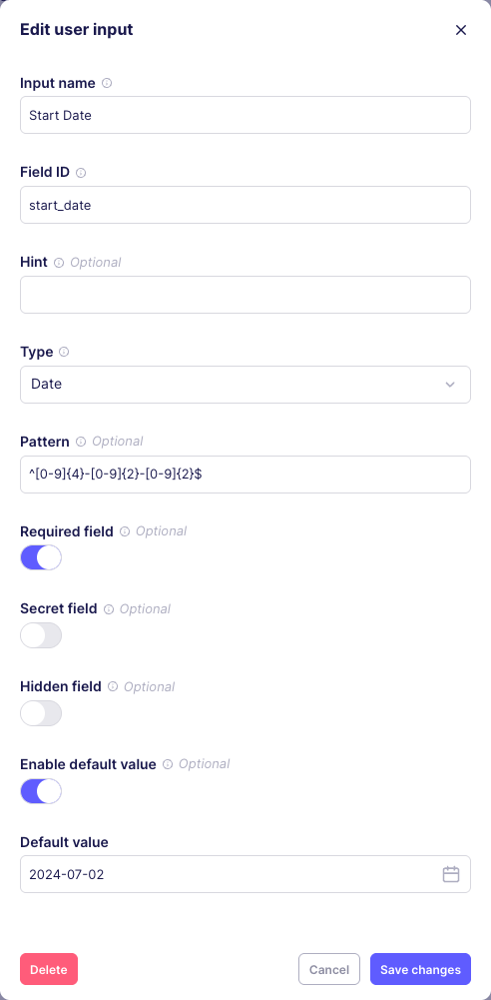
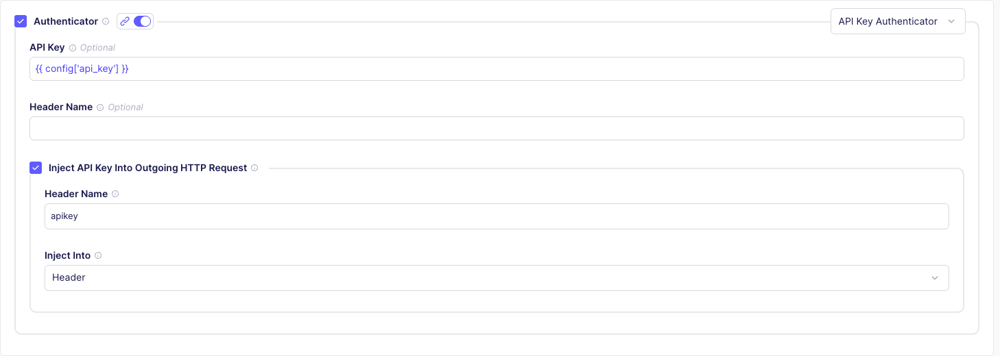
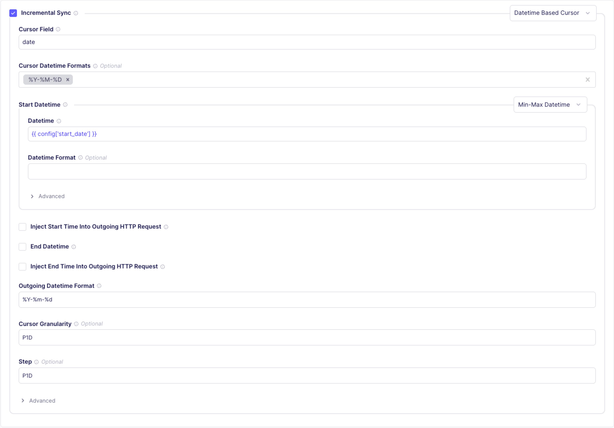
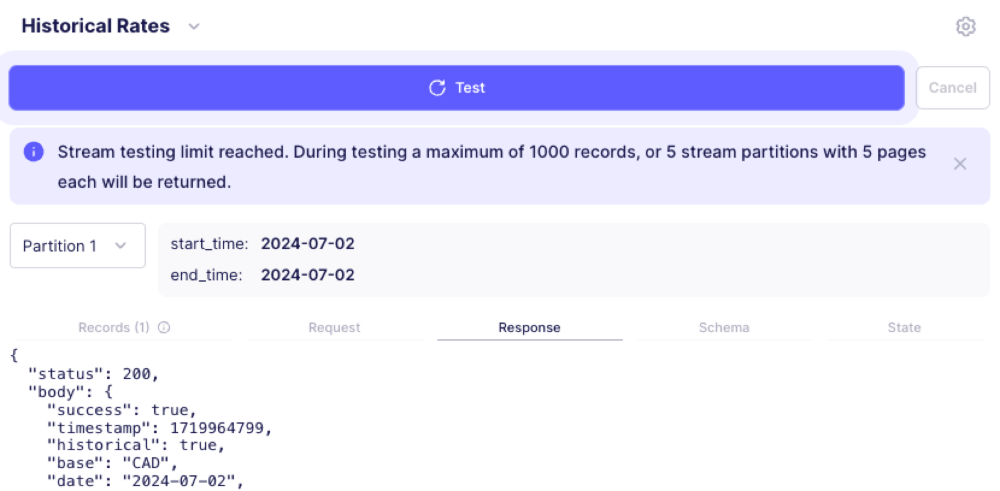

# Connector Builder tutorial

In this tutorial, you'll create an Airbyte connector using the Connector Builder UI to read and extract data from an API called the Exchange Rates API. The steps here are a foundation you can use to build connectors for any API you might be interested in. You can complete this tutorial in 30-45 minutes.

[Here's the API documentation](https://apilayer.com/marketplace/exchangerates_data-api) for the Exchange Rates API. Feel free to review it, but you don't need to know it well. In this tutorial, you'll read data from the following endpoints:

- Latest Rates
- Historical Rates

Your goal is to build and publish a source connector with two streams containing exchange rates from a base currency to many other currencies. The output schema of our streams will look like this:

```json title="JSON response schema"
{
  "base": "USD",
  "date": "2022-07-15",
  "rates": {
    "CAD": 1.28,
    "EUR": 0.98
    // ...
  }
}
```

## Step 1: Setup

### Set up an Exchange Rates API key

Generate a free API access key for the Exchange Rates API.

1. Visit https://apilayer.com

2. Sign into an existing account or sign up for a new account.

3. Once you're signed in, visit the [Exchange Rates API](https://apilayer.com/marketplace/exchangerates_data-api) and sign up for the Free tier. After signing up, an API key appears on the page.

4. Copy or save that API key.

### Set up Airbyte

You need access to Airbyte, if you don't already have it. Do one of the following:

- Sign up for [Airbyte Cloud](https://cloud.airbyte.com/)

- Run Airbyte [on your own infrastructure](../../using-airbyte/getting-started/oss-quickstart.md)

## Step 2: Initial configuration

### Create a Connector Builder project

<Arcade id="pHZZYzww0smsCHN9wuuS" title="Use the Connection Dashboard to diagnose unhealthy syncs" paddingBottom="calc(50% + 0px)" />

When developing a connector using the Connector Builder UI, Airbyte saves the current state of your work as a connector builder project. These projects are saved as part of your Airbyte workspace and are separate from your sources, destinations, and connections.

1. Visit the Airbyte UI in your browser.

2. Click **Builder** in the navigation.

3. Select **Start from scratch** to start a new connector builder project. If your workspace already has custom connectors, click **New custom connector**, then click **Start from scratch**.

4. Click **Skip and start manually** to skip using the AI Assistant.

5. Set the connector name to `Exchange Rates (Tutorial)`.

Your connector builder project is now set up.

### Setting up Global Configuration and Inputs

<Arcade id="YkuAGpCNlYucNB2Lp4NG" title="Use the Connection Dashboard to diagnose unhealthy syncs" paddingBottom="calc(50% + 0px)" />

On the **Global Configuration** page, you set up general settings applying to all streams: which streams to test when running a [check](/platform/understanding-airbyte/airbyte-protocol#check) operation, concurrency levels, and API budgets for manage rate limiting. For now, you don't have any global configurations to make.

On the **Inputs** page, you manage inputs that users of your connector have to fill in themselves. This is a great use case for an API key: you always need an API key, but everyone using the connector needs their own.

1. Click **Inputs**.

2. Click **Add new user input**.

3. Add the following values.

    1. Set **Input name** to "API key".

    2. Set **Field ID** to "api_key".

    3. Set **Type** to "String".

    4. Turn on **Secret field** and **Required field**, but leave **Hidden field** and **Enable default value** off.

4. Click **Create**.

5. Enter your API key for testing purposes. This API Key is not part of the connector itself. Instead, users of your connector will enter their own API key as part of the source configuration.

### Setting up and testing a stream

<Arcade id="phfYAWDplEnaU1eEV7p9" title="Use the Connection Dashboard to diagnose unhealthy syncs" paddingBottom="calc(50% + 0px)" />

Set up a new stream and tell your connector how to retrieve records from this source.

1. Next to **Streams**, click the Plus icon.

2. Set the name to **Rates**.

3. Set the **API Endpoint URL** to `https://api.apilayer.com/exchangerates_data/latest?base=USD`.

4. Set **HTTP Method** to `GET`.

5. Turn on **Authenticator**, then turn on the **Shared Authenticator** toggle so other streams in this authentication can use this.

    1. Set **API Key** to `{{ config['api_key'] }}`. This allows the stream to use the API key input you created earlier when you test it. If someone else uses your connector later, the connector uses the API key they input, not yours.

    2. Turn on **Inject API Key Into Outgoing HTTP Request**.

    3. Set **Inject Into** to `Header` and set **Header Name** to `apikey`.

6. Click **Test** to test the stream.

The API returns a response that looks like this.

```json
{
  "status": 200,
  "body": {
    "success": true,
    "timestamp": 1752629824,
    "base": "USD",
    "date": "2025-07-16",
    "rates": {
      "AED": 3.6725,
      "AFN": 69.470828,
      "ALL": 84.383278,
      "AMD": 386.552088,
      "ANG": 1.789699,
      "AOA": 917.000213,
      // ...
    }
  }
}
```

If this were a real sync, Airbyte would pass this record to your destination.

- The Request and Response tabs are helpful during development to see which requests and responses your connector will send and receive from the API.

- The Schema tab indicates the schema that was detected by analyzing the returned records. This detected schema is automatically set as the declared schema for this stream.

## Step 3: Stream configuration

In this step, you'll enhance your connector to accept more user inputs and return incremental data over time.

### Make the base currency configurable

<Arcade id="XLt48Lyju0wJhZZaa6wU" title="Use the Connection Dashboard to diagnose unhealthy syncs" paddingBottom="calc(50% + 0px)" />

The Exchange Rates API allows you to configure a different base currency using a query parameter. Make that a user input so anyone using this connector can input their preferred currency, the same as their API key.

1. In the navigation, click **Inputs** to go back to the user inputs screen.

2. Click **Add new user input**. Add a new input called `base`. Set **Type** to String again and turn off **Required field**.

3. Click **Create**. For testing purposes, set the base to `USD`, `CAD`, `GBP`, or any other currency code you prefer.

4. Return to your **Rates** stream.

5. Check **Query Parameters**.

6. Click **Add Key/Value Pair**.

7. Set **Key** to `base` and **Value** to `{{ config['base'] }}`.

8. Update **API Endpoint URL** to `https://api.apilayer.com/exchangerates_data/latest` so the base currency is no longer set explicitly with the URL.

9. Click **Test**. This time, the stream returns exchange rates in the currency you set in your `base` input.

Now, when making requests, your connector uses the currency the connector user specifies. You can repeat this pattern in many contexts, making your connectors more robust for different people in different contexts.

### Add incremental reads

Currently, your connector only reads the latest data, but it doesn't collect historical data. You can read the exchange rates for a specific date by querying the `"/exchangerates_data/{date}"` endpoint instead of `"/exchangerates_data/latest"`.

1. Go back to the **Inputs** page and create a new input.

    1. Set **Input name** to `Start Date`.

    2. Set **Type** to `Date`.

    3. Set **Pattern** to `^[0-9]{4}-[0-9]{2}-[0-9]{2}$`.

    4. Turn on **Required field** and **Enable default value**. Set the default value to any recent or meaningful date. Turn off the other toggles.

    5. Click **Save changes**.

    

2. Create a new stream and call it **Historical Rates**.

3. Set the **API Endpoint URL** to `https://api.apilayer.com/exchangerates_data/{{ config['start_date'] }}?base={{ config['base'] }}`.

    :::tip
    Notice how, unlike step 2, you're setting the `base` query parameter on the URL itself rather than creating a query parameter in the form below. Both options are fine, but the query parameter form feature is more powerful at scale.
    :::

4. Set up your Authenticator so it's identical to the `Rates` stream.

    

5. Turn on **Incremental Sync**.

    1. Set **Cursor Field** to `date`.

    2. Set **Cursor Datetime Formats** to `%Y-%M-%D`.

    3. Under **Start Datetime**, set **Datetime** to `{{ config['start_date'] }}`.

    4. Set **Outgoing Datetime Format** to `%Y-%m-%d`.

    5. Set **Cursor Granularity** to `P1D`.

    6. Set **Step** to `P1D`.

    

6. Click **Test**. Once you receive a response, you see a dropdown above the records view that lets you step through the daily exchange rates along with the requests performed to fetch this data. To speed up testing, the Connector Builder only shows you the first 5 partitions. During a real sync, Airbyte pulls data for the full range of time.

    

When used in a real connection, the connector will not request exchange rates for the same day multiple times. The date of the last fetched record will be stored and the next scheduled sync will pick up from where the previous one stopped.

## Step 4: Publish and sync

So far, you've configured this connector as part of a Connector Builder project. To use this connector in actual connections, you need to publish it. This captures the current state of the configuration and makes the connector available as a Custom Connector within the current Airbyte workspace.

1. Click **Publish**.

2. Choose **Publish to organizaton**

3. Give your connector a name and description.

4. Click **Publish**.

Congratulations! You now have a production-ready Exchange Rates connector.

## What's next?

You, or someone in your organizaton, can set up your connector [as a source](/platform/using-airbyte/getting-started/add-a-source) and start syncing data with it at any time.

This tutorial only covers some basic concepts, but there are many more features in the Connector Builder. Learn more on the following pages:

- [AI Assistant](/platform/connector-development/connector-builder-ui/ai-assist)
- [Authentication](/platform/connector-development/connector-builder-ui/authentication/)
- [Record processing](/platform/connector-development/connector-builder-ui/record-processing/)
- [Pagination](/platform/connector-development/connector-builder-ui/pagination/)
- [Incremental sync](/platform/connector-development/connector-builder-ui/incremental-sync/)
- [Partitioning](/platform/connector-development/connector-builder-ui/partitioning/)
- [Error handling](/platform/connector-development/connector-builder-ui/error-handling/)
- [Stream templates](/platform/connector-development/connector-builder-ui/stream-templates/)
- [Asynchronous job streams](/platform/connector-development/connector-builder-ui/async-streams/)

The Connector Builder supports a broad range of APIs, but not every API can be consumed by the Connector Builder. If you need more flexibility, consider using the [Python CDK](/platform/connector-development/cdk-python/) to build a connector with additional features.
