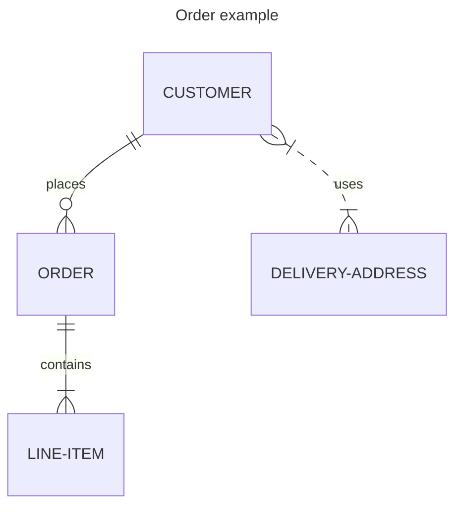
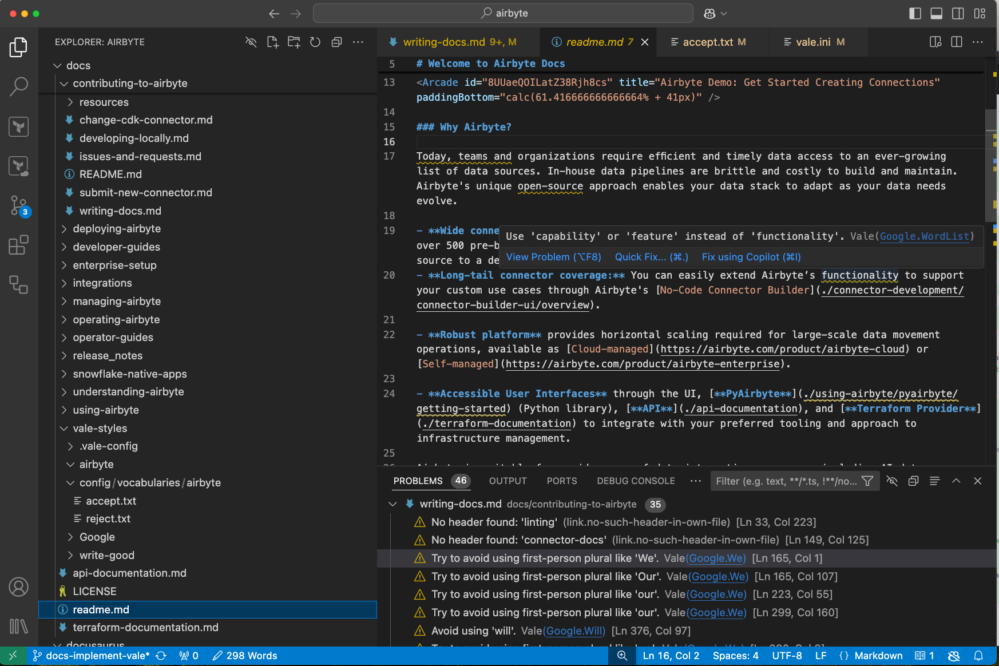

import Tabs from "@theme/Tabs";
import TabItem from "@theme/TabItem";

# Updating documentation

Everyone is welcome to contribute to Airbyte's documentation.

Airbyte's documentation is in the [Airbyte repository](https://github.com/airbytehq/airbyte/tree/master/docs) on GitHub. It's published at [docs.airbyte.com](https://docs.airbyte.com/) using [Vercel](https://vercel.com). Connector docs are also rendered within Airbyte itself when setting up new connectors. The docs are built on [Docusaurus](https://docusaurus.io/). Content is written in [Markdown](https://guides.github.com/features/mastering-markdown/) and all topics are in the `/docs` folder. Configuration files and previously-released versions of platform docs are in the `/docusaurus` folder.

## Open source contributions welcome

Open source contributors are a vital part of Airbyte. Technical writers are welcome to use any content you author in your portfolio.

If you're interested in becoming a regular contributor, join Airbyte's [Contributor program](https://airbyte.com/community/contributor-program). Airbyte pays for high-quality work on select issues. AI-generated content isn't eligible for the contributor program. You're welcome to use AI as a research tool and editing partner, but paid submissions must be principally human-generated.

## Before you start

Before you contribute, familiarize yourself with these concepts.

### Read Airbyte's code of conduct

Read the Airbyte Community [code of conduct](/platform/community/code-of-conduct).

### Learn Docusaurus basics

Even if you've never used it before, most developers and technical writers find Docusaurus intuitive.

- [Markdown basics](https://guides.github.com/features/mastering-markdown/)
- [Docusaurus 5-minute tutorial](https://tutorial.docusaurus.io/)

### Style guide

Follow the [Google developer documentation style guide](https://developers.google.com/style/highlights). It's a widely adopted style guide with good examples and easy-to-follow rules. You can [lint your content with Vale](#linting) to ensure style compliance.

### Find a good first issue

The Docs team maintains a list of [good first issues](https://github.com/airbytehq/airbyte/issues?q=is%3Aopen+is%3Aissue+label%3Aarea%2Fdocumentation+label%3A%22good+first+issue%22) for new contributors. If you'd like to start a complex documentation project, you can create or comment on a [GitHub issue](https://github.com/airbytehq/airbyte/issues) and tag [@ian-at-airbyte](https://github.com/ian-at-airbyte) to decide on an approach together.

## Edit files directly on GitHub

To make minor changes like fixing typos or editing a single file, you can edit the file directly in your browser.

1. Click **Edit this page** at the bottom of any page on [docs.airbyte.com](https://docs.airbyte.com/). You'll be taken to the GitHub editor.
2. Edit the file directly on GitHub and open a Pull Request ([help](https://docs.github.com/en/repositories/working-with-files/managing-files/editing-files)).

## Edit files on your local machine

If you're making substantial documentation changes, it's best to clone the repository and work locally so you can test as you work.

### Prerequisites

Install these tools on your local machine, first.

1. [Node.js](https://nodejs.org/en/learn/getting-started/how-to-install-nodejs)
2. [`pnpm`](https://pnpm.io/installation)
3. A tool to work with GitHub, like [Git](https://git-scm.com/) or [GitHub Desktop](https://github.com/apps/desktop)
4. A code editor, like [Visual Studio Code](https://code.visualstudio.com/).

Optionally:

1. [Vale](https://vale.sh/docs/install) and [MarkDownLint-cli2](https://github.com/DavidAnson/markdownlint-cli2) so you can lint your content.

### Fork and clone the repo

1. [Fork](https://docs.github.com/en/github/getting-started-with-github/fork-a-repo) the [Airbyte repo](https://github.com/airbytehq/airbyte).

2. Clone the fork on your local machine.

   ```bash
   git clone git@github.com:{YOUR_USERNAME}/airbyte.git
   cd airbyte
   ```

   Or

   ```bash
   git clone https://github.com/{YOUR_USERNAME}/airbyte.git
   cd airbyte
   ```

3. Create a feature branch.

   ```bash
   git checkout -b {YOUR_USERNAME}/{FEATURE/BUG}
   ```

   For example:

   ```bash
   git checkout -b jdoe/source-stock-api-stream-fix
   ```

### Set up your environment

Open a terminal and install the docs locally.

```bash
cd docusaurus
pnpm install
```

To see changes as you make them in a development build:

1. Run:

   ```bash
   pnpm start
   ```

2. Navigate to [http://localhost:3005/](http://localhost:3005/). Whenever you make and save changes, you will see them reflected in the server. To stop the running server, press <kbd>Ctrl</kbd>+<kbd>C</kbd> in the terminal.

To create an optimized production build that does not update automatically:

1. Run:

   ```bash
   pnpm build
   pnpm serve
   ```

2. Navigate to [http://localhost:3000/](http://localhost:3000/) to see your changes. To stop the running server, press <kbd>Ctrl</kbd>+<kbd>C</kbd> in the terminal.

### Author content

[Follow the basic GitHub workflow](https://docs.github.com/en/get-started/quickstart/contributing-to-projects/) to update content: branch, write, commit, pull request, merge.

## Content templates

Every page must have a purpose. Bad documentation often has origins in:

- Poorly defined goals, or no goal
- Failed execution of otherwise good goals
- The intimidating effect of a blank page

The [Good Docs Project](https://www.thegooddocsproject.dev/) maintains a collection of open source docs templates you can use to help you write and update articles. Here are common patterns in Airbyte's docs.

| Purpose         | Overview                                                                                            | Template                                                                  |
| --------------- | --------------------------------------------------------------------------------------------------- | ------------------------------------------------------------------------- |
| Concept         | Explain a concept, context, or background information about a product or its features.              | [Template](https://gitlab.com/tgdp/templates/-/tree/main/concept)         |
| How-to          | A concise set of numbered steps to do one task with the product.                                    | [Template](https://gitlab.com/tgdp/templates/-/tree/main/how-to)          |
| Tutorial        | Instructions to set up an example project intended for hands-on learning.        | [Template](https://gitlab.com/tgdp/templates/-/tree/main/tutorial)        |
| Troubleshooting | Common problems experienced by users, an explanation of the causes, and steps to resolve the issue. | [Template](https://gitlab.com/tgdp/templates/-/tree/main/troubleshooting) |
| Reference       | Specific, in-depth details about a particular topic.                                                | [Template](https://gitlab.com/tgdp/templates/-/tree/main/reference)       |
| Release note    | Communicate new features, improvements, bug fixes, and known issues about a product.                | [Template](https://gitlab.com/tgdp/templates/-/tree/main/release-notes)   |

[View all templates](https://www.thegooddocsproject.dev/template).

:::important
These templates can only be used for platform docs. Docs for connectors have their own template. See [Write connector docs](#connector-docs) for more details.
:::

## Write connector docs {#connector-docs}

If you're writing docs for a data source or destination, there are special rules you must follow. See the [Connector Documentation Guide](../connector-development/writing-connector-docs.md). Platform documentation is less formulaic.

## Multiple instances and versions

The docs site uses [multiple instances](https://docusaurus.io/docs/docs-multi-instance). Some of these instances [use versioning](https://docusaurus.io/docs/versioning) and some do not. This pattern allows us to maintain multiple smaller doc sets that each have their own properties and configurations, and which are aggregated into a single site at build time. The rationale behind this is that some content benefits from allowing users to view different versions of the docs while other content does not.

Currently, the site has four instances, but Airbyte could add more instances later.

- Home (not versioned - this is our home page)
- Platform (versioned)
- Connectors (not versioned)
- Release notes (not versioned)

For most contributors, this reality isn't particularly relevant to producing docs. However, there is one important concept to keep in mind.

When you update content for a versioned set of docs, your changes go into what Docusaurus calls the Next version: the version of Airbyte that isn't released yet, and which users can access by selecting "Next" using the version picker in the navigation. Docs for previously released versions of Airbyte aren't updated. If you are unable to see your changes reflected on the site, you're probably looking at docs for a version that was already released. Switch to the Next version to see your changes.

You can still update documentation for released versions, but you need to make these changes to the released files. Docusaurus stores these in `/docusaurus/<instance>_versioned_docs`.

For help creating and managing versions, see [Release and manage documentation versions](#doc-versions).

## Common patterns and components

Since the docs site is based on Docusaurus, it inherits all of Docusaurus' capabilities. You should be aware of some Airbyte-specific elements. Most of these customizations can be combined together.

### Tabs

Use tabs to display mutually exclusive concepts in a concise way. See [Tabs](https://docusaurus.io/docs/markdown-features/tabs).

:::note
We maintain a separate `Tabs` implementation to support rendering tabs in Airbyte's in-app documentation. Airbyte's in-app renderer creates some additional rules that aren't necessarily true in other Docusaurus implementations:

- Always use empty lines to separate different Markup elements (tags, paragraphs, lists, etc.)
- Do not indent `TabItem` tags and their content according to normal HTML conventions. Different Markdown rendering tools handle indented tags inconsistently.

:::

### Code blocks

Code blocks are used to represent sample code and command line input and output with easy-to-read syntax highlighting. See [Code blocks](https://docusaurus.io/docs/markdown-features/code-blocks).

Not all languages are turned on. If syntax highlighting doesn't work for your language, add it to `docusaurus/docusaurus.config.js`'s `module.exports.themeConfig.prism.additionalLanguages` property. Then, restart your local server to test the new language.

### Admonitions (notes, warnings, tips, etc.)

Docusaurus has custom markup to create a note, warning, tip, danger, or info block. See [Admonitions](https://docusaurus.io/docs/markdown-features/admonitions).

### Expandable details panels

Details panels are a great way to render content that's not relevant to everyone, or to condense long pages. See [Details](https://docusaurus.io/docs/markdown-features#details).

### Product badges

Some platform features are reserved for certain Airbyte products. To avoid confusion and indicate which products a topic applies to, pages can display badges in a prominent location under the title. [This page is an example](../using-airbyte/getting-started/oss-quickstart).

To enable badges, include `products` in the Markdown metadata. The following values are possible, and you can combine them as needed.

- `all`: Self-Managed Community, Self-Managed Enterprise, and Cloud (doesn't include Cloud Teams or Embedded)
- `oss-community`: Self-Managed Community only
- `oss-enterprise`: Self-Managed Enterprise only
- `cloud`: Cloud only
- `cloud-teams`: Cloud Teams only
- `embedded`: Embedded only (hidden if not specified - there is no off state for the Embedded badge)

In this example, the Self-Managed Community badge is highlighted, and Cloud and Self-Managed Enterprise badges are grayed out.

```markdown
---
products: oss-community
---

# This topic is only for Self-Managed Community

Some text.
```

In this example, the Self-Managed Community badge is grayed out, but the Cloud Teams and Self-Managed Enterprise badges are highlighted.

```markdown
---
products: cloud-teams, oss-enterprise
---

# This topic is only for Cloud Teams and Self-Managed Enterprise

Some text.
```

### Diagrams

The [Mermaid](https://mermaid.js.org/) plugin runs on our Docusaurus instance. If possible, you should create diagrams with Mermaid, because they're easier to build, maintain, and translate. They're also more suitable for assistive technologies like screen readers.

:::warning
Connector docs do **not** support Mermaid. Mermaid can also be unsuitable for complex diagrams, where you need more visual control. If Mermaid can't meet your needs, create an SVG diagram or use Whimsical. Airbyte employees have access to a paid Whimsical account with Airbyte's color palette built in.
:::

Here is an example of how to create a Mermaid diagram:

Add a code block to your Markdown and specify `mermaid` as the language.

````md

````

This produces the following diagram.


The [Mermaid documentation](https://mermaid.js.org/intro) goes into more depth.

### Update the sidebar

If you're adding a new file, removing a file, or moving things around, update the appropriate sidebar.

Each instance in the docs has its own sidebar. Make sure you add topics to the sidebar appropriate to your change.

- Add platform docs in `/docs/platform` and add an entry for them to [`docusaurus/sidebar-platform.js`](https://github.com/airbytehq/airbyte/blob/master/docusaurus/sidebar-platform.js).
- Add connector docs in `/docs/integrations`. Docusaurus automatically adds files in this directory to [`docusaurus/sidebar-connectors.js`](https://github.com/airbytehq/airbyte/blob/master/docusaurus/sidebar-connectors.js), so you don't need to do anything else.
- Add release notes in `/docs/release_notes` and add an entry for them to [`docusaurus/sidebar-release_notes.js`](https://github.com/airbytehq/airbyte/blob/master/docusaurus/sidebar-release_notes.js).

### Add a redirect

If you're moving or renaming a page, you should add a redirect to its new location. If you're deleting a page, you should add a redirect to the most relevant new file, like a replacement topic or a parent page.

Redirects are managed by Vercel. To add or change a redirect, open the [`docusaurus/vercel.json`](https://github.com/airbytehq/airbyte/blob/master/docusaurus/vercel.json) file and add an entry from the old path to the new path. Vercel.json supports complex redirects using wildcards and regular expressions, if necessary. For help, see [Configuring projects with vercel.json](https://vercel.com/docs/project-configuration#redirects).

You can test redirects on the test build Vercel generates after you submit a pull request.

:::note
Redirect rules with trailing slashes in them may not function correctly. Vercel.json automatically redirects trailing slashes to the same URL without a trailing slash. You don't need to handle trailing slashes and can assume they never exist.
:::

### Document a code module

If you're adding a README to a code module, make sure the README has the following components:

- A brief description of the module
- Development prerequisites (like which language or binaries are required for development)
- How to install dependencies
- How to build and run the code locally and via Docker
- Any other information needed for local iteration

:::tip
AI tools like ChatGPT and GitHub Copilot are good at describing code. For open source repositories, you might find it helpful to point one to your code module and ask it to generate a first draft for you. Airbyte employees working on a proprietary repository should follow Airbyte's AI usage policies.
:::

## Lint your content {#linting}

The documentation runs two linters, Vale and MarkDownLint. Vale lints for style, writing, and grammar. MarkDownLint lints for MarkDown structure. For example, Vale tells you when you use passive language and MarkDownLint tells you that you've skipped a heading level. Together, these linters provide broad protection against most common readability, accessibility, and rendering problems.

:::note
Vale and MarkDownLint are newly implemented. They might still generate false positives or false negatives. Currently, Airbyte doesn't enforce them on pull requests. This might happen in the future. For now, just do your best to comply with the linters' recommendations.
:::

### Lint with Vale

Airbyte uses Vale to promote standardization and minimum quality for docs content. Vale is an open source command-line tool that brings code-like linting to prose. It's not a general-purpose writing aid or an AI. It simply automates the identification of non-compliance with the style guide, principles for good writing, and other rules Airbyte defines as needed.

#### How Vale works

A configuration file, `//docusaurus/vale.ini`, controls Vale at the highest level. This file specifies the location of Vale's style rules, libraries, vocabularies, and other resources. Those styles and rules exist in `//docs/vale-styles`. Some of them are Airbyte-specific, but most rules come from the [Google](https://github.com/errata-ai/Google) and [Write Good](https://github.com/errata-ai/write-good) libraries.

The repository imports those libraries from an external source. Don't modify them, or a future update may overwrite your modifications. If you want to improve these rules, modify `//docs/vale-styles/airbyte` or our vocabularies in `//docs/vale-styles/config/airbyte`.

#### Install Vale

The easiest way to install Vale is with a package manager. This ensures Vale is available in your PATH and allows you to keep up to date with new releases. For more options, see [Vale's documentation](https://vale.sh/docs/install).

1. Install Vale.

   <Tabs>
   <TabItem value="Windows" label="Windows" default>
      ```bash
      choco install vale
      ```
   </TabItem>
   <TabItem value="Mac" label="Mac">
      ```bash
      brew install vale
      ```
   </TabItem>
   <TabItem value="Linux" label="Linux">
      ```bash
      snap install vale
      ```
   </TabItem>
   </Tabs>

2. Sync Vale to get the latest style packages.

   ```bash title="bash"
   vale sync
   ```

#### Run Vale

You can run Vale in a command line tool or you can install an extension for most common code editors.

##### Command line tool

1. Go to the Docusaurus directory.

   ```bash
   cd docusaurus
   ```

2. Lint your content. You can lint a single file or an entire directory and its subdirectories.

   - To lint a file, type the relative path to the file.

      ```bash
      vale ../docs/myfolder/myfile.md
      ```

   - To lint a folder, type the relative path to that folder and end with a slash.

      ```bash
      vale ../docs/myfolder/
      ```

   - For more command-line tool help, see [Vale's docs](https://vale.sh/docs/cli).

##### In your code editor

Vale has extensions for many popular code editors. For the complete list, see [their docs (under Integrations)](https://vale.sh/docs).

For example, if you use Visual Studio Code, you can install the [Visual Studio Code extension](https://github.com/chrischinchilla/vale-vscode). Once the extension runs, Visual Studio Code lists violations in the Problems tab, and highlights them on your screen as you type as if they were typos. You may need to adjust your [settings for Vale](https://code.visualstudio.com/docs/editor/settings) to specify the location of the `vale.ini` file on your computer.



### Lint with MarkDownLint

MarkDownLint is an open source, command-line library. It lints MarkDown files against common markup and structural issues that can confuse MarkDown interpreters and readers. Since Airbyte publishes docs to multiple contexts that may not interpret MarkDown the same way, this tool helps you write documentation to the CommonMark standard and maximize the likelihood that your content renders properly everywhere it's needed.

#### Use markdownlint-cli2

For those who prefer command line tools, **markdownlint-cli2** is the recommended way to work with MarkDownLint. To install markdownlint-cli2, follow the installation [instructions in GitHub](https://github.com/DavidAnson/markdownlint-cli2?tab=readme-ov-file#install). On a Mac:

```bash
brew install markdownlint-cli2
```

To lint files:

   - To lint a single file:

      ```bash
      markdownlint-cli2 "./docs/myfolder/myfile.md"
      ```

   - To lint a single directory but not its subdirectories:

      ```bash
      markdownlint-cli2 "./docs/myfolder/*.md"
      ```

   - To lint a directory and its subdirectories recursively:

      ```bash
      markdownlint-cli2 "./docs/folder/**/*.md
      ```

   - To auto-fix issues, add a `--fix` modifier. MarkDownLint can fix most issues on its own, but it might not fix them all.

      ```bash
      markdownlint-cli2 --fix "../docs/myfolder/*.md"
      ```

For full usage details, see the tool's [GitHub readme](https://github.com/DavidAnson/markdownlint-cli2?tab=readme-ov-file#use).

#### Use the Visual Studio Code extension

If you use Visual Studio Code, the optimal way to work with MarkDownLint is to [install the extension](https://marketplace.visualstudio.com/items?itemName=DavidAnson.vscode-markdownlint). Once you enable the extension, Visual Studio Code lists rule violations in the Problems tab, and highlights them on your screen as you type, as if they were typos.

You may need to adjust your [settings for MarkDownLint](https://code.visualstudio.com/docs/editor/settings) and specify the location of the configuration file as `/docusaurus/.markdownlint.jsonc`.

You can use the Visual Studio Code extension and `markdownlint-cli2` at the same time.

#### Rule configuration

Airbyte disables a handful of default MarkDownLint rules because the docs intentionally violate them or they're not worth enforcing. These configurations are in `//docusaurus/.markdownlint.jsonc`. If you need to modify these configurations, this configuration file isn't that well documented, but the [Visual Studio Code extension](https://marketplace.visualstudio.com/items?itemName=DavidAnson.vscode-markdownlint) seems to provide the best explanation of how it works.

#### Full documentation

See [the GitHub project](https://github.com/DavidAnson/markdownlint?tab=readme-ov-file) for full details about using the different versions of MarkDownLint.

## Create a pull request

When you're ready to submit your work, create a pull request into `master`.

### Review and approval

New pull requests with docs changes are automatically submitted to [#docs-prs](https://airbytehq-team.slack.com/archives/C075JMUK2FJ) in Airbyte's internal Slack. [@ian-at-airbyte](https://github.com/ian-at-airbyte) monitors this feed. If you want a specific person to review your work, add them as a reviewer. If not, you don't need to tag anyone, but you must wait for at least one Airbyte employee to explicitly approve your pull request before anyone can merge it.

Vercel builds a preview of the updated docs site automatically. If you're a community contributor, someone from Airbyte must authorize that build before it proceeds.

:::tip Collaboration tip
If you're not finished but want to collaborate with others, create a draft pull request. Vercel still builds your docs site, creating a preview others can see, and you can continue to work on your branch to incorporate feedback.
:::

:::note
Before Airbyte accepts your contribution, you need to sign the Contributor License Agreement (CLA). By signing a CLA, Airbyte can ensure that the community is free and confident in its ability to use your contributions. GitHub prompts you to sign the CLA when you open your first pull request.
:::

## Deploy the documentation site

When someone merges documentation changes into the `master` branch, Vercel deploys updated docs automatically. This takes 5-10 minutes and needs no human intervention.

## Release and manage documentation versions {#doc-versions}

:::info Airbyte employees only
This information is only relevant to Airbyte employees who release new versions of Airbyte.
:::

When you release a new version of Airbyte, make a new docs version of the docs to match it.

### Create a new major version

When you release a new major version of Airbyte (for example, 2.0, 2.1, etc.), generate a documentation version for it. This process generates a "frozen" set of the docs based on their state at that point in time. Once the version exists, you _can_ still update those docs, but changes you make don't carry forward to future versions.

1. In GitHub, create a new branch off `master`.

2. Open a terminal, change to the docusaurus folder, and run the command to generate a version. `<version>` can be a number like `2.0` or anything else you like. Be consistent with Airbyte and other versions on the docs site. Whatever string you enter here later appears in the docs UI.

      ```bash
      cd docusaurus
      pnpm run docusaurus docs:version:platform <version>
      ```

      Docusaurus automatically does three things at this point. It:

      - Defines the existence of that version in the `/docusaurus/platform_versions.json` file
      - Creates a physical copy of the versioned platform docs in `/docusaurus/platform_versioned_docs`
      - Creates a physical copy of the versioned platform sidebar in `/docusaurus/platform_versioned_sidebars`

3. Test your build locally to make sure everything looks as expected. Verify:

   - The docs site builds locally
   - Your local Docusaurus build doesn't report new broken links
   - The version selector in the navigation contains your new version

4. Create a pull request, get an approval, wait for CI checks to pass, and merge your changes into `master`.

### Create a new minor version

Typically, you don't generate a docs version for patch releases (2.1.1). The only exception is if there is an actual substantive change in that patch and it needs separate documentation. If you actually need to do this, the process is the same as a major version, described in the preceding section.

### Delete a version

Delete old documentation versions when they're no longer useful, like when all users have upgraded past that version. Deleting old versions speeds up docs builds and removes irrelevant information from the internet so it doesn't confuse people.

1. Remove the version from the array in the `/docusaurus/<instance>_versions.json` file.
2. Delete the versioned docs directory from `/docusaurus/<instance>_versioned_docs`.
3. Delete the versioned sidebar file from `/docusaurus/<instance>_versioned_sidebars`.

### Update an existing version

In almost all cases, you work on docs for the Next version. Sometimes, though, you need to update something you've already released.

Though released documentation versions are "frozen," they're made of normal files, and you can still edit them like you would anything else. When you do, those changes only apply to the version you are editing. You can't automatically carry them forward to future versions. For this reason, it's best not to make major changes to released docs versions. Focus on making the next version better and only updated released versions when it's unavoidable.

Find content files in `/docusaurus/<instance>_versioned_docs` and sidebars in `/docusaurus/<instance>_versioned_sidebars`.

### Regenerate an existing version

From time to time, you may need to regenerate an existing version of the docs from the next version. For example, you follow a major version release with a critical patch, and that patch requires updating all docs for that version. Rather than trying to update both the next and current docs versions, you could potentially just regenerate the versioned docs using the current state of the docs.

1. Follow the preceding steps to delete that version.
2. Follow the preceding steps to create that version.

When you do this, you run the risk of an unintended change leaking into this version of the docs. For example, a documented feature from a future, unreleased version of Airbyte. Pay attention to the diff in GitHub and, if necessary, expunge anything from the versioned docs files that shouldn't be there.
