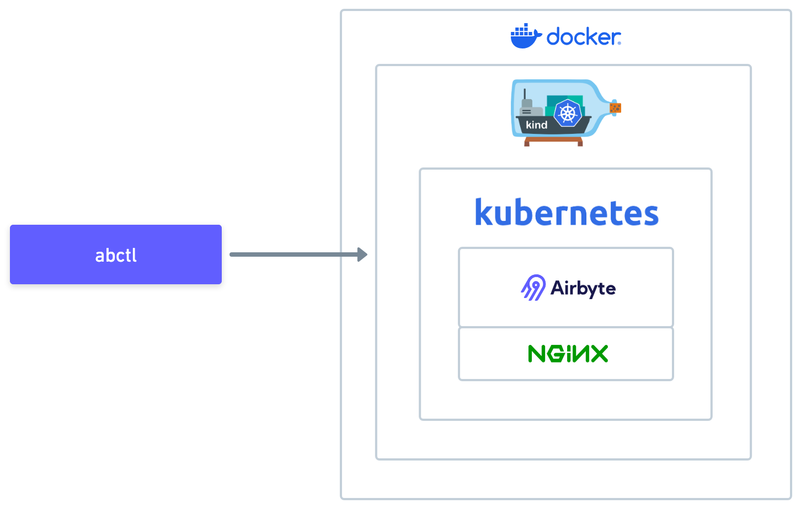

import Tabs from "@theme/Tabs";
import TabItem from "@theme/TabItem";
import { FontAwesomeIcon } from "@fortawesome/react-fontawesome";
import { faWindows } from "@fortawesome/free-brands-svg-icons";

# abctl

abctl is Airbyte's open source command line tool to create and manage local instances of Airbyte running in Docker.

## Overview of abctl

Airbyte runs on Kubernetes. People run Airbyte in a diverse set of environments like a local machine, a bare metal server, or a virtual machine. However, you might not be running Kubernetes and might not even know much about it. abctl makes it easy to run Airbyte anywhere Docker is running with just a few commands.

### When to use abctl

You use abctl to run Airbyte on a machine that isn't running a Kubernetes cluster, but is running Docker. This could be your local machine, a bare metal server, or a virtual machine. Generally, you do *not* use abctl to manage enterprise deployments, which typically use dedicated Kubernetes infrastructure.

abctl is not relevant to Airbyte Cloud.

### What abctl does

abctl uses [kind](https://kind.sigs.k8s.io/) to create a [Kubernetes](https://kubernetes.io/) cluster inside a [Docker](https://www.docker.com/) container. Then, it uses [helm](https://helm.sh/) to install (or upgrade to) the latest Airbyte and [NGINX Ingress Controller](https://docs.nginx.com/nginx-ingress-controller/) helm charts. It also helps you manage and understand that infrastructure.



## Before you start

Before you use abctl, install Docker Desktop on your machine: [Mac](https://docs.docker.com/desktop/install/mac-install/), [Windows](https://docs.docker.com/desktop/install/windows-install/), [Linux](https://docs.docker.com/desktop/install/linux-install/).

## Install abctl

To install abctl, follow the instructions for your operating system.

<Tabs defaultValue="abctl-curl">

<TabItem value="abctl-curl" label="curl">

Use curl to install abctl.

1. Open a terminal and run the following command.

    ```shell
    curl -LsfS https://get.airbyte.com | bash -
    ```

2. If your terminal asks you to enter your password, do so.

When installation completes, you'll see `abctl install succeeded.`

</TabItem>
<TabItem value="abctl-go" label="Go">

Use [go install](https://go.dev/ref/mod#go-install) to install abctl.

Open a terminal and run the following command.

```bash
go install github.com/airbytehq/abctl@latest
```

</TabItem>
<TabItem value="abctl-brew" label="Homebrew">

Use [Homebrew](https://brew.sh/) to install abctl.

1. Install Homebrew, if you haven't already.

2. Run the following commands after Homebrew is installed.

    ```bash
    brew tap airbytehq/tap
    brew install abctl
    ```

3. Keep abctl up to date with Homebrew, too.

    ```bash
    brew upgrade abctl
    ```

</TabItem>
<TabItem value="abctl-linux" label="GitHub - Linux">

1. Verify your processor architecture.

    ```bash
    uname -m
    ```

    If the output is `x86_64`, you'll download the **linux-amd64** release. If the output is `aarch64` or similar, you'll download the **linux-arm64** release.

2. Download the file that is compatible with your machine's processor architecture

    <a class="abctl-download button button--primary" data-architecture="linux" href="https://github.com/airbytehq/abctl/releases/latest" target="_blank" download>Latest Linux Release</a>

3. Extract the archive. This creates a directory named `abctl`, which contains the executable and other needed files.

    ```bash
    tar -xvzf {name-of-file-downloaded.linux-*.tar.gz}
    ```

4. Make the extracted executable accessible. This allows you to run `abctl` as a command.

    ```bash
    chmod +x abctl/abctl
    ```

5. Add `abctl` to your PATH. This allows you to run `abctl` from any directory in your terminal.

    ```bash
    sudo mv abctl /usr/local/bin
    ```

6. Verify the installation. If this command prints the installed version of abctl, you can now use it to manage a local Airbyte instance.

```bash
abctl version
```

</TabItem>
<TabItem value="abctl-windows" label="GitHub - Windows">

1. Verify your processor architecture.

    1. Press <kbd><FontAwesomeIcon icon={faWindows} /> Windows</kbd> + <kbd>I</kbd>.

    2. Click **System** > **About**.

    3. Next to **Processor**, if it says `AMD`, you'll download the **windows-amd64** release. If the output is `ARM` or similar, you'll download the **windows-arm64** release.

2. Download the latest release of `abctl`.

    <a class="abctl-download button button--primary" data-architecture="windows" href="https://github.com/airbytehq/abctl/releases/latest" target="_blank" download>Latest Windows Release</a>

3. Extract the zip file to a destination of your choice. This creates a folder containing the abctl executable and other required files. Copy the filepath because you'll need this in a moment.

4. Add the executable to your `Path` environment variable.

    1. Click <FontAwesomeIcon icon={faWindows} /> **Start** and type `environment`.

    2. Click **Edit the system environment variables**. The System Properties opens.

    3. Click **Environment Variables**.

    4. Find the Path variable and click **Edit**.

    5. Click **New**, then paste the filepath you saved in step 3.

    6. Click **OK**, then click **OK**, then close the System Properties.

5. Open a new Command Prompt or PowerShell window. Changes to your Path variable only take effect in a new Window.

6. Verify abctl is installed correctly. If this command prints the installed version of abctl, you can now use it to manage a local Airbyte instance.

    ```bash
    abctl version
    ```

</TabItem>
</Tabs>

## Install and manage local Airbyte instances

This section shows you how to use abctl. It's not a step-by-step guide to deploy Airbyte. See Airbyte's [deployment guides](./deploying-airbyte.md) for a complete explanation of the deployment process.

### Install or update Airbyte

To install or update Airbyte, run:

```bash
abctl local install
```

Optional flags are available and you can combine them in powerful ways. For example, you can create a Kubernetes secret and customize your Airbyte installation using a yaml file to make use of that secret.

```bash
abctl local install --secret YOUR_SECRET --values values.yaml
```

For a list of all flags, see the [full reference](#reference).

:::note
Depending on your internet speed, abctl local install may take in excess of 20 minutes.
:::

### Get information about your Airbyte instance

If an Airbyte installation exists, you can get critical information about that installation.

```bash
abctl local status
```

For example:

```bash
$ abctl local status
Existing cluster 'airbyte-abctl' found
Found helm chart 'airbyte-abctl'
  Status: deployed
  Chart Version: 0.422.2
  App Version: 0.63.15
Found helm chart 'ingress-nginx'
  Status: deployed
  Chart Version: 4.11.1
  App Version: 1.11.1
Airbyte should be accessible via http://localhost:8000
```

### View and change credentials

If an Airbyte installation exists, you can view and update the credentials needed to access that installation.

To view credentials, run:

```bash
abctl local credentials
```

To update credentials, run:

```bash
abctl local credentials --email YOUR_EMAIL --password YOUR_PASSWORD
```

abctl returns something like this:

```bash
{
  "email": "[YOUR EMAIL]",
  "password": "[RANDOM PASSWORD]",
  "client-id": "[RANDOM CLIENT-ID]",
  "client-secret": "[RANDOM CLIENT-SECRET]"
}
```

### Manage your local Kubernetes instance

To display Kubernetes deployment information, run:

```bash
abctl local deployments
```

If you need to restart Kubernetes, run:

```bash
abctl local deployments --restart
```

### Uninstall Airbyte

To stop running all containers, but keep your data, run:

```shell
abctl local uninstall
```

To stop running containers and delete all data:

1. Uninstall Airbyte with the `--persisted` flag.

    ```shell
    abctl local uninstall --persisted
    ```

2. Clear any remaining information abctl created.

    ```shell
    rm -rf ~/.airbyte/abctl
    ```

## Manage Docker images

To get a manifest of the images used by Airbyte and abctl, run:

```bash
abctl images manifest
```

<!-- I need more clarification about what these flags are doing -->

## Get abctl version information

To display version information about the abctl tool, run `abctl version`.

```bash
$ abctl version
version: v0.19.0
```

## Help and debugging

All abctl commands and sub-commands support two flags:

- `--help`: Displays help information, describing the available options for this command.
- `--verbose`: Enables verbose/debug output. This is useful when debugging unexpected behavior.

## Disable telemetry

You can disable telemetry tracking on the abctl tool by setting the environment variable `DO_NOT_TRACK` to any value.

<!-- Need further elaboration. Is this like the env variable in values.yaml? I think this disables telemetry on Airbyte itself, but abctl is probably different.

```yml title="values.yaml"
global:
    env_vars:
        DO_NOT_TRACK: 1
```

I think in this case we mean an actual environment variable for the command line that runs abctl.

-->
## Full abctl reference {#reference}

abctl has three commands: `local`, `images`, and `version`. Most commands have sub-commands and support various flags.

<details>
    <summary>`local`</summary>

    Local sub-commands are focused on managing the local Airbyte installation.
    
    <details>
        <summary>`credentials`</summary>

        Display the credentials required to login to the local Airbyte installation.

        When `abctl local install` is first executed, a random `password`, `client-id`, and `client-secret` are generated. Returns the `email`, `password`, `client-id`, and `client-secret` credentials. The `email` and  `password` are required to login to Airbyte. The `client-id` and `client-secret` are necessary to create an [Access Token for interacting with the Airbyte API](https://reference.airbyte.com/reference/createaccesstoken).

        `credentials` has the following flags.

        | Name       | Default | Description                               | Example          |
        | ---------- | ------- | ----------------------------------------- | ---------------- |
        | --email    | ""      | Changes the authentication email address. | you@example.com  |
        | --password | ""      | Changes the authentication password.      | MyStrongPassword |
    </details>

    <details>
    <summary>`deployments`</summary>

    Display version information about the abctl tool.

    </details>

    <details>
    <summary>`install`</summary>

    Display version information about the abctl tool.

    </details>

    <details>
    <summary>`status`</summary>

    Display version information about the abctl tool.

    </details>

    <details>
    <summary>`uninstall`</summary>

    Display version information about the abctl tool.

    </details>

</details>

<details>
    <summary>`images`</summary>

    Display a manifest of images used by Airbyte and abctl.

</details>

<details>
    <summary>`version`</summary>

    Display version information about the abctl tool.

</details>