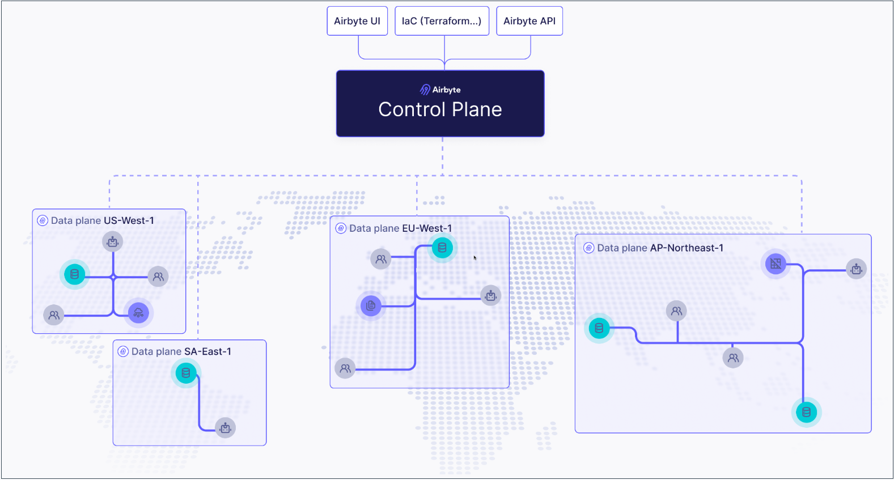
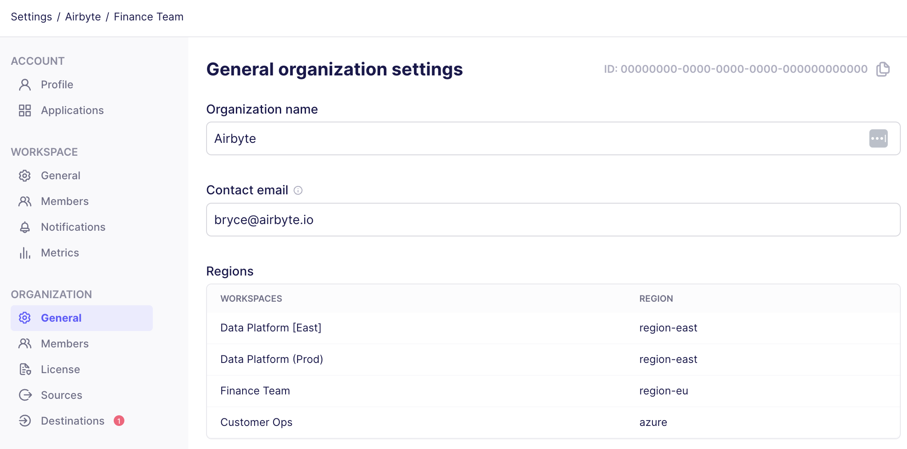

import Tabs from '@theme/Tabs';
import TabItem from '@theme/TabItem';

# Deploy a data plane with Helm in Enterprise Flex

Airbyte Enterprise Flex customers can use Airbyte's public API to define regions and create independent data planes that operate in those regions. This ensures you're satisfying your data residency and governance requirements with a single Airbyte Cloud deployment, and it can help you reduce data egress costs with cloud providers.



## How it works

If you're not familiar with Kubernetes, think of the control plane as the brain and data planes as the muscles doing work the brain tells them to do.

- The control plane is responsible for Airbyte's user interface, APIs, Terraform provider, and orchestrating work. Airbyte manages this for you in the cloud, reducing the time and resources it takes to start moving your data.
- The data plane initiates jobs, syncs data, completes jobs, and reports its status back to the control plane. We offer [cloud regions](https://docs.airbyte.com/platform/cloud/managing-airbyte-cloud/manage-data-residency) equipped to do this for you, but you also have the flexibility to deploy your own to keep sensitive data protected or meet local data residency requirements.

This separation of duties is what allows a single Airbyte deployment to ensure your data remains segregated and compliant.

By default, Airbyte has a single data plane that any workspace in the organization can access, and it's automatically tied to the default workspace when Airbyte first starts. To configure additional data planes and regions, complete these steps.

If you have not already, ensure you have the [required infrastructure](getting-started) to run your data plane.

1. [Create a region](#step-1).
2. [Create a data plane](#step-2) in that region.
3. [Configure Kubernetes secrets](#step-3).
4. [Create your values.yaml file](#step-4).
5. [Deploy your data plane](#step-5).
6. [Associate your region to an Airbyte workspace](#step-6). You can tie each workspace to exactly one region.


## Prerequisites

Before you begin, make sure you've completed the following:

- You must be an Organization Administrator to manage regions and data planes.

- You need a Kubernetes cluster on which your data plane can run. For example, if you want your data plane to run on eu-west-1, create an EKS cluster on eu-west-1.

- You need to use a [secrets manager](https://docs.airbyte.com/platform/deploying-airbyte/integrations/secrets) for the connections on your data plane. Modifying the configuration of connector secret storage will cause all existing connectors to fail, so we recommend only using newly created workspaces on the data plane.

- If you haven't already, get access to Airbyte's API by creating an application and generating an access token. For help, see [Configuring API access](https://docs.airbyte.com/platform/using-airbyte/configuring-api-access).

### Infrastructure prerequisites

For a production-ready deployment of self-managed data planes, you require the following infrastructure components. Airbyte recommend deploying to Amazon EKS, Google Kubernetes Engine, or Azure Kubernetes Service.

<Tabs>
<TabItem value="Amazon" label="Amazon" default>

| Component                | Recommendation                                                                                                                                                            |
| ------------------------ | ------------------------------------------------------------------------------------------------------------------------------------------------------------------------- |
| Kubernetes Cluster       | Amazon EKS cluster running on EC2 instances in [2 or more availability zones](https://docs.aws.amazon.com/eks/latest/userguide/disaster-recovery-resiliency.html). |
| External Secrets Manager | [Amazon Secrets Manager](/platform/operator-guides/configuring-airbyte#secrets) for storing connector secrets, using a dedicated Airbyte role using a [policy with all required permissions](/platform/operating-airbyte/external-secrets#step-1-configure-cloud-provider-permissions). |
| Object Storage (Optional)| Amazon S3 bucket with a directory for log storage.                                                                         |

</TabItem>
<TabItem value="Azure" label="Azure" default>

| Component                | Recommendation                                                                                                                                                            |
| ------------------------ | ------------------------------------------------------------------------------------------------------------------------------------------------------------------------- |
| Kubernetes Cluster       | Azure Kubernetes Service cluster running in [2 or more availability zones](https://learn.microsoft.com/en-us/azure/aks/reliability-zone-resiliency-recommendations). |
| External Secrets Manager | [Azure Key Vault](/platform/operator-guides/configuring-airbyte#secrets) for storing connector secrets, using a dedicated Airbyte role using a [policy with all required permissions](/platform/operating-airbyte/external-secrets#step-1-configure-cloud-provider-permissions). |
| Object Storage (Optional)| Azure Blob Storage with a directory for log storage.                                                                         |

</TabItem>
</Tabs>

A few notes on Kubernetes cluster provisioning for self-managed data planes and Airbyte Enterprise Flex:

- We support Amazon Elastic Kubernetes Service (EKS) on EC2, Google Kubernetes Engine (GKE) on Google Compute Engine (GCE), or Azure Kubernetes Service (AKS) on Azure.
- While we support GKE Autopilot, we do not support Amazon EKS on Fargate.

We require you to install and configure the following Kubernetes tooling:

1. Install `helm` by following [these instructions](https://helm.sh/docs/intro/install/)
2. Install `kubectl` by following [these instructions](https://kubernetes.io/docs/tasks/tools/).
3. Configure `kubectl` to connect to your cluster by using `kubectl use-context my-cluster-name`:

<details>
<summary>Configure kubectl to connect to your cluster</summary>

<Tabs>
<TabItem value="Amazon EKS" label="Amazon EKS" default>

1. Configure your [AWS CLI](https://docs.aws.amazon.com/cli/latest/userguide/cli-chap-configure.html) to connect to your project.
2. Install [eksctl](https://eksctl.io/introduction/).
3. Run `eksctl utils write-kubeconfig --cluster=$CLUSTER_NAME` to make the context available to kubectl.
4. Use `kubectl config get-contexts` to show the available contexts.
5. Run `kubectl config use-context $EKS_CONTEXT` to access the cluster with kubectl.

</TabItem>

<TabItem value="GKE" label="GKE">

1. Configure `gcloud` with `gcloud auth login`.
2. On the Google Cloud Console, the cluster page will have a "Connect" button, with a command to run locally: `gcloud container clusters get-credentials $CLUSTER_NAME --zone $ZONE_NAME --project $PROJECT_NAME`.
3. Use `kubectl config get-contexts` to show the available contexts.
4. Run `kubectl config use-context $EKS_CONTEXT` to access the cluster with kubectl.

</TabItem>
</Tabs>

</details>

We also require you to create a Kubernetes namespace for your Airbyte deployment:

```
kubectl create namespace airbyte
```

## 1. Create a region {#step-1}

The first step is to create a region. Regions are objects that contain data planes, and which you associate to workspaces.

<details>
  <summary>Request</summary>

Send a POST request to /v1/regions/.

```bash
curl --request POST \
  --url https://api.airbyte.com/v1/regions \
  --header "Authorization: Bearer $TOKEN" \
  --header "Content-Type: application/json" \
  --data '{
  "name": "aws-us-east-1",
  "organizationId": "00000000-0000-0000-0000-000000000000"
}'
```

Include the following parameters in your request.

| Body parameter   | Required? | Description                                                                                                                              |
| ---------------- | --------- | ---------------------------------------------------------------------------------------------------------------------------------------- |
| `name`           | Required  | The name of your region in Airbyte. We recommend as best practice that you include the cloud provider  (if applicable), and actual region in the name. |
| `organizationId` | Required  | Your Airbyte organization ID. To find this in the UI, navigate to **Organizaton settings** > **General**.                                             |
| `enabled`        | Optional  | Defaults to true. Set this to `false` if you don't want this region enabled.                                                             |

For additional request examples, see [the API reference](https://reference.airbyte.com/reference/regions#/).

</details>

<details>
  <summary>Response</summary>

Make note of your `regionId`. You need it to create a data plane.

```json title="200 Successful operation"
{
  //highlight-next-line
  "regionId": "uuid-string",
  "name": "region-name",
  "organizationId": "org-uuid-string",
  "enabled": true,
  "createdAt": "timestamp-string",
  "updatedAt": "timestamp-string"
}
```
</details>

## 2. Create a data plane {#step-2}

Once you have a region, you create a data plane within it.

<details>
  <summary>Request</summary>

Send a POST request to /v1/dataplanes.

```bash
curl -X POST https://api.airbyte.com/v1/dataplanes \
  --header "Authorization: Bearer $TOKEN" \
  --header "Content-Type: application/json" \
  -d '{
    "name": "aws-us-east-1",
    "regionId": "00000000-0000-0000-0000-000000000000"
  }'
```

Include the following parameters in your request.

| Body parameter | Required? | Description                                                                                                         |
| -------------- | --------- | ------------------------------------------------------------------------------------------------------------------- |
| `name`         | Required  | The name of your data plane. For simplicity, you might want to name it based on the region in which you created it. |
| `regionId`     | Optional  | The region this data plane belongs to.                                                                              |

For additional request examples, see [the API reference](https://reference.airbyte.com/reference/dataplanes#/).

</details>

<details>
  <summary>Response</summary>

Make note of your `dataplaneId`, `clientId` and `clientSecret`. You need these values later to deploy your data plane on Kubernetes.

```json title="200 Successful operation"
json
{
  "dataplaneId": "uuid-string",
  "clientId": "client-id-string",
  "clientSecret": "client-secret-string"
}
```

</details>


## 3. Configure Kubernetes Secrets {#step-3}

Your data plane relies on Kubernetes secrets to identify itself with the control plane.

In step 5, you create a values.yaml file that references this Kubernetes secret store and these secret keys. Configure all required secrets before deploying your data plane.


You may apply your Kubernetes secrets by applying the example manifests below to your cluster, or using kubectl directly. Ensure that the secrets manager configuration on your data plane matches the configuration on the control plane. The Helm values in this guide use access key authentication for AWS Secrets Manager. If your organization uses an IAM role for secret storage instead, see [AWS Secrets Manager access with IAM](#aws-iam).

While you can set the name of the secret to whatever you prefer, you need to set that name in your values.yaml file. For this reason it's easiest to keep the name of airbyte-config-secrets unless you have a reason to change it.

<details>
<summary>airbyte-config-secrets</summary>

<Tabs>
<TabItem value="AWS" label="AWS" default>

```yaml
apiVersion: v1
kind: Secret
metadata:
  name: airbyte-config-secrets
type: Opaque
stringData:
  # Insert the data plane credentials received in step 2
  DATA_PLANE_CLIENT_ID: your-data-plane-client-id
  DATA_PLANE_CLIENT_SECRET: your-data-plane-client-secret
  
  # Only set these values if they are also set on your control plane
  AWS_SECRET_MANAGER_ACCESS_KEY_ID: your-aws-secret-manager-access-key
  AWS_SECRET_MANAGER_SECRET_ACCESS_KEY: your-aws-secret-manager-secret-key
  S3_ACCESS_KEY_ID: your-s3-access-key
  S3_SECRET_ACCESS_KEY: your-s3-secret-key
```

Apply your secrets manifest in your command-line tool with `kubectl`: `kubectl apply -f <file>.yaml -n <namespace>`.

You can also use `kubectl` to create the secret directly from the command-line tool:

```bash
kubectl create secret generic airbyte-config-secrets \
  --from-literal=DATA_PLANE_CLIENT_ID='' \
  --from-literal=DATA_PLANE_CLIENT_SECRET='' \
  --from-literal=S3_ACCESS_KEY_ID='' \
  --from-literal=S3_SECRET_ACCESS_KEY='' \
  --from-literal=AWS_SECRET_MANAGER_ACCESS_KEY_ID='' \
  --from-literal=AWS_SECRET_MANAGER_SECRET_ACCESS_KEY='' \
  --namespace airbyte
```

</TabItem>

<TabItem value="Azure" label="Azure" default>

```yaml title="values.yaml"
airbyteUrl: https://cloud.airbyte.com # Base URL for the control plane so Airbyte knows where to authenticate

dataPlane:
  # Used to render the data plane creds secret into the Helm chart.
  secretName: airbyte-config-secrets
  id: "preview-data-plane"

  # Describe secret name and key where each of the client ID and secret are stored
  clientIdSecretName: airbyte-config-secrets
  clientIdSecretKey: DATA_PLANE_CLIENT_ID
  clientSecretSecretName: airbyte-config-secrets
  clientSecretSecretKey: DATA_PLANE_CLIENT_SECRET

# Secret manager secrets/config
# Must be set to the same secrets manager as the control plane
secretsManager:
  secretName: airbyte-config-secrets
  type: AZURE_KEY_VAULT
  azureKeyVault:
      vaultUrl: ## https://my-vault.vault.azure.net/
      tenantId: ## 3fc863e9-4740-4871-bdd4-456903a04d4e
      clientId: ""
      clientIdSecretKey: ""
      clientSecret: ""
      clientSecretSecretKey: ""
```

</TabItem>

</Tabs>
</details>

## 4. Create your deployment values {#step-4}

Add the following overrides to a new `values.yaml` file.

```yaml title="values.yaml"
airbyteUrl: https://cloud.airbyte.com # Base URL for the control plane so Airbyte knows where to authenticate

dataPlane:
  # Used to render the data plane creds secret into the Helm chart.
  secretName: airbyte-config-secrets
  id: "preview-data-plane"

  # Describe secret name and key where each of the client ID and secret are stored
  clientIdSecretName: airbyte-config-secrets
  clientIdSecretKey: DATA_PLANE_CLIENT_ID
  clientSecretSecretName: airbyte-config-secrets
  clientSecretSecretKey: DATA_PLANE_CLIENT_SECRET


# S3 bucket secrets/config
# Only set this section if you are using a self-managed bucket, otherwise it can be omitted.
storage:
  secretName: airbyte-config-secrets
  type: "s3"
  bucket:
    log: my-bucket-name
    state: my-bucket-name
    workloadOutput: my-bucket-name 
  s3:
    region: "us-west-2"
    authenticationType: credentials
    accessKeyIdSecretKey: S3_ACCESS_KEY_ID
    secretAccessKeySecretKey: S3_SECRET_ACCESS_KEY

# Secret manager secrets/config
# Must be set to the same secrets manager as the control plane
secretsManager:
  secretName: airbyte-config-secrets
  type: AWS_SECRET_MANAGER
  awsSecretManager:
    region: us-west-2 
    authenticationType: credentials
    accessKeyIdSecretKey: AWS_SECRET_MANAGER_ACCESS_KEY_ID 
    secretAccessKeySecretKey: AWS_SECRET_MANAGER_SECRET_ACCESS_KEY
```

## 5. Deploy your data plane {#step-5}

In your command-line tool, deploy the data plane using `helm upgrade`. The examples here may not reflect your actual Airbyte version and namespace conventions, so make sure you use the settings that are appropriate for your environment.

```bash title="Example using the default namespace in your cluster"
helm upgrade --install airbyte-enterprise airbyte/airbyte-data-plane --version 2.0.1 --values values.yaml
```

```bash title="Example using or creating a namespace called 'airbyte-dataplane'"
helm upgrade --install airbyte-enterprise airbyte/airbyte-data-plane --version 2.0.1 -n airbyte-dataplane --create-namespace --values values.yaml
```

## 6. Associate a region to a workspace {#step-6}

One you have a region and a data plane, you need to associate that region to your workspace. You can associate a workspace with a region when you create that workspace or later, after it exists.

:::note
You can only associate each workspace with one region.
:::

<Tabs>
  <TabItem value="workspace-association-ui" label="UI" default>

Follow these steps to associate your region to your current workspace using Airbyte's user interface.

1. In the navigation panel, click **Workspace settings** > **General**.

2. Under **Region**, select your region.

3. Click **Save changes**. Now, run any sync. You will see the workloads spin up in the new data plane you've configured.

  </TabItem>
  <TabItem value="workspace-association-api" label="API">

When creating a new workspace:

<details>
  <summary>Request</summary>

Send a POST request to /v1/workspaces/

```bash
curl -X POST "api.airbyte.com/v1/workspaces" \
  --header "Authorization: Bearer $TOKEN" \
  --header "Content-Type: application/json" \
  -d '{
    "name": "My New Workspace",
    "dataResidency": "auto"
  }'
```

Include the following parameters in your request.

| Body parameter  | Description                                               |
| --------------- | --------------------------------------------------------- |
| `name`          | The name of your workspace in Airbyte.                    |
| `dataResidency` | A string with a region identifier you received in step 1. |

For additional request examples, see [the API reference](https://reference.airbyte.com/reference/workspaces#/).

</details>

<details>
  <summary>Response</summary>

```json
{
  "workspaceId": "uuid-string",
  "name": "workspace-name",
  "dataResidency": "auto",
  "notifications": {
    "failure": {},
    "success": {}
  }
}
```

</details>

When updating a workspace:

<details>
  <summary>Request</summary>

Send a PATCH request to /v1/workspaces/`{workspaceId}`.

```bash
curl -X PATCH "https://api.airbyte.com/v1/workspaces/{workspaceId}" \
  --header "Authorization: Bearer $TOKEN" \
  --header "Content-Type: application/json" \
  -d '{
    "name": "Updated Workspace Name",
    "dataResidency": "us-west"
  }'
```

Include the following parameters in your request.

| Body parameter  | Description                                               |
| --------------- | --------------------------------------------------------- |
| `name`          | The name of your workspace in Airbyte.                    |
| `dataResidency` | A string with a region identifier you received in step 1. |

For additional request examples, see [the API reference](https://reference.airbyte.com/reference/workspaces#/).

</details>

<details>
  <summary>Response</summary>

```json
{
  "workspaceId": "uuid-string",
  "name": "updated-workspace-name",
  "dataResidency": "region-identifier",
  "notifications": {
    "failure": {},
    "success": {}
  }
}
```

</details>
  </TabItem>
</Tabs>

## AWS Secrets Manager access with IAM {#aws-iam}

This section applies when your Airbyte-managed secrets live in AWS Secrets Manager in your own AWS account. You own every IAM resource involved. Airbyte does not create IAM users, roles, or policies in your account. For the IAM policy Airbyte needs and the configuration you send to Airbyte, see [External Secret Management](/platform/operating-airbyte/external-secrets).

### Identities and trust relationships

Two different identities read and write your secrets. Each needs its own permissions.

| Identity | What it does | How you grant access |
| --- | --- | --- |
| Control plane | Creates, updates, and deletes secrets when you check, save, or delete a source or destination. | Access keys stored with Airbyte, or a role in your account that trusts Airbyte and requires an external ID. You send this configuration to Airbyte as described in [External Secret Management](/platform/operating-airbyte/external-secrets). |
| Data plane workloads | Read secrets when a check, discover, or sync runs on your cluster. | Access keys in the `airbyte-config-secrets` Kubernetes Secret, or the Kubernetes service account identity of the data plane pods (for example, IAM roles for service accounts on EKS). |

Keep these facts in mind.

- The data plane identity and the control plane identity are separate trust relationships. Fixing one does not fix the other.
- If Airbyte assumes a role in your account, the role's trust policy must allow the Airbyte principal and must require the exact external ID that Airbyte stores for your storage. AWS compares `sts:ExternalId` as an exact string. A different value, extra whitespace, or a change in case fails.
- Role names and role ARN values are case sensitive when a role is assumed. Copy them exactly, including any path segment such as `role/service/`.
- If your data plane pods assume the same secrets role through a Kubernetes service account, that trust policy statement is a separate statement with its own principal and conditions. It does not use the external ID.

### Effective permissions

A request succeeds only if every applicable policy allows it. When a request fails, check all of them.

- The trust policy on the role controls who may assume it.
- The identity policy on the caller must allow `sts:AssumeRole` on the role ARN, and the identity policy on the role must allow the Secrets Manager actions it needs.
- Permissions boundaries limit permissions. They never grant them. A boundary on the role or on the calling identity can block an action that the identity policy allows.
- Service control policies and session policies also limit permissions.
- An explicit deny in any policy overrides every allow.

Tag conditions are literal too. `StringEquals` and `StringLike` compare tag values case sensitively, and only `StringLike` treats `*` as a wildcard. For example, a policy that requires `aws:PrincipalTag/Project` to match `svc-airbyte-*` does not match a principal tagged `Project=Airbyte`. Do not change a tag value to make a condition pass until you know which policy contains the condition and what it is meant to allow. The owner of that policy decides the fix.

Use the AWS documentation for the exact semantics: [permissions boundaries](https://docs.aws.amazon.com/IAM/latest/UserGuide/access_policies_boundaries.html), [external IDs](https://docs.aws.amazon.com/IAM/latest/UserGuide/id_roles_common-scenarios_third-party.html), [policy evaluation logic](https://docs.aws.amazon.com/IAM/latest/UserGuide/reference_policies_evaluation-logic.html), and [condition operators](https://docs.aws.amazon.com/IAM/latest/UserGuide/reference_policies_elements_condition_operators.html).

### Verify in stages

A successful step proves only that step. Verify each stage before you rely on the next one.

1. **Check and save a connector.** This proves the control plane can write a secret and read it back. It does not prove the data plane can read it.
2. **Run a small sync.** This proves the data plane workload can read the secret and the connector can move data. Use one stream with a small number of records.
3. **Confirm records in the destination.** Query the destination directly and compare the count with the source. Only this step proves data arrived.

A passing check with a failing sync points at the data plane identity first. A sync that reports success with no destination records is a connector or destination question, not a secret storage question.

### Common errors

| Symptom | Likely cause | What to check |
| --- | --- | --- |
| Check or save fails with an access denied error from AWS | The control plane cannot assume the role or cannot write to Secrets Manager. | Trust policy principal and external ID, identity policy actions, permissions boundary, service control policies. |
| Check passes but the sync fails while starting the connector | The data plane workload cannot read the secret. | The service account annotation or access keys on the data plane, the Secrets Manager read actions for that identity, and that the data plane secrets manager configuration matches the control plane. |
| `AccessDenied` on `sts:AssumeRole` even though the trust policy looks right | Exact string mismatch, or a boundary or session policy on the caller. | Role ARN, path, and case. External ID value. Boundaries on both the caller and the role. |
| Access denied on `secretsmanager:GetSecretValue` for a secret that exists | A tag or resource condition does not match the secret. | The condition keys in the identity and resource policies, and the tags on the secret. |
| A new connector fails after the storage configuration was changed | The workspace now points at a storage the identities cannot reach. | Which storage the workspace uses, and whether the new storage has the same identities and permissions. |

### Evidence to send to support

Send the following. None of it is a secret.

- The exact error message and the time it happened, in UTC.
- The Airbyte workspace URL and the connector type.
- Which stage failed: check and save, sync start, sync data movement, or destination confirmation.
- The role ARN, or the fact that you use access keys. Never send an access key secret.
- A redacted copy of the trust policy and the identity policy, and whether a permissions boundary or service control policy applies.
- The AWS request ID from the error, and matching CloudTrail events for `AssumeRole` or the Secrets Manager action, with the requester identity shown.
- Your data plane Helm chart version and the `secretsManager` block of your values file with secret values removed.

### Replace or change a secret storage

Do not delete and recreate a secret storage to fix an access problem. Fix the IAM configuration instead. Connectors keep a reference to the storage that holds their secrets, so removing a storage leaves existing connectors pointing at a storage the workloads may no longer be able to read.

If you need to move to a different AWS account, region, or role, contact Airbyte Support before you change anything. Airbyte can migrate existing secrets to the new storage so your connections keep working. See [External Secret Management](/platform/operating-airbyte/external-secrets) for the configuration Airbyte needs.

## Check which region your workspaces use

<Tabs>
  <TabItem value="check-regions" label="UI" default>

You can see a list of your workspaces and the region associated to each from Airbyte's organization settings.

1. In Airbyte's user interface, click **Workspace settings** > **General**. Airbyte displays your workspaces and each workspace region under **Regions**.



  </TabItem>
  <TabItem value="check-regions-api" label="API">

Request:

```bash
bash
curl -X GET "https://api.airbyte.com/v1/workspaces/{workspaceId}" \
  -H "Authorization: Bearer YOUR_ACCESS_TOKEN" \
  -H "Content-Type: application/json"
```

Response:

```json
{
  "workspaceId": "18dccc91-0ab1-4f72-9ed7-0b8fc27c5826",
  "name": "Acme Company",
  //highlight-next-line
  "dataResidency": "auto",
}
```

  </TabItem>
</Tabs>
