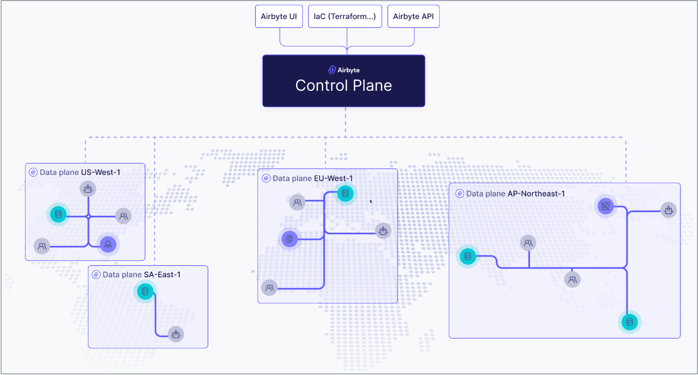

import Tabs from '@theme/Tabs';
import TabItem from '@theme/TabItem';

# Multiple region deployments

Airbyte Enterprise Flex customers can use Airbyte's public API to define regions and create independent data planes that operate in those regions. This ensures you're satisfying your data residency and governance requirements with a single Airbyte Cloud deployment, and it can help you reduce data egress costs with cloud providers.



## How it works
If you're not familiar with Kubernetes, think of the control plane as the brain and data planes as the muscles doing work the brain tells them to do.

- The control plane is responsible for Airbyte's user interface, APIs, Terraform provider, and orchestrating work. Airbyte manages this for you in the cloud, reducing the time and resources it takes to start moving your data.
- The data plane initiates jobs, syncs data, completes jobs, and reports its status back to the control plane. We offer [cloud regions](https://docs.airbyte.com/platform/cloud/managing-airbyte-cloud/manage-data-residency) equipped to do this for you, but you also have the flexibility to deploy your own to keep sensitive data protected or meet local data residency requirements. 

This separation of duties is what allows a single Airbyte deployment to ensure your data remains segregated and compliant.

By default, Airbyte has a single data plane that any workspace in the organization can access, and it's automatically tied to the default workspace when Airbyte first starts. To configure additional data planes and regions, complete these steps.

If you have not already, ensure you have the [required infrastructure](https://docs.airbyte.com/platform/enterprise-flex/getting-started) to run your data plane.

1. [Create a region](#step-1).
2. [Create a data plane](#step-2) in that region.
3. [Configure Kubernetes secrets](#step-3).
4. [Create your values.yaml file](#step-4).
5. [Deploy your data plane](#step-5).
6. [Associate your region to an Airbyte workspace](#step-6). You can tie each workspace to exactly one region.


## Prerequisites

Before you begin, make sure you've completed the following:

 - You must be an Organization Administrator to manage regions and data planes.
- You need a Kubernetes cluster on which your data plane can run. For example, if you want your data plane to run on eu-west-1, create an EKS cluster on eu-west-1.
- You need to use a [secrets manager](https://docs.airbyte.com/platform/deploying-airbyte/integrations/secrets) for the connections on your data plane. Modifying the configuration of connector secret storage will cause all existing connectors to fail, so we recommend only using newly created workspaces on the data plane.
- If you haven't already, get access to Airbyte's API by creating an application and generating an access token. For help, see [Configuring API access](https://docs.airbyte.com/platform/using-airbyte/configuring-api-access).

## 1. Create a region {#step-1}

The first step is to create a region. Regions are objects that contain data planes, and which you associate to workspaces.

<details>
  <summary>Request</summary>

Send a POST request to /v1/regions/.

```bash
curl --request POST \
  --url https://api.airbyte.com/v1/regions \
  --header "Authorization: Bearer $TOKEN" \
  --header "Content-Type: application/json" \
  --data '{
  "name": "aws-us-east-1",
  "organizationId": "00000000-0000-0000-0000-000000000000"
}'
```
Include the following parameters in your request.

| Body parameter   | Required? | Description                                                                                                                              |
| ---------------- | --------- | ---------------------------------------------------------------------------------------------------------------------------------------- |
| `name`           | Required  | The name of your region in Airbyte. We reccomend as best practice that you include the cloud provider  (if applicable), and actual region in the name. |
| `organizationId` | Required  | Your Airbyte organization ID. To find this in the UI, navigate to `Settings` > `General`.                                             |
| `enabled`        | Optional  | Defaults to true. Set this to `false` if you don't want this region enabled.                                                             |

For additional request examples, see [the API reference](https://reference.airbyte.com/reference/regions#/).

</details>

<details>
  <summary>Response</summary>

Make note of your `regionId`. You need it to create a data plane.

```json title="200 Successful operation"
{
  //highlight-next-line
  "regionId": "uuid-string",
  "name": "region-name",
  "organizationId": "org-uuid-string",
  "enabled": true,
  "createdAt": "timestamp-string",
  "updatedAt": "timestamp-string"
}
```
</details>

## 2. Create a data plane {#step-2}

Once you have a region, you create a data plane within it.

<details>
  <summary>Request</summary>

Send a POST request to /v1/dataplanes.

```bash
curl -X POST https://api.airbyte.com/v1/dataplanes \
  --header "Authorization: Bearer $TOKEN" \
  --header "Content-Type: application/json" \
  -d '{
    "name": "aws-us-east-1",
    "regionId": "00000000-0000-0000-0000-000000000000"
  }'
```

Include the following parameters in your request.

| Body parameter | Required? | Description                                                                                                         |
| -------------- | --------- | ------------------------------------------------------------------------------------------------------------------- |
| `name`         | Required  | The name of your data plane. For simplicity, you might want to name it based on the region in which you created it. |
| `regionId`     | Optional  | The region this data plane belongs to.                                                                              |

For additional request examples, see [the API reference](https://reference.airbyte.com/reference/dataplanes#/).

</details>

<details>
  <summary>Response</summary>

Make note of your `dataplaneId`, `clientId` and `clientSecret`. You need these values later to deploy your data plane on Kubernetes.

```json title="200 Successful operation"
json
{
  "dataplaneId": "uuid-string",
  "clientId": "client-id-string",
  "clientSecret": "client-secret-string"
}
```

</details>


## 3. Configure Kubernetes Secrets {#step-3}

Your data plane relies on Kubernetes secrets to identify itself with the control plane.

In step 5, you create a values.yaml file that references this Kubernetes secret store and these secret keys. Configure all required secrets before deploying your data plane.


You may apply your Kubernetes secrets by applying the example manifests below to your cluster, or using kubectl directly. Ensure that the secrets manager configurtion on your data plane matches the configuration on the control plane. At this time, only access key authentication is supported. 

While you can set the name of the secret to whatever you prefer, you need to set that name in your values.yaml file. For this reason it's easiest to keep the name of airbyte-config-secrets unless you have a reason to change it.

<details>
<summary>airbyte-config-secrets</summary>

<Tabs>
<TabItem value="AWS" label="AWS" default>

```yaml
apiVersion: v1
kind: Secret
metadata:
  name: airbyte-config-secrets
type: Opaque
data:
  # Insert the data plane credentials received in step 2
  DATA_PLANE_CLIENT_ID: your-data-plane-client-id
  DATA_PLANE_CLIENT_SECRET: your-data-plane-client-secret
  
  # Only set these values if they are also set on your control plane
  AWS_SECRET_MANAGER_ACCESS_KEY_ID: your-aws-secret-manager-access-key
  AWS_SECRET_MANAGER_SECRET_ACCESS_KEY: your-aws-secret-manager-secret-key
  S3_ACCESS_KEY_ID: your-s3-access-key
  S3_SECRET_ACCESS_KEY: your-s3-secret-key
```

Apply your secrets manifest in your command-line tool with `kubectl`: `kubectl apply -f <file>.yaml -n <namespace>`.

You can also use `kubectl` to create the secret directly from the command-line tool:

```bash
kubectl create secret generic airbyte-config-secrets \
  --from-literal=license-key='' \
  --from-literal=data_plane_client_id='' \
  --from-literal=data_plane_client_secret='' \
  --from-literal=s3-access-key-id='' \
  --from-literal=s3-secret-access-key='' \
  --from-literal=aws-secret-manager-access-key-id='' \
  --from-literal=aws-secret-manager-secret-access-key='' \
  --namespace airbyte
```

</TabItem>
</Tabs>
</details>

## 4. Create your deployment values {#step-4}

Add the following overrides to a new `values.yaml` file.

```yaml title="values.yaml"
airbyteUrl: https://cloud.airbyte.com # Base URL for the control plane so Airbyte knows where to authenticate

dataPlane:
  # Used to render the data plane creds secret into the Helm chart.
  secretName: airbyte-config-secrets
  id: "preview-data-plane"

  # Describe secret name and key where each of the client ID and secret are stored
  clientIdSecretName: airbyte-config-secrets
  clientIdSecretKey: DATA_PLANE_CLIENT_ID
  clientSecretSecretName: airbyte-config-secrets
  clientSecretSecretKey: DATA_PLANE_CLIENT_SECRET


# S3 bucket secrets/config
# Only set this section if you are using a self-managed bucket, otherwise it can be omitted.
storage:
  secretName: airbyte-config-secrets
  type: "s3"
  bucket:
    log: my-bucket-name
    state: my-bucket-name
    workloadOutput: my-bucket-name 
  s3:
    region: "us-west-2"
    authenticationType: credentials
    accessKeyIdSecretKey: S3_ACCESS_KEY_ID
    secretAccessKeySecretKey: S3_SECRET_ACCESS_KEY

# Secret manager secrets/config
# Must be set to the same secrets manager as the control plane
secretsManager:
  secretName: airbyte-config-secrets
  type: AWS_SECRET_MANAGER
  awsSecretManager:
    region: us-west-2 
    authenticationType: credentials
    accessKeyIdSecretKey: AWS_SECRET_MANAGER_ACCESS_KEY_ID 
    secretAccessKeySecretKey: AWS_SECRET_MANAGER_SECRET_ACCESS_KEY
```

## 5. Deploy your data plane {#step-5}

In your command-line tool, deploy the data plane using `helm upgrade`. The examples here may not reflect your actual Airbyte version and namespace conventions, so make sure you use the settings that are appropriate for your environment.

```bash title="Example using the default namespace in your cluster"
helm upgrade --install airbyte-enterprise airbyte/airbyte-data-plane --version 1.8.1 --values values.yaml
```

```bash title="Example using or creating a namespace called 'airbyte-dataplane'"
helm upgrade --install airbyte-enterprise airbyte/airbyte-data-plane --version 1.8.1 -n airbyte-dataplane --create-namespace --values values.yaml
```

## 6. Associate a region to a workspace {#step-6}

One you have a region and a data plane, you need to associate that region to your workspace. You can associate a workspace with a region when you create that workspace or later, after it exists.

:::note
You can only associate each workspace with one region.
:::

<Tabs>
  <TabItem value="workspace-association-ui" label="UI" default>

Follow these steps to associate your region to your current workspace using Airbyte's user interface.

1. In the navigation panel, click **Settings**.

2. Under **Workspace**, click **General**.

3. Under **Region**, select your region.

4. Click **Save changes**. Now, run any sync. You will see the workloads spin up in the new data plane you've configured.

  </TabItem>
  <TabItem value="workspace-association-api" label="API">

When creating a new workspace:

<details>
  <summary>Request</summary>

Send a POST request to /v1/workspaces/

```bash
curl -X POST "api.airbyte.com/v1/workspaces" \
  --header "Authorization: Bearer $TOKEN" \
  --header "Content-Type: application/json" \
  -d '{
    "name": "My New Workspace",
    "dataResidency": "auto"
  }'
```

Include the following parameters in your request.

| Body parameter  | Description                                               |
| --------------- | --------------------------------------------------------- |
| `name`          | The name of your workspace in Airbyte.                    |
| `dataResidency` | A string with a region identifier you received in step 1. |

For additional request examples, see [the API reference](https://reference.airbyte.com/reference/workspaces#/).

</details>

<details>
  <summary>Response</summary>

```json
{
  "workspaceId": "uuid-string",
  "name": "workspace-name",
  "dataResidency": "auto",
  "notifications": {
    "failure": {},
    "success": {}
  }
}
```

</details>

When updating a workspace:

<details>
  <summary>Request</summary>

Send a PATCH request to /v1/workspaces/`{workspaceId}`.

```bash
curl -X PATCH "https://api.airbyte.com/v1/workspaces/{workspaceId}" \
  --header "Authorization: Bearer $TOKEN" \
  --header "Content-Type: application/json" \
  -d '{
    "name": "Updated Workspace Name",
    "dataResidency": "us-west"
  }'
```

Include the following parameters in your request.

| Body parameter  | Description                                               |
| --------------- | --------------------------------------------------------- |
| `name`          | The name of your workspace in Airbyte.                    |
| `dataResidency` | A string with a region identifier you received in step 1. |

For additional request examples, see [the API reference](https://reference.airbyte.com/reference/workspaces#/).

</details>

<details>
  <summary>Response</summary>

```json
{
  "workspaceId": "uuid-string",
  "name": "updated-workspace-name",
  "dataResidency": "region-identifier",
  "notifications": {
    "failure": {},
    "success": {}
  }
}
```

</details>
  </TabItem>
</Tabs>


## Check which region your workspaces use

<Tabs>
  <TabItem value="check-regions" label="UI" default>

You can see a list of your workspaces and the region associated to each from Airbyte's organization settings.

1. In Airbyte's user interface, click **Settings**.

2. Under **Organization**, click **General**.

Airbyte displays your workspaces and each workspace region under **Regions**.


  </TabItem>
  <TabItem value="check-regions-api" label="API">

Request:

```bash
bash
curl -X GET "https://api.airbyte.com/v1/workspaces/{workspaceId}" \
  -H "Authorization: Bearer YOUR_ACCESS_TOKEN" \
  -H "Content-Type: application/json"
```

Response:

```json
{
  "workspaceId": "18dccc91-0ab1-4f72-9ed7-0b8fc27c5826",
  "name": "Acme Company",
  //highlight-next-line
  "dataResidency": "auto",
}
```

  </TabItem>
</Tabs>
