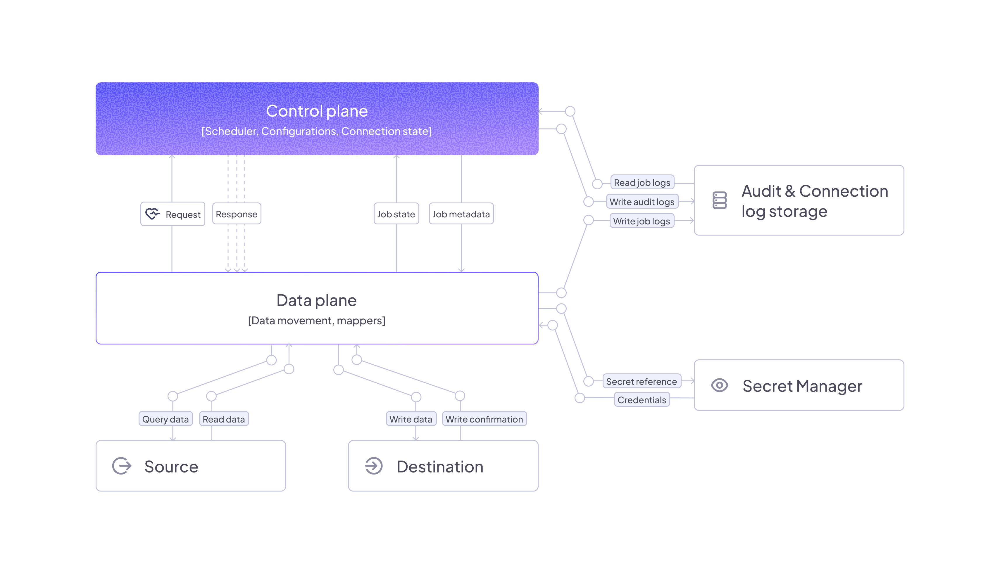

import Tabs from '@theme/Tabs';
import TabItem from '@theme/TabItem';

# Getting started

Any Airbyte Cloud enviornment can be easily upgraded to Enterprise Flex. To learn more about upgrading to Enterprise Flex, [talk to sales](https://airbyte.com/company/talk-to-sales).

You may choose to run a self-managed data plane while using Airbyte Enterprise Flex. 

**If you are not using any self-managed data planes, then no additional infrastructure is required to begin creating connections and running syncs.**

 The following diagram illustrates a typical Airbyte Enterpris Flex deployment running a self-managed data plane:



## Infrastructure prerequisites

For a production-ready deployment of self-managed data planes, various infrastructure components are required. We recommend deploying to Amazon EKS, Google Kubernetes Engine, or Azure Kubernetes Service.

<Tabs>
<TabItem value="Amazon" label="Amazon" default>

| Component                | Recommendation                                                                                                                                                            |
| ------------------------ | ------------------------------------------------------------------------------------------------------------------------------------------------------------------------- |
| Kubernetes Cluster       | Amazon EKS cluster running on EC2 instances in [2 or more availability zones](https://docs.aws.amazon.com/eks/latest/userguide/disaster-recovery-resiliency.html). |
| External Secrets Manager | [Amazon Secrets Manager](/platform/operator-guides/configuring-airbyte#secrets) for storing connector secrets, using a dedicated Airbyte role using a [policy with all required permissions](/platform/enterprise-setup/implementation-guide#aws-secret-manager-policy). |
| Object Storage (Optional)| Amazon S3 bucket with a directory for log storage.                                                                         |

</TabItem>
</Tabs>                                              

A few notes on Kubernetes cluster provisioning for self-managed data planes and Airbyte Enterprise Flex:

- We support Amazon Elastic Kubernetes Service (EKS) on EC2, Google Kubernetes Engine (GKE) on Google Compute Engine (GCE), or Azure Kubernetes Service (AKS) on Azure.
- While we support GKE Autopilot, we do not support Amazon EKS on Fargate.

We require you to install and configure the following Kubernetes tooling:

1. Install `helm` by following [these instructions](https://helm.sh/docs/intro/install/)
2. Install `kubectl` by following [these instructions](https://kubernetes.io/docs/tasks/tools/).
3. Configure `kubectl` to connect to your cluster by using `kubectl use-context my-cluster-name`:

<details>
<summary>Configure kubectl to connect to your cluster</summary>

<Tabs>
<TabItem value="Amazon EKS" label="Amazon EKS" default>

1. Configure your [AWS CLI](https://docs.aws.amazon.com/cli/latest/userguide/cli-chap-configure.html) to connect to your project.
2. Install [eksctl](https://eksctl.io/introduction/).
3. Run `eksctl utils write-kubeconfig --cluster=$CLUSTER_NAME` to make the context available to kubectl.
4. Use `kubectl config get-contexts` to show the available contexts.
5. Run `kubectl config use-context $EKS_CONTEXT` to access the cluster with kubectl.

</TabItem>

<TabItem value="GKE" label="GKE">

1. Configure `gcloud` with `gcloud auth login`.
2. On the Google Cloud Console, the cluster page will have a "Connect" button, with a command to run locally: `gcloud container clusters get-credentials $CLUSTER_NAME --zone $ZONE_NAME --project $PROJECT_NAME`.
3. Use `kubectl config get-contexts` to show the available contexts.
4. Run `kubectl config use-context $EKS_CONTEXT` to access the cluster with kubectl.

</TabItem>
</Tabs>

</details>

We also require you to create a Kubernetes namespace for your Airbyte deployment:

```
kubectl create namespace airbyte
```

## Limitations and considerations

- While data planes process data in their respective regions, some metadata remains in the control plane.
    - Airbyte stores Cursor and Primary Key data in the control plane regardless of data plane location. If you have data that you can't store in the control plane, don't use it as a cursor or primary key.
- The Connector Builder processes all data through the control plane, regardless of workspace settings. This limitation applies to the development and testing phase only; published connectors respect workspace data residency settings during syncs.
- If you want to run multiple data planes in the same region for higher availability, both must be part of the same region in Airbyte and use the same secrets manager to ensure connection credentials are the same.
- Data planes and the control plane must be configured to use the same secrets manager.
    - This ensures that when you enter credentials in the UI, they are written to the secrets manager and available to the data plane when running syncs.
- Data planes must be able to communicate with the control plane. 
- **Data planes will only ever send requests to the control plane and never require inbound requests.**