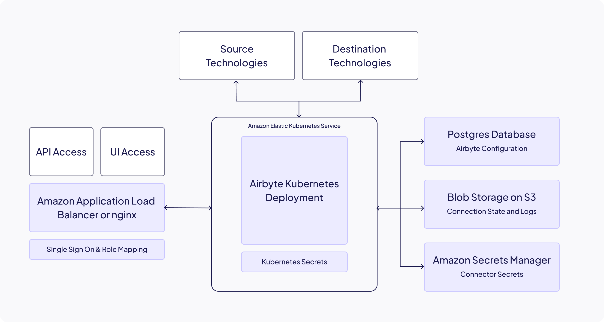

# Airbyte Self-Managed Enterprise

Self-Managed Enterprise is an enterprise-grade, on-premise data movement platform. You get all 600+ pre-built connectors, data never leaves your environment, and Self-Managed Enterprise introduces new governance capabilities targeted towards large organizations designed to enhance your data platform’s capabilities and security.

To run Self-Managed Enterprise, you need a valid license key.

| Feature             | Description                                                                                                                                                             |
| ------------------- | ----------------------------------------------------------------------------------------------------------------------------------------------------------------------- |
| User Management     | Enable multiple users to concurrently move data from a single Airbyte deployment.                                                                                       |
| Single Sign-On      | Manage user access to Airbyte from your Okta, Azure Entra ID or OIDC-compatible identity provider.                                                                      |
| Multiple Workspaces | Manage multiple isolated projects or teams on a single Airbyte deployment.                                                                                              |
| Role-Based Access   | Manage user permissions and access across workspaces from a single pane of glass.                                                                                       |
| Column Hashing      | Protect sensitive information by hashing personally identifiable information (PII) as it moves through your pipelines.                                                   |
| Support with SLAs   | [Priority assistance](https://docs.airbyte.com/operator-guides/contact-support/#airbyte-enterprise-self-hosted-support) with deploying, managing and upgrading Airbyte. |

The following diagram outlines the elements involved when you deploy Self-Managed Enterprise. For help with your deployment, see the [implementation guide](implementation-guide).

