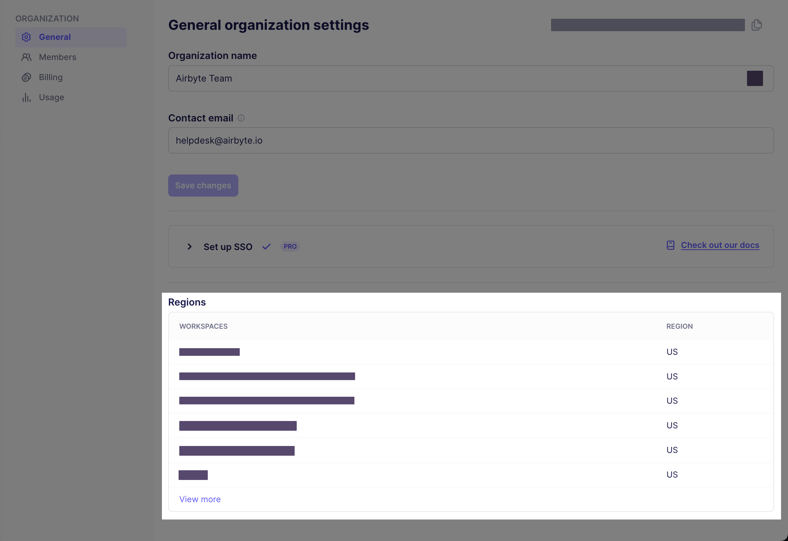

import Tabs from '@theme/Tabs';
import TabItem from '@theme/TabItem';

# Multiple region deployments

Self-Managed Enterprise customers can use Airbyte's public API to define regions and create independent data planes that operate in those regions. This ensures you're satisfying your data residency and governance requirements with a single Airbyte deployment, and it can help you reduce data egress costs with cloud providers.


## How it works

If you're not familiar with Kubernetes, think of the control plane as the brain and data planes as the muscles doing work the brain tells them to do.

- The control plane is responsible for Airbyte's user interface, APIs, Terraform provider, and orchestrating work.
- The data plane initiates jobs, syncs data, completes jobs, and reports its status back to the control plane.

This separation of duties is what allows a single Airbyte deployment to ensure your data remains segregated and compliant.

By default, Airbyte has a single data plane that any workspace in the organization can access, and it's automatically tied to the default workspace when Airbyte first starts. To configure additional data planes and regions, complete these steps.

1. [Create a region](#step-1).
2. [Create a data plane](#step-2) in that region.
3. [Associate your data plane to an Airbyte workspace](#step-3). You can tie each workspace to exactly one region.
4. [Configure Kubernetes secrets](#step-4).
5. [Create your values.yaml file](#step-5).
6. [Deploy your data plane](#step-6).

Once you complete these steps, jobs in your workspace move data exclusively using the data plane mapped to that region.

### Limitations and considerations

While data planes process data in their respective regions, some metadata remains in the control plane.

- Airbyte stores Cursor and Primary Key data in the control plane regardless of data plane location. If you have data that you can't store in the control plane, don't use it as a cursor or primary key.

- The Connector Builder processes all data through the control plane, regardless of workspace settings. This limitation applies to the development and testing phase only; published connectors respect workspace data residency settings during syncs.

- If you're using a secrets manager, the secrets manager used by the control plane is the one used by the data plane.

## Prerequisites

Before you begin, make sure you've completed the following.

- Deploy your Self-Managed Enterprise version of Airbyte as described in the [implementation guide](implementation-guide).

- You must be an Instance Administrator to manage regions and data planes.

- You need a Kubernetes cluster on which your data plane can run. For example, if your Airbyte control plane already runs on an EKS cluster on `us-west-2`, and you want your data plane to run on `eu-west-1`, create an EKS cluster on `eu-west-1`.

- If you haven't already, get access to Airbyte's API by creating an application and generating an access token. For help, see [Configuring API access](../enterprise-setup/api-access-config).

## 1. Create a region {#step-1}

The first step is to create a region. Regions are objects that contain data planes, and which you associate to workspaces.

<details>
  <summary>Request</summary>

Send a POST request to /v1/regions/.

```bash
curl --request POST \
  --url https://example.com/api/public/v1/regions \
  --header 'authorization: Bearer $TOKEN' \
  --header 'content-type: application/json' \
  --data '{
  "name": "aws-us-east-1",
  "organizationId": "00000000-0000-0000-0000-000000000000"
}'
```

Include the following parameters in your request.

| Body parameter   | Required? | Description                                                                                                                              |
| ---------------- | --------- | ---------------------------------------------------------------------------------------------------------------------------------------- |
| `name`           | Required  | The name of your region in Airbyte. For simplicity, you might want to make this the same as the actual cloud region this region runs on. |
| `organizationId` | Required  | Your Airbyte organization ID. In most cases, this is `00000000-0000-0000-0000-000000000000`.                                             |
| `enabled`        | Optional  | Defaults to true. Set this to `false` if you don't want this region enabled.                                                             |

For additional request examples, see [the API reference](https://reference.airbyte.com/reference/regions#/).

</details>

<details>
  <summary>Response</summary>

Make note of your `regionId`. You need it to create a data plane.

```json title="200 Successful operation"
{
  //highlight-next-line
  "regionId": "uuid-string",
  "name": "region-name",
  "organizationId": "org-uuid-string",
  "enabled": true,
  "createdAt": "timestamp-string",
  "updatedAt": "timestamp-string"
}
```

</details>

## 2. Create a data plane {#step-2}

Once you have a region, you create a data plane within it.

<details>
  <summary>Request</summary>

Send a POST request to /v1/regions/`<REGION_ID>`/dataplanes.

```bash
curl --request POST \
  --url https://example.com/api/public/v1/regions/116a49ab-b04a-49d6-8f9e-4d9d6a4189cc/dataplanes \
  --header 'authorization: Bearer $TOKEN' \
  --header 'content-type: application/json' \
  --data '{
  "name": "aws-us-west-3-dp-8"
}'
```

Include the following parameters in your request.

| Body parameter | Required? | Description                                                                                                         |
| -------------- | --------- | ------------------------------------------------------------------------------------------------------------------- |
| `name`         | Required  | The name of your data plane. For simplicity, you might want to name it based on the region in which you created it. |
| `enabled`      | Optional  | Defaults to true. Set this to `false` if you don't want this data plane enabled.                                        |

For additional request examples, see [the API reference](https://reference.airbyte.com/reference/regions#/).

</details>

<details>
  <summary>Response</summary>

Make note of your `dataplaneId`, `clientId` and `clientSecret`. You need these values later to deploy your data plane on Kubernetes.

```json title="200 Successful operation"
json
{
  "dataplaneId": "uuid-string",
  "clientId": "client-id-string",
  "clientSecret": "client-secret-string"
}
```

</details>

## 3. Associate a region to a workspace {#step-3}

One you have a region and a data plane, you need to associate that region to your workspace. You can associate a workspace with a region when you create that workspace or later, after it exists.

:::note
You can only associate each workspace with one region.
:::

### When creating a new workspace

<details>
  <summary>Request</summary>

Send a POST request to /v1/workspaces/

```bash
curl -X POST "https://example.com/api/public/v1/workspaces" \
  -H "Authorization: Bearer YOUR_ACCESS_TOKEN" \
  -H "Content-Type: application/json" \
  -d '{
    "name": "My New Workspace",
    "dataResidency": "auto"
  }'
```

Include the following parameters in your request.

| Body parameter  | Description                                               |
| --------------- | --------------------------------------------------------- |
| `name`          | The name of your workspace in Airbyte.                    |
| `dataResidency` | A string with a region identifier you received in step 1. |

For additional request examples, see [the API reference](https://reference.airbyte.com/reference/workspaces#/).

</details>

<details>
  <summary>Response</summary>

```json
{
  "workspaceId": "uuid-string",
  "name": "workspace-name",
  "dataResidency": "auto",
  "notifications": {
    "failure": {},
    "success": {}
  }
}
```

</details>

### When updating a workspace

<details>
  <summary>Request</summary>

Send a PATCH request to /v1/workspaces/`{workspaceId}`

```bash
curl -X PATCH "https://example.com/api/public/v1/workspaces/{workspaceId}" \
  -H "Authorization: Bearer YOUR_ACCESS_TOKEN" \
  -H "Content-Type: application/json" \
  -d '{
    "name": "Updated Workspace Name",
    "dataResidency": "us-west"
  }'
```

Include the following parameters in your request.

| Body parameter  | Description                                               |
| --------------- | --------------------------------------------------------- |
| `name`          | The name of your workspace in Airbyte.                    |
| `dataResidency` | A string with a region identifier you received in step 1. |

For additional request examples, see [the API reference](https://reference.airbyte.com/reference/workspaces#/).

</details>

<details>
  <summary>Response</summary>

```json
{
  "workspaceId": "uuid-string",
  "name": "updated-workspace-name",
  "dataResidency": "region-identifier",
  "notifications": {
    "failure": {},
    "success": {}
  }
}
```

</details>

## 4. Configure Kubernetes Secrets {#step-4}

Your data plane relies on Kubernetes secrets to identify itself with the control plane.

In the next step, you create a values.yaml file that references this Kubernetes secret store and these secret keys. Configure all required secrets before deploying your data plane.

You may apply your Kubernetes secrets by applying the example manifests below to your cluster, or using kubectl directly. If your Kubernetes cluster already has permissions to make requests to an external entity via an instance profile, credentials aren't required. For example, if your Amazon EKS cluster has a sufficient AWS IAM role to make requests to AWS S3, you don't need to specify access keys.

### Creating a Kubernetes secret

While you can set the name of the secret to whatever you prefer, you need to set that name in your values.yaml file. For this reason it's easiest to keep the name of airbyte-config-secrets unless you have a reason to change it.

<details>
<summary>airbyte-config-secrets</summary>

<Tabs>
<TabItem value="S3" label="S3" default>

```yaml
apiVersion: v1
kind: Secret
metadata:
  name: airbyte-config-secrets
type: Opaque
data:
  # Enterprise License Key
  license-key: your-airbyte-license-key

  # Insert the data plane credentials received in step 2
  DATA_PLANE_CLIENT_ID: your-data-plane-client-id
  DATA_PLANE_CLIENT_SECRET: your-data-plane-client-id
  
  # Only set these values if they are also set on your control plane
  AWS_SECRET_MANAGER_ACCESS_KEY_ID: your-aws-secret-manager-access-key
  AWS_SECRET_MANAGER_SECRET_ACCESS_KEY: your-aws-secret-manager-secret-key
  S3_ACCESS_KEY_ID: your-s3-access-key
  S3_SECRET_ACCESS_KEY: your-s3-secret-key
```

Apply your secrets manifest in your command-line tool with `kubectl`: `kubectl apply -f <file>.yaml -n <namespace>`.

You can also use `kubectl` to create the secret directly from the command-line tool:

```bash
kubectl create secret generic airbyte-config-secrets \
  --from-literal=license-key='' \
  --from-literal=data_plane_client_id='' \
  --from-literal=data_plane_client_secret='' \
  --from-literal=s3-access-key-id='' \
  --from-literal=s3-secret-access-key='' \
  --from-literal=aws-secret-manager-access-key-id='' \
  --from-literal=aws-secret-manager-secret-access-key='' \
  --namespace airbyte
```

</TabItem>
<TabItem value="GCS" label="GCS">

First, create a new file `gcp.json` containing the credentials JSON blob for the service account you are looking to assume.

```yaml
apiVersion: v1
kind: Secret
metadata:
  name: airbyte-config-secrets
type: Opaque
stringData:
  # Enterprise License Key
  license-key: your-airbyte-license-key

  # Insert the data plane credentials received in step 2
  DATA_PLANE_CLIENT_ID: your-data-plane-client-id
  DATA_PLANE_CLIENT_SECRET: your-data-plane-client-id
  
  # Only set these values if they are also set on your control plane
  AWS_SECRET_MANAGER_ACCESS_KEY_ID: your-aws-secret-manager-access-key
  AWS_SECRET_MANAGER_SECRET_ACCESS_KEY: your-aws-secret-manager-secret-key
  S3_ACCESS_KEY_ID: your-s3-access-key
  S3_SECRET_ACCESS_KEY: your-s3-secret-key

  # GCP Secrets
  gcp.json: <CREDENTIALS_JSON_BLOB>
```

Apply your secrets manifest in your command-line tool with `kubectl`: `kubectl apply -f <file>.yaml -n <namespace>`.

You can also use `kubectl` to create the secret directly from the command-line tool:

```bash
kubectl create secret generic airbyte-config-secrets \
  --from-literal=license-key='' \
  --from-literal=data_plane_client_id='' \
  --from-literal=data_plane_client_secret='' \
  --from-literal=s3-access-key-id='' \
  --from-literal=s3-secret-access-key='' \
  --from-literal=aws-secret-manager-access-key-id='' \
  --from-literal=aws-secret-manager-secret-access-key='' \
  --from-file=gcp.json
  --namespace airbyte
```

</TabItem>
</Tabs>
</details>

## 5. Create your deployment values {#step-5}

Add the following overrides to a new `values.yaml` file.

```yaml title="values.yaml"
airbyteUrl: https://airbyte.example.com # Base URL for the control plane so Airbyte knows where to authenticate

edition: enterprise # Required for Self-Managed Enterprise

# Logging:
#  level: DEBUG

dataPlane:
  # Used to render the data plane creds secret into the Helm chart.
  secretName: airbyte-config-secrets
  id: "preview-data-plane"

  # Describe secret name and key where each of the client ID and secret are stored
  clientIdSecretName: airbyte-config-secrets
  clientIdSecretKey: "DATA_PLANE_CLIENT_ID"
  clientSecretSecretName: airbyte-config-secrets
  clientSecretSecretKey: "DATA_PLANE_CLIENT_SECRET"

# Describe the secret name and key where the Airbyte license key is found
enterprise:
  secretName: airbyte-config-secrets
  licenseKeySecretKey: AIRBYTE_LICENSE_KEY

# S3 bucket secrets/config
# Only set this section if the control plane has also set these values.
storage:
  secretName: airbyte-config-secrets
  type: "s3"
  bucket:
    log: my-bucket-name
    state: my-bucket-name
    workloadOutput: my-bucket-name 
  s3:
    region: "us-west-2"
    authenticationType: credentials
    accessKeyIdSecretKey: S3_ACCESS_KEY_ID
    secretAccessKeySecretKey: S3_SECRET_ACCESS_KEY

# Secret manager secrets/config
# Only set this section if the control plane has also set these values.
secretsManager:
  secretName: airbyte-config-secrets
  type: AWS_SECRET_MANAGER
  awsSecretManager:
    region: us-west-2 
    authenticationType: credentials
    accessKeyIdSecretKey: AWS_SECRET_MANAGER_ACCESS_KEY_ID 
    secretAccessKeySecretKey: AWS_SECRET_MANAGER_SECRET_ACCESS_KEY
```

## 6. Deploy your data plane {#step-6}

In your command-line tool, deploy the data plane using `helm upgrade`. The examples here may not reflect your actual Airbyte version and namespace conventions, so make sure you use the settings that are appropriate for your environment.

```bash title="Example using the default namespace in your cluster"
helm upgrade --install airbyte-enterprise airbyte/airbyte-data-plane --version 1.6.0 --values values.yaml
```

```bash title="Example using or creating a namespace called 'airbyte-dataplane'"
helm upgrade --install airbyte-enterprise airbyte/airbyte-data-plane --version 1.6.0 -n airbyte-dataplane --create-namespace --values values.yaml
```

## Check which region your workspaces use

### From Airbyte's UI

You can see a list of your workspaces and the region associated to each from Airbyte's organization settings.

1. In Airbyte's user interface, click **Settings**.

2. Click **General**.

Airbyte displays your workspaces and each workspace region under **Regions**.



### From Airbyte's API

Request:

```bash
bash
curl -X GET "https://example.com/api/public/v1/workspaces/{workspaceId}" \
  -H "Authorization: Bearer YOUR_ACCESS_TOKEN" \
  -H "Content-Type: application/json"
```

Response:

```json
{
  "workspaceId": "18dccc91-0ab1-4f72-9ed7-0b8fc27c5826",
  "name": "Acme Company",
  //highlight-next-line
  "dataResidency": "auto",
}
```
