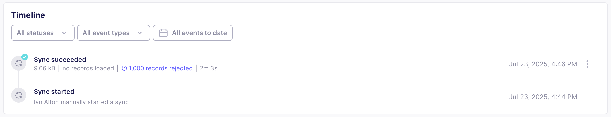

# Rejected records

When syncing data to a [data activation destination](elt-data-activation), you may encounter rejected records. Rejected records are records Airbyte was unable to sync to your destination, even though the sync itself was otherwise successful.

## Why records get rejected

Records become rejected because they don't conform to the schema of the destination. The underlying reasons for this can be complex.

- The destination requires a field, but that field is empty in the source.
- The destination requires a field to be in a certain format, but that field is in an incompatible format in the source.
- The destination requires a field to be unique, but that field isn't unique in the source.
- A transformation error has corrupted a record at an earlier stage of your data pipeline.
- Many other issues.

Look at the following example.

| ID  | First Name       | Last Name | Phone Number | Address         |
| --- | ---------------- | --------- | ------------ | --------------- |
| 123 | Alphonso         | Mariyam   | 123-456-7890 | 123 Fake Street |
| 456 | Emerald          | Sanja     | 234-567-8901 | 456 Fake Street |
| 789 | Sebastian Argyos |           | 345-678-9012 | 789 Fake Street |

Imagine you want to move this data into your CRM, Salesforce. However, your Salesforce object requires that everyone has a first and last name. In this case, Sebastian Argyos' last name has been combined with his first name. From Salesforce's perspective, he doesn't have a last name. As a result, it rejects this record.

## Where rejected records go

Rejected records go into an S3 bucket, if you've configured one. You configure this bucket when you set up your destination. If you haven't configured one yet, you can do this later on, and rejected records begin to populate with subsequent syncs.

You should decide on a strategy for managing these records at scale. You might want to populate all of them to a single bucket for ease of observability, or you may want different destinations to use different buckets.

## Find out if the destination rejected records after a sync

Airbyte shows you rejected records on the connections Timeline page and the sync summary in the log for each sync.

If you've configured a storage bucket for rejected records, Airbyte links to it on the Timeline.



You can also monitor logs for them.

```json title="snowflake_salesforce_logs_12345_txt.txt"
Sync summary: {
  // ...
  "totalStats" : {
    // ...
    // highlight-next-line
    "recordsRejected" : 1000
  },
  "streamStats" : [ {
    "streamName" : "USERS",
    "streamNamespace" : "DATA_PRODUCT",
    "stats" : {
        // ...
        // highlight-next-line
        "recordsRejected" : 1000
    }
  } ],
  "performanceMetrics" : {
    "mappers" : {
      "field-renaming" : 0
    }
  }
}
```

## Fixing rejected records so Airbyte can sync them

In most cases, it's important to repair rejected records if you can. They may contain valuable data that you want to sync, and in large numbers, can erode the effectiveness of your data activation initiative.

You can repair rejected records in your source data warehouse or the upstream source that syncs to your data warehouse. Once you repair them, Airbyte can process them again during your next sync.
