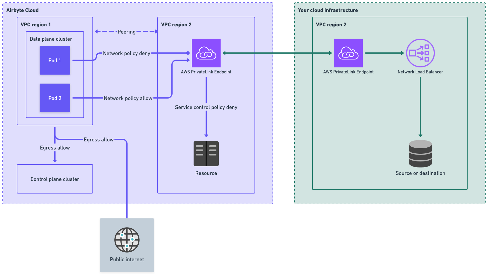

# PrivateLink

PrivateLink allows Airbyte Cloud to securely connect to your data sources and destinations without using the public internet or exposing IPs. Traffic between Airbyte and your resources stays entirely within your cloud provider's private network, providing enhanced security for organizations with strict network isolation requirements.

## Why use PrivateLink

Most Airbyte customers don't need to use PrivateLink. However, some organizatons maintain a heightened security posture and more comprehensive data protection, but still want to benefit from the simplicity of cloud infrastructure and SaaS. PrivateLink is an excellent choice for organizations that can't expose systems and data to the public internet.

PrivateLink offers several advantages for security-conscious organizations.

- **No public IP exposure**: Your data sources and destinations remain private. You don't need to assign public IP addresses or open firewall rules to the internet.

- **Traffic stays on your cloud provider's network**: All data transferred between Airbyte and your resources travels through the cloud provider's private backbone, never traversing the public internet.

- **Simplified network security**: Instead of managing complex firewall rules and IP allowlists, you control access through the cloud provider's native endpoint service permissions.

- **Reduced attack surface**: By eliminating public endpoints, you reduce the vectors for unauthorized access to your infrastructure.

## How it works

With PrivateLink, you create a VPC endpoint service in your cloud provider that exposes your data source or destination. Airbyte then creates a VPC endpoint that connects to your endpoint service, establishing a private network path between Airbyte's infrastructure and your resources.

When a sync runs, Airbyte routes traffic through this private connection rather than over the public internet. Your resources never need public IP addresses or internet-facing firewall rules. All communication happens within the cloud provider's internal network.

Airbyte maintains dedicated infrastructure for PrivateLink connections, ensuring that only your workspace's sync jobs can access your endpoint.

### Security model

Airbyte's PrivateLink implementation ensures that only sync jobs from your workspace can access your PrivateLink endpoint. Each workspace is assigned a unique security token, and Airbyte's infrastructure enforces network-level isolation so that jobs from other workspaces cannot reach your endpoint, even if they run on shared infrastructure.

### Single tenant or multi tenant

Airbyte Cloud is multi-tenant cloud software, regardless of whether you use PrivateLink. However, PrivateLink can feel like a single-tenant experience due to the lack of a shared public endpoint and strong isolation at your network boundary. With or without PrivateLink, all sync jobs in Airbyte use separate Kubernetes pods. This pod-level isolation further helps ensure data syncs from one organizaton are never exposed to another organizaton. Your syncs never run in their pods, and their syncs never run in your pods.

### Availability and supported regions

| Cloud provider | Name                            | Available |
| -------------- | ------------------------------- | --------- |
| AWS            | PrivateLink                     | Yes       |
| Azure          | Private Endpoint / Private Link | No        |
| GCP            | Private Service Connect         | No        |

We currently offer regions in the US and EU.

### Limitations

PrivateLink connections are limited to sources and destinations running in AWS. This includes services like Snowflake, Databricks, and PostgreSQL hosted on AWS. If you need to connect to resources outside of AWS, PrivateLink is not an option.

For managed AWS services like RDS or Aurora, additional configuration is required to expose them via PrivateLink. See [Using PrivateLink with Managed Services](#using-privatelink-with-managed-services) for details.

## Prerequisites

Before setting up PrivateLink, ensure you have the following:

- **AWS infrastructure**: Your source or destination must be running in AWS, since PrivateLink is currently AWS-only.

- **Permissions to create VPC endpoint services**: You need IAM permissions to create and configure VPC endpoint services in your AWS account, including:

  - `ec2:CreateVpcEndpointServiceConfiguration`
  - `ec2:ModifyVpcEndpointServicePermissions`
  - `ec2:DescribeVpcEndpointServiceConfigurations`

- **Network Load Balancer (NLB)**: AWS PrivateLink requires a Network Load Balancer in front of your target service. If your service doesn't already have one, you'll need to create it as part of the setup process. This requires additional IAM permissions:

  - `elasticloadbalancing:CreateLoadBalancer`
  - `elasticloadbalancing:CreateTargetGroup`
  - `elasticloadbalancing:RegisterTargets`

## Set up PrivateLink

### Step 1: Contact Airbyte

Before configuring anything, contact Airbyte to discuss your PrivateLink requirements. Airbyte will confirm region availability and provide you with the AWS account ID you'll need to grant access to your endpoint service.

### Step 2: Create a VPC Endpoint Service

For a complete overview of sharing services through AWS PrivateLink, see [Share your services through AWS PrivateLink](https://docs.aws.amazon.com/vpc/latest/privatelink/privatelink-share-your-services.html). The key steps for Airbyte integration are:

1. If your service doesn't already have a Network Load Balancer, create one that targets your service. See [Create a Network Load Balancer](https://docs.aws.amazon.com/elasticloadbalancing/latest/network/create-network-load-balancer.html) in the AWS documentation.

2. Create a VPC endpoint service configuration that points to your Network Load Balancer. See [Create an endpoint service](https://docs.aws.amazon.com/vpc/latest/privatelink/create-endpoint-service.html) in the AWS documentation.

3. Note your endpoint service name. It follows the format `com.amazonaws.vpce.{region}.vpce-svc-{id}`. You provide this to Airbyte in Step 4.

### Step 3: Configure permissions for Airbyte

Add Airbyte's AWS account as an allowed principal on your endpoint service. This allows Airbyte to create a VPC endpoint that connects to your service. Airbyte provides this account number for you.

See [Manage permissions](https://docs.aws.amazon.com/vpc/latest/privatelink/configure-endpoint-service.html#add-remove-permissions) in the AWS documentation for instructions on adding principals to your endpoint service.

### Step 4: Provide your endpoint service name to Airbyte

Share your endpoint service name with Airbyte. Airbyte creates its own VPC endpoint and complete the connection setup. Once configured, your PrivateLink connection is ready to use with your Airbyte connections.

## Using PrivateLink with Managed Services

Managed AWS services like Amazon RDS and Aurora don't natively support VPC endpoint services. To use PrivateLink with these services, you need to set up additional infrastructure to expose them via a Network Load Balancer.

The general approach is almost identical to the steps above. You create an NLB that targets your RDS or Aurora endpoint, then creating a VPC endpoint service that points to that NLB.

AWS provides a guide for this configuration: [Access Amazon RDS across VPCs using AWS PrivateLink and Network Load Balancer](https://aws.amazon.com/blogs/database/access-amazon-rds-across-vpcs-using-aws-privatelink-and-network-load-balancer/).

## IP allowlist (rare)

In most cases, PrivateLink eliminates the need for IP allowlisting since traffic flows through private connections. However, if you have a connection where one side uses PrivateLink and the other side requires IP allowlisting (for example, a public source connecting to a PrivateLink-enabled destination), you may need to allowlist Airbyte's IP addresses for the non-PrivateLink endpoint.

These IPs are _separate_ from the normal IP allow list for Airbyte Cloud. Airbyte provides the list of IPs for your region on request.
