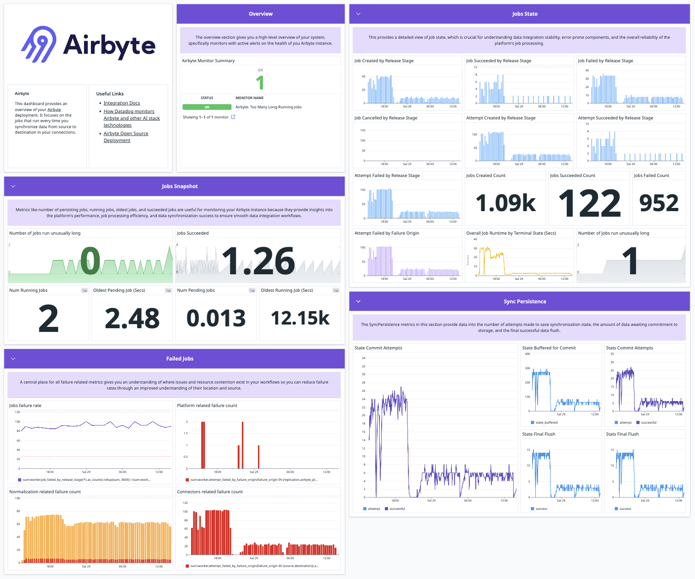

# Monitoring Airbyte

Airbyte offers extensive logging capabilities.

## Connection logging

All Airbyte instances include extensive logging for each connector. These logs give you detailed reports on each data sync. [Learn more about browsing logs](browsing-output-logs).

## OpenTelemetry metrics monitoring {#otel}

Self-Managed Enterprise customers can configure Airbyte to send telemetry data to an OpenTelemetry collector endpoint so you can consume these metrics in your downstream monitoring tool of choice. See [OpenTelemetry metrics monitoring](open-telemetry). Airbyte Cloud does not currently support a an OTEL integration.

## Datadog Integration

Self-Managed Enterprise customers can send metrics to Datadog using [OpenTelemetry](open-telemetry). Airbyte Cloud does not currently support a Datadog integration.

