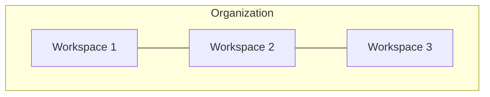

import DocCardList from '@theme/DocCardList';

# Organizations

The highest level of structure in Airbyte is an **organization**. Organizations are how you manage membership and permissions, billing (if applicable), and overall account usage. Most Airbyte users belong to a single organization, but some Airbyte users consult for multiple clients and move from one organization to another.

Self-Managed deployments only have one organization, but you can deploy Airbyte multiple times to establish different organizations.

Organizations contain one or more [workspaces](../workspaces). From your organization's home page, you can view all of your workspaces and the current status of all syncs. This is especially useful for identifying workspaces with failed syncs that might need your attention.

Think about the relationship of an organization to a workspace like this.

## Manage your organizations

<DocCardList />
