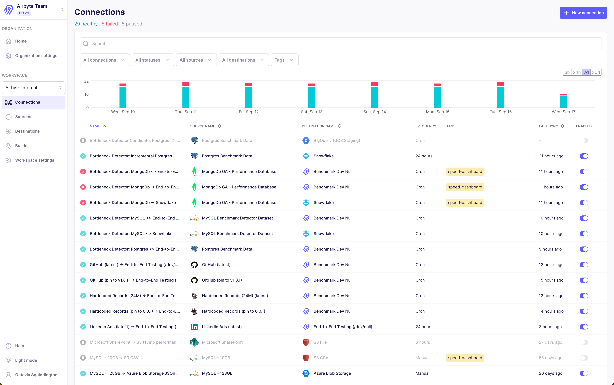

import DocCardList from '@theme/DocCardList';

# Workspaces

Each organization consists of one or more **workspaces**. A workspace groups sources, destinations, and connections. You can also use workspaces to assign access and permissions. You can use a single workspace for everything, or you can divide your organization into multiple workspaces.

You can use workspaces for the following purposes.

- Manage access and monitor usage at a more granular level. For example, you may want to separate Airbyte users into smaller groups who can only access certain data based on their role of permission level in your organization.

- Organize sources, destinations, and connections into different conceptual buckets.

- Control data residency and sovereignty. Each workspace can run syncs in a separate region.

    - If you use Cloud, you can choose between Airbyte's managed regions.

    - If you use [Enterprise Flex](../../enterprise-flex) or [Self-Managed Enterprise](../../enterprise-setup), you can also self-manage your own regions and data planes on your own infrastructure.

- Set up notifications.

If you use Core, you only have one workspace. If you use Cloud Standard, each organization is limited to one workspace. You can upgrade to Pro or Enterprise Flex to access multiple workspaces per organization.

<DocCardList />
