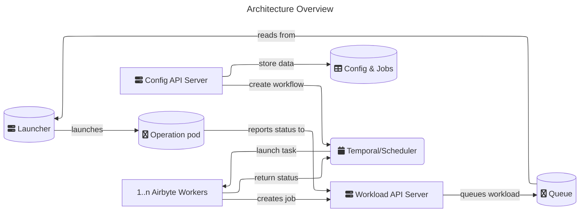
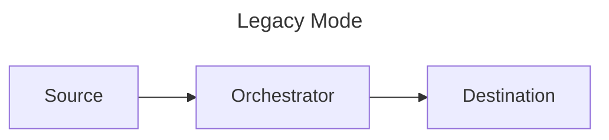
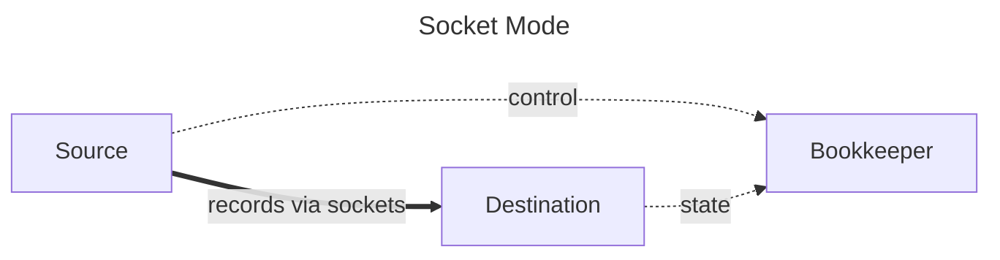

# Architecture overview

Think of Airbyte as two things:

- The platform
- Connectors

The platform provides all the horizontal services required to configure and run data movement operations. This includes the UI, API, job scheduling, logging, alerting, etc. These functions exist as a set of microservices.

Connectors are independent modules which push/pull data to/from sources and destinations. Connectors follow the [Airbyte Specification](./airbyte-protocol.md), which describes the interface with which Airbyte can move data between a source and a destination. Connectors are Docker images, which allows flexibility over the technologies used to implement them.

## Platform architecture

This diagram describes platform orchestration at a high level.

### Steady state operation

- **Config API Server** [`airbyte-server`, `airbyte-server-api`]: Airbyte's main controller and graphical user interface. All operations in Airbyte such as creating sources, destinations, connections, managing configurations, etc. are configured and invoked from the API.

- **Database config & jobs** [`airbyte-db`]: stores all the configuration \(credentials, frequency...\) and job history.

- **Temporal service** [`airbyte-temporal`]: manages the scheduling and sequencing task queues and workflows.

- **Worker** [`airbyte-worker`]: reads from the task queues and executes the connection scheduling and sequencing logic, making calls to the workload API.

- **Workload API** [`airbyte-workload-api-server`]: The HTTP interface for enqueuing workloads and the discrete pods that run the connector operations.

- **Launcher** [`airbyte-workload-launcher`]: consumes events from the workload API and interfaces with k8s to launch workloads.

### Additional components

- **Cron** [`airbyte-cron`]: cleans the server and sync logs (when using local logs). Regularly updates connector definitions and sweeps old workloads ensuring eventual consensus.

- **Bootloader** [`airbyte-bootloader`]: upgrades and migrates database tables and confirm the environment is ready to work.

### Data transfer middleware

Airbyte supports two data transfer modes.

- **Socket mode**: Records flow directly from source to destination via Unix domain sockets. This is a high-throughput parallel data transfer. A lightweight bookkeeper process handles control messages, state, and logs.

- **Legacy mode**: Records flow through an orchestrator middleware that sits between source and destination, using standard input/output streams.

Airbyte selects the mode automatically, based on the capabilities of the connectors used in a connection. It uses socket mode when both source and destination connectors support it. Socket mode provides between four and ten times the performance of legacy mode.

Within connector operation pods, Airbyte runs middleware containers to process connector output.

- **Bookkeeper** [`airbyte-bookkeeper`]: Used in socket mode. Processes control messages, state, and logs while records flow directly between connectors via sockets.

- **Container Orchestrator** [`airbyte-container-orchestrator`]: Used in legacy mode. Sits between source and destination connectors, processing all data and control messages.

#### Data flow comparison

