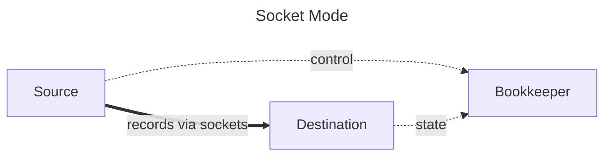
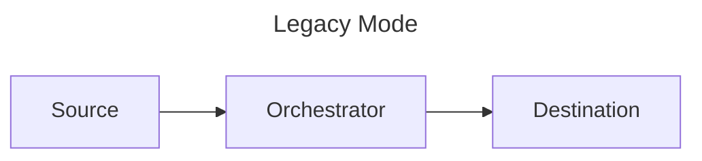
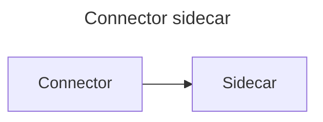
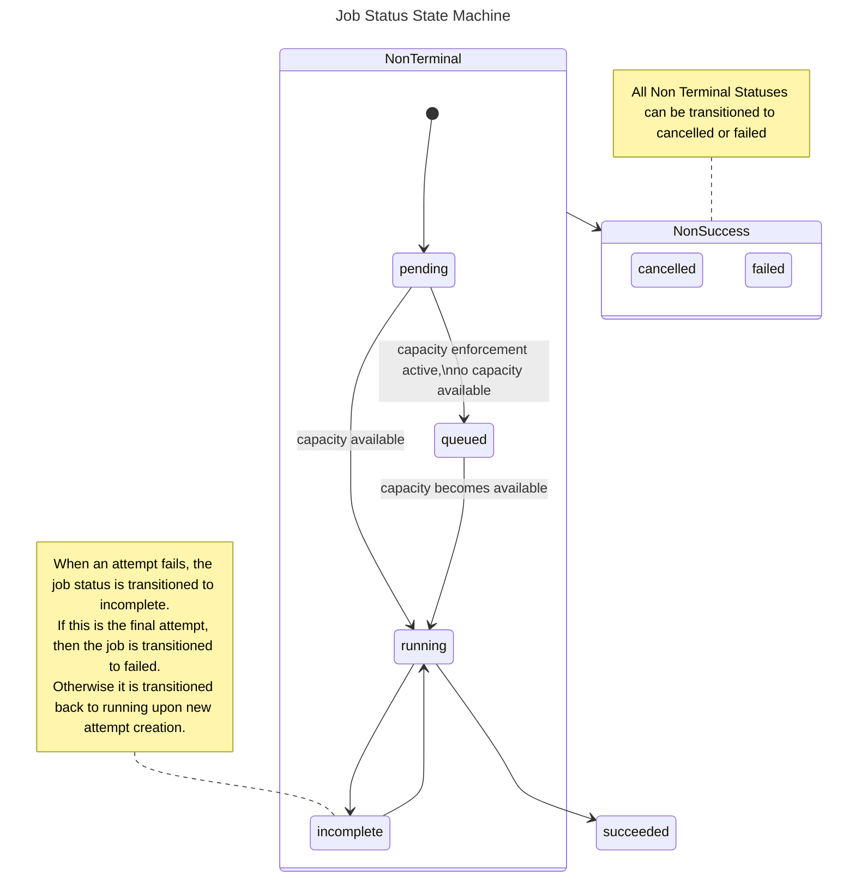
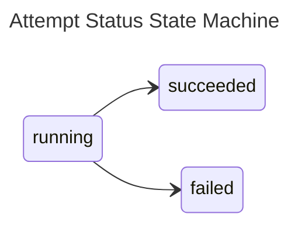

# Workloads & jobs

In Airbyte, all connector operations run as 'workloads', a pod encapsulating the discrete invocation of one or more connectors' interface methods: `READ`, `WRITE`, `CHECK`, `DISCOVER`, and `SPEC`.

Generally, there are 2 types of workload pods:

- Replication (`SYNC`) pods: call `READ` on the source and `WRITE` on the destination docker images

- Connector Job (`CHECK`, `DISCOVER`, `SPEC`) pods: call the specified interface method on the connector image

## Airbyte middleware and bookkeeping containers

Inside any connector operation pod, a special Airbyte-controlled container runs alongside the connector container to process and interpret results and perform necessary side effects. Two types of middleware containers exist.

- The container orchestrator (legacy mode) **or** the bookkeeper (socket mode)

- The connector sidecar (for CHECK, DISCOVER, SPEC operations)

### Replication architecture modes

Airbyte supports two architecture modes for replication (sync) jobs, with the platform automatically selecting the optimal mode based on connector capabilities and connection configuration.

#### Socket mode with Bookkeeper

Socket mode is Airbyte's high-performance architecture that enables 4-10x faster data movement compared to legacy mode. In this mode, data flows directly from source to destination via Unix domain sockets, while control messages like logs, state, and statistics flow through the Bookkeeper via standard I/O.

```mermaid
---
title: Socket Mode
---
flowchart LR
    direction LR
    SRC2[Source] -.->|control| BK[Bookkeeper]
    SRC2 ==>|records via sockets| DEST2[Destination]
    DEST2 -.->|state| BK[Bookkeeper]
```

Bookkeeper has the following responsibilities:

- Processes control messages from source and destination via STDIO
- Persists state messages and statistics
- Handles heartbeating and job lifecycle management
- Lightweight resource footprint (1 CPU, 1024Mi memory)

Socket mode introduces the following performance benefits.

- **Parallel Processing**: Multiple Unix domain sockets enable concurrent data streams
- **Binary Serialization**: Protocol Buffers provide efficient data encoding and strong type safety
- **Lower Latency**: Eliminates STDIO buffering delays
- **Higher Throughput**: Direct socket communication reduces overhead

By default, Airbyte determines the number of sockets by `min(source_cpu_limit, destination_cpu_limit) * 2`, allowing parallel data transfer. For example, connectors with 4 CPU limits use 8 sockets. Airbyte can override this default. For example, syncs to Iceberg destinations that deduplicate data use a single socket.

Socket mode offers enhanced state management to support parallel processing and ensure data consistency:

**Partition identifiers**: each record and state message includes a `partition_id`, a random alphanumeric string, which links records to their corresponding checkpoint state. This enables the destination to verify that all records from a partition have been received before committing the state and ensures both the destination and platform maintain consistent state information throughout the sync.

**State ordering**: state messages include an incrementing `id` field to maintain proper ordering. Since states can arrive on any socket in any order due to parallel processing, the destination uses these IDs to commit states in the correct sequence, ensuring resumability if a sync fails.

**Dual state emission**: in socket mode, Airbyte sends state messages to both:

- The destination via socket (for record count verification and ordering)

- The Bookkeeper via STDIO (for persistence and platform tracking)

#### Legacy mode with container orchestrator

Legacy mode uses the traditional STDIO-based architecture where all data flows through the container orchestrator.

```mermaid
---
title: Legacy Mode
---
flowchart LR
    direction LR
    SRC1[Source] --> ORCH[Orchestrator] --> DEST1[Destination]
```

Container orchestrator has the following responsibilities.

- Sits between source and destination connector containers
- Hosts middleware capabilities such as scrubbing PII, aggregating stats, transforming data, and checkpointing progress
- Interprets and records connector operation results
- Handles miscellaneous side effects (logging, auth token refresh flows, etc.)

#### How Airbyte selects architecture

Airbyte automatically determines which mode to use based on these factors:

It chooses socket mode when all of these conditions are met.

- Not a file transfer operation
- Not a reset operation
- Both source and destination declare IPC capabilities in their metadata
- No hashed fields or mappers configured in the connection
- Matching data channel versions between source and destination
- Both connectors support socket transport
- Compatible serialization format exists (PROTOBUF preferred, JSONL fallback)

It chooses legacy mode in the following conditions.

- Any of the above conditions aren't met
- The connectors' IPC options are missing
- The `ForceRunStdioMode` feature flag is enabled

Airbyte can also force socket mode with the `SocketTest` feature flag, which bypasses these checks. If the source and destination share no serialization format or transport medium at all, the sync fails rather than falling back to legacy mode.

### Connector sidecar

An Airbyte-controlled container that reads the output of a connector container inside a Connector Pod for non-replication operations (`CHECK`, `DISCOVER`, `SPEC`).

```mermaid
---
title: Connector sidecar
---
flowchart LR
    direction LR
    Connector --> Sidecar
```

The connector sidecar has the following responsibilities.

- Interprets and records connector operation results
- Handles miscellaneous side effects like logging and auth token refresh flows

## Workload launching architecture

Workloads are designed to be more scalable, reliable and maintainable than the previous Worker architecture. It performs particularly well in low-resource environments.

One big flaw of pre-Workloads architecture was the coupling of scheduling a job with starting a job. This complicated configuration, and created thundering herd situations for resource-constrained environments with spiky job scheduling.

Workloads is an Airbyte-internal job abstraction decoupling the number of running jobs (including those in queue), from the number of jobs that can be started. Jobs stay queued until more resources are available or canceled. This allows for better back pressure and self-healing in resource constrained environments.

Dumb workers now communicate with the Workload API Server to create a Workload instead of directly starting jobs.

The **Workload API Server** places the job in a queue. The **Launcher** picks up the job and launches the resources needed to run the job e.g. Kuberenetes pods. It throttles job creation based on available resources, minimising deadlock situations.

With this set up, Airbyte now supports:

- configuring the maximum number of concurrent jobs via the `MAX_CHECK_WORKERS` and `MAX_SYNC_WORKERS` environment variables.
- configuring the maximum number of jobs that can be started at once via the `WORKLOAD_LAUNCHER_PARALLELISM` environment variable.
- differentiating between job schedule time & job start time via the Workload API, though this is not exposed to the UI.

This also unlocks future work to turn Workers asynchronous, which allows for more efficient steady-state resource usage. See
[this blogpost](https://airbyte.com/blog/introducing-workloads-how-airbyte-1-0-orchestrates-data-movement-jobs) for more detailed information.

### Troubleshooting Workload Launch Delays

You may see a gap of several minutes in the platform logs between the workload being submitted and the sync starting. Specifically, between the `APPLY Stage: LAUNCH` log line and the `Attempting to update workload ... to LAUNCHED` log line. This time is spent waiting for Kubernetes to schedule the pod and for its init containers to complete.

Common causes of delay include:

- **Large resource requests** require the cluster autoscaler to provision new nodes (e.g. 4 CPU / 4 GiB per container × 4 containers = 16 CPU / 16 GiB total). Reducing resource requests or provisioning larger nodes can help.
- **Container images** need to be pulled for the first time on a new node.
- **Init containers** must complete before the main containers start.
- **Cluster capacity** is insufficient and pods remain in a `Pending` state until resources free up.

To diagnose long delays, check the Kubernetes pod events (`kubectl describe pod <pod-name> -n <namespace>`) for scheduling or image-pull issues.

### Workload Monitor

Airbyte runs a background monitoring process (the **Workload Monitor**) that periodically checks whether workloads are making expected progress through their lifecycle. If a workload misses its expected deadline, the monitor fails it automatically.

The monitor runs the following checks every minute by default:

| Check | Watches for | Failure message | Likely cause |
| --- | --- | --- | --- |
| **Not claimed** | Workloads stuck in PENDING status past their deadline | _"Airbyte could not start the process within time limit. No data-plane available to process the job."_ | No Launcher instances are running, or all are at capacity. |
| **Not started** | Workloads stuck in CLAIMED status past their deadline | _"Airbyte could not start the process within time limit. Unable to start the job."_ | The Launcher claimed the workload but failed to launch the pod (e.g. Kubernetes API errors, resource limits). |
| **Not heartbeating** | Workloads in LAUNCHED or RUNNING status whose heartbeat deadline has expired | _"Airbyte could not track the sync progress. Sync process exited without reporting status."_ | The pod crashed, was OOM-killed, or the orchestrator process exited before it could report status. |
| **Timeout** | Workloads exceeding their maximum allowed duration | _"Non sync workload timeout"_ or _"Sync workload timeout"_ | Non-sync workloads time out after 4 hours by default; sync workloads after 30 days. |

When one of these checks fails a workload, the message above becomes the attempt's failure message, attributed to the Airbyte platform. Older Airbyte versions reported these failures as a `WorkloadMonitorException` with the message _"Airbyte could not start the sync process or track the progress of the sync."_, so you may still see that wording in older logs or job history.

This is distinct from [source/destination heartbeat errors](./heartbeats.md), which monitor connector-level responsiveness within a running sync. The Workload Monitor operates at the platform level and checks whether the pod itself is alive and reporting.

**How to debug a Workload Monitor failure:**

1. Check the Kubernetes pod status: `kubectl get pods -n <namespace>` — look for `CrashLoopBackOff`, `OOMKilled`, `ImagePullBackOff`, or `Pending` states.
2. Inspect pod events: `kubectl describe pod <pod-name> -n <namespace>` — check for scheduling failures, resource pressure, or image pull errors.
3. Review pod logs: `kubectl logs <pod-name> -n <namespace> -c <container-name>` — look for startup errors or uncaught exceptions.
4. Check cluster resources: Ensure the cluster has enough CPU and memory to satisfy the pod's resource requests.

## Further configuring Jobs & Workloads

Details on configuring jobs & workloads can be found [here](../operator-guides/configuring-airbyte.md).

## Sync Jobs

At a high level, a sync job is an individual invocation of the Airbyte pipeline to synchronize data from a source to a destination data store.

### Sync Job State Machine

Sync jobs have the following state machine.

```mermaid
---
title: Job Status State Machine
---
stateDiagram-v2
direction TB
state NonTerminal {
    [*] --> pending
    pending
    queued
    running
    incomplete
    note left of incomplete
        When an attempt fails, the job status is transitioned to incomplete.
        If this is the final attempt, then the job is transitioned to failed.
        Otherwise it is transitioned back to running upon new attempt creation.

    end note
}
note left of NonSuccess
    All Non Terminal Statuses can be transitioned to cancelled or failed
end note

pending --> queued : capacity enforcement active,\nno capacity available
pending --> running : capacity available
queued --> running : capacity becomes available
running --> incomplete
incomplete --> running
running --> succeeded
state NonSuccess {
    cancelled
    failed
}
NonTerminal --> NonSuccess
```

```mermaid
---
title: Attempt Status State Machine
---
stateDiagram-v2
    direction LR
    running --> succeeded
    running --> failed
```

### Queued state (Cloud Pro and Enterprise Flex)

On Cloud Pro and Enterprise Flex plans, the `queued` state is used when capacity enforcement is active and all committed data workers are in use. A job transitions from `pending` to `queued` when no capacity is available. The job stays in `queued` until capacity frees up, at which point it transitions to `running`.

A queued job is cancelled if:

- The connection is modified, cancelled, deleted, or reset.
- The next scheduled sync for that connection arrives. The newer sync replaces the queued one.
- Eight hours have elapsed and the connection uses a manual schedule type.

Capacity enforcement applies only to sync jobs, not to check, discover, or spec operations. For more information, see [Monitor data worker usage](/platform/cloud/managing-airbyte-cloud/manage-data-workers).

### Attempts and Retries

In the event of a failure, the Airbyte platform will retry the pipeline. Each of these sub-invocations of a job is called an attempt.

### Retry Rules

Based on the outcome of previous attempts, the number of permitted attempts per job changes. By default, Airbyte is configured to allow the following:

- 5 subsequent attempts where no data was synchronized
- 10 total attempts where no data was synchronized
- 20 total attempts where some data was synchronized

For oss users, these values are configurable. See [Configuring Airbyte](../operator-guides/configuring-airbyte.md#jobs) for more details.

### Workflow Restarts and Retry Limits

Retries described above operate **within a single job execution**. However, certain platform-level events can cause the orchestration workflow to restart entirely. When this happens, the behavior is different from a normal retry:

1. All in-progress jobs for the connection are **terminally failed** — both the current attempt and the job itself are marked as `FAILED`.
2. The failure message reads: _"An internal transient Airbyte error has occurred. The sync should work fine on the next retry."_
3. **No automatic retry occurs.** The connection waits for its next scheduled sync to create a new job.
4. Retry counters (successive failures, total failures) start over, because retry state is tracked per job and the next scheduled sync creates a new job.

:::note
The error message says "the sync should work fine on the next retry," but this refers to the **next scheduled sync run**, not an immediate automatic retry. Connections without a schedule need to be triggered manually. If the underlying issue persists (e.g. repeated platform restarts), the connection may fail on successive scheduled runs without ever completing.
:::

### Retry Backoff

After an attempt where no data was synchronized, we implement a short backoff period before starting a new attempt. This will increase with each successive complete failure—a partially successful attempt will reset this value.

By default, Airbyte is configured to backoff with the following values:

- 10 seconds after the first complete failure
- 30 seconds after the second
- 90 seconds after the third
- 4 minutes and 30 seconds after the fourth

For oss users, these values are configurable. See [Configuring Airbyte](../operator-guides/configuring-airbyte.md#jobs) for more details.

The duration of expected backoff between attempts can be viewed in the logs accessible from the job history UI.

### Retry examples

To help illustrate what is possible, below are a couple examples of how the retry rules may play out under more elaborate circumstances.

<table>
    <thead>
        <tr>
            <th colspan="2">Job #1</th>
        </tr>
        <tr>
            <th>Attempt Number</th>
            <th>Synced data?</th>
        </tr>
    </thead>
    <tbody>
        <tr>
            <td>1</td>
            <td>No</td>
        </tr>
        <tr>
            <td colspan="2">10 second backoff</td>
        </tr>
        <tr>
            <td>2</td>
            <td>No</td>
        </tr>
        <tr>
            <td colspan="2">30 second backoff</td>
        </tr>
        <tr>
            <td>3</td>
            <td>Yes</td>
        </tr>
        <tr>
            <td>4</td>
            <td>Yes</td>
        </tr>
        <tr>
            <td>5</td>
            <td>Yes</td>
        </tr>
        <tr>
            <td>6</td>
            <td>No</td>
        </tr>
        <tr>
            <td colspan="2">10 second backoff</td>
        </tr>
        <tr>
            <td>7</td>
            <td>Yes</td>
        </tr>
        <tr>
            <td colspan="2">Job succeeds — all data synced</td>
        </tr>
    </tbody>
</table>

<table>
    <thead>
        <tr>
            <th colspan="2">Job #2</th>
        </tr>
        <tr>
            <th>Attempt Number</th>
            <th>Synced data?</th>
        </tr>
    </thead>
    <tbody>
        <tr>
            <td>1</td>
            <td>Yes</td>
        </tr>
        <tr>
            <td>2</td>
            <td>Yes</td>
        </tr>
        <tr>
            <td>3</td>
            <td>Yes</td>
        </tr>
        <tr>
            <td>4</td>
            <td>Yes</td>
        </tr>
        <tr>
            <td>5</td>
            <td>Yes</td>
        </tr>
        <tr>
            <td>6</td>
            <td>Yes</td>
        </tr>
        <tr>
            <td>7</td>
            <td>No</td>
        </tr>
        <tr>
            <td colspan="2">10 second backoff</td>
        </tr>
        <tr>
            <td>8</td>
            <td>No</td>
        </tr>
        <tr>
            <td colspan="2">30 second backoff</td>
        </tr>
        <tr>
            <td>9</td>
            <td>No</td>
        </tr>
        <tr>
            <td colspan="2">90 second backoff</td>
        </tr>
        <tr>
            <td>10</td>
            <td>No</td>
        </tr>
        <tr>
            <td colspan="2">4 minute 30 second backoff</td>
        </tr>
        <tr>
            <td>11</td>
            <td>No</td>
        </tr>
        <tr>
            <td colspan="2">Job Fails — successive failure limit reached</td>
        </tr>
    </tbody>
</table>
