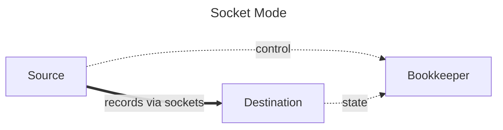
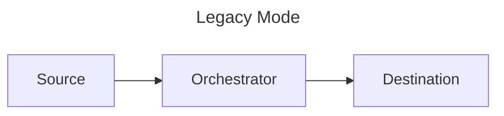
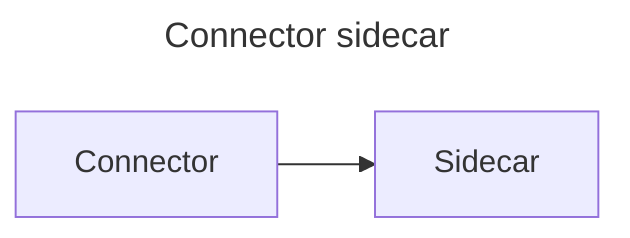
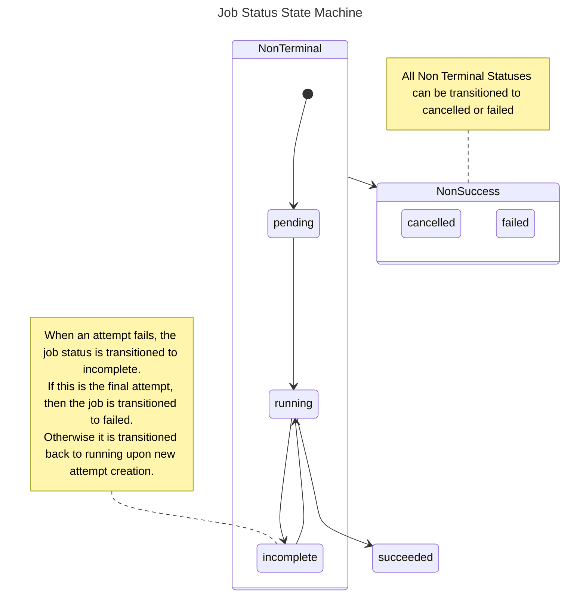
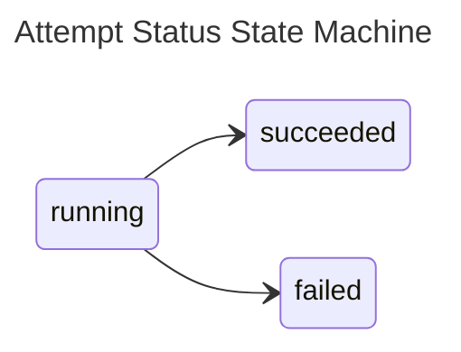

# Workloads & jobs

In Airbyte, all connector operations run as 'workloads', a pod encapsulating the discrete invocation of one or more connectors' interface methods: `READ`, `WRITE`, `CHECK`, `DISCOVER`, and `SPEC`.

Generally, there are 2 types of workload pods:

- Replication (`SYNC`) pods: call `READ` on the source and `WRITE` on the destination docker images

- Connector Job (`CHECK`, `DISCOVER`, `SPEC`) pods: call the specified interface method on the connector image

## Airbyte middleware and bookkeeping containers

Inside any connector operation pod, a special Airbyte-controlled container runs alongside the connector container to process and interpret results and perform necessary side effects. Two types of middleware containers exist.

- The container orchestrator (legacy mode) **or** the bookkeeper (socket mode)

- The connector sidecar (for CHECK, DISCOVER, SPEC operations)

### Replication architecture modes

Airbyte supports two architecture modes for replication (sync) jobs, with the platform automatically selecting the optimal mode based on connector capabilities and connection configuration.

#### Socket mode with Bookkeeper

Socket mode is Airbyte's high-performance architecture that enables 4-10x faster data movement compared to legacy mode. In this mode, data flows directly from source to destination via Unix domain sockets, while control messages like logs, state, and statistics flow through the Bookkeeper via standard I/O.

Bookkeeper has the following responsibilities:

- Processes control messages from source and destination via STDIO
- Persists state messages and statistics
- Handles heartbeating and job lifecycle management
- Lightweight resource footprint (1 CPU, 1024Mi memory)

Socket mode introduces the following performance benefits.

- **Parallel Processing**: Multiple Unix domain sockets enable concurrent data streams
- **Binary Serialization**: Protocol Buffers provide efficient data encoding and strong type safety
- **Lower Latency**: Eliminates STDIO buffering delays
- **Higher Throughput**: Direct socket communication reduces overhead

Airbyte determines the number of sockets by `min(source_cpu_limit, destination_cpu_limit) * 2`, allowing parallel data transfer. For example, connectors with 4 CPU limits use 8 sockets.

Socket mode offers enhanced state management to support parallel processing and ensure data consistency:

**Partition identifiers**: each record and state message includes a `partition_id`, a random alphanumeric string, which links records to their corresponding checkpoint state. This enables the destination to verify that all records from a partition have been received before committing the state and ensures both the destination and platform maintain consistent state information throughout the sync.

**State ordering**: state messages include an incrementing `id` field to maintain proper ordering. Since states can arrive on any socket in any order due to parallel processing, the destination uses these IDs to commit states in the correct sequence, ensuring resumability if a sync fails.

**Dual state emission**: in socket mode, Airbyte sends state messages to both:

- The destination via socket (for record count verification and ordering)

- The Bookkeeper via STDIO (for persistence and platform tracking)

#### Legacy mode with container orchestrator

Legacy mode uses the traditional STDIO-based architecture where all data flows through the container orchestrator.

Container orchestrator has the following responsibilities.

- Sits between source and destination connector containers
- Hosts middleware capabilities such as scrubbing PII, aggregating stats, transforming data, and checkpointing progress
- Interprets and records connector operation results
- Handles miscellaneous side effects (logging, auth token refresh flows, etc.)

#### How Airbyte selects architecture

Airbyte automatically determines which mode to use based on these factors:

It chooses socket mode when all of these conditions are met.

- Not a file transfer operation
- Not a reset operation
- Both source and destination declare IPC capabilities in their metadata
- No hashed fields or mappers configured in the connection
- Matching data channel versions between source and destination
- Both connectors support socket transport
- Compatible serialization format exists (PROTOBUF preferred, JSONL fallback)

It chooses legacy mode in the following conditions.

- Any of the above conditions aren't met
- The `ForceRunStdioMode` feature flag is enabled
- IPC options are missing or incompatible

### Connector sidecar

An Airbyte-controlled container that reads the output of a connector container inside a Connector Pod for non-replication operations (`CHECK`, `DISCOVER`, `SPEC`).

The connector sidecar has the following responsibilities.

- Interpret and records connector operation results
- Handle miscellaneous side effects like logging and auth token refresh flows

## Workload launching architecture

Workloads are designed to be more scalable, reliable and maintainable than the previous Worker architecture. It performs particularly well in low-resource environments.

One big flaw of pre-Workloads architecture was the coupling of scheduling a job with starting a job. This complicated configuration, and created thundering herd situations for resource-constrained environments with spiky job scheduling.

Workloads is an Airbyte-internal job abstraction decoupling the number of running jobs (including those in queue), from the number of jobs that can be started. Jobs stay queued until more resources are available or canceled. This allows for better back pressure and self-healing in resource constrained environments.

Dumb workers now communicate with the Workload API Server to create a Workload instead of directly starting jobs.

The **Workload API Server** places the job in a queue. The **Launcher** picks up the job and launches the resources needed to run the job e.g. Kuberenetes pods. It throttles job creation based on available resources, minimising deadlock situations.

With this set up, Airbyte now supports:

- configuring the maximum number of concurrent jobs via `MAX_CHECK_WORKERS` and `MAX_SYNC_WORKERS` environment variables.`
- configuring the maximum number of jobs that can be started at once via ``
- differentiating between job schedule time & job start time via the Workload API, though this is not exposed to the UI.

This also unlocks future work to turn Workers asynchronous, which allows for more efficient steady-state resource usage. See
[this blogpost](https://airbyte.com/blog/introducing-workloads-how-airbyte-1-0-orchestrates-data-movement-jobs) for more detailed information.

## Further configuring Jobs & Workloads

Details on configuring jobs & workloads can be found [here](../operator-guides/configuring-airbyte.md).

## Sync Jobs

At a high level, a sync job is an individual invocation of the Airbyte pipeline to synchronize data from a source to a destination data store.

### Sync Job State Machine

Sync jobs have the following state machine.

### Attempts and Retries

In the event of a failure, the Airbyte platform will retry the pipeline. Each of these sub-invocations of a job is called an attempt.

### Retry Rules

Based on the outcome of previous attempts, the number of permitted attempts per job changes. By default, Airbyte is configured to allow the following:

- 5 subsequent attempts where no data was synchronized
- 10 total attempts where no data was synchronized
- 20 total attempts where some data was synchronized

For oss users, these values are configurable. See [Configuring Airbyte](../operator-guides/configuring-airbyte.md#jobs) for more details.

### Retry Backoff

After an attempt where no data was synchronized, we implement a short backoff period before starting a new attempt. This will increase with each successive complete failure—a partially successful attempt will reset this value.

By default, Airbyte is configured to backoff with the following values:

- 10 seconds after the first complete failure
- 30 seconds after the second
- 90 seconds after the third
- 4 minutes and 30 seconds after the fourth

For oss users, these values are configurable. See [Configuring Airbyte](../operator-guides/configuring-airbyte.md#jobs) for more details.

The duration of expected backoff between attempts can be viewed in the logs accessible from the job history UI.

### Retry examples

To help illustrate what is possible, below are a couple examples of how the retry rules may play out under more elaborate circumstances.

<table>
    <thead>
        <tr>
            <th colspan="2">Job #1</th>
        </tr>
        <tr>
            <th>Attempt Number</th>
            <th>Synced data?</th>
        </tr>
    </thead>
    <tbody>
        <tr>
            <td>1</td>
            <td>No</td>
        </tr>
        <tr>
            <td colspan="2">10 second backoff</td>
        </tr>
        <tr>
            <td>2</td>
            <td>No</td>
        </tr>
        <tr>
            <td colspan="2">30 second backoff</td>
        </tr>
        <tr>
            <td>3</td>
            <td>Yes</td>
        </tr>
        <tr>
            <td>4</td>
            <td>Yes</td>
        </tr>
        <tr>
            <td>5</td>
            <td>Yes</td>
        </tr>
        <tr>
            <td>6</td>
            <td>No</td>
        </tr>
        <tr>
            <td colspan="2">10 second backoff</td>
        </tr>
        <tr>
            <td>7</td>
            <td>Yes</td>
        </tr>
        <tr>
            <td colspan="2">Job succeeds — all data synced</td>
        </tr>
    </tbody>
</table>

<table>
    <thead>
        <tr>
            <th colspan="2">Job #2</th>
        </tr>
        <tr>
            <th>Attempt Number</th>
            <th>Synced data?</th>
        </tr>
    </thead>
    <tbody>
        <tr>
            <td>1</td>
            <td>Yes</td>
        </tr>
        <tr>
            <td>2</td>
            <td>Yes</td>
        </tr>
        <tr>
            <td>3</td>
            <td>Yes</td>
        </tr>
        <tr>
            <td>4</td>
            <td>Yes</td>
        </tr>
        <tr>
            <td>5</td>
            <td>Yes</td>
        </tr>
        <tr>
            <td>6</td>
            <td>Yes</td>
        </tr>
        <tr>
            <td>7</td>
            <td>No</td>
        </tr>
        <tr>
            <td colspan="2">10 second backoff</td>
        </tr>
        <tr>
            <td>8</td>
            <td>No</td>
        </tr>
        <tr>
            <td colspan="2">30 second backoff</td>
        </tr>
        <tr>
            <td>9</td>
            <td>No</td>
        </tr>
        <tr>
            <td colspan="2">90 second backoff</td>
        </tr>
        <tr>
            <td>10</td>
            <td>No</td>
        </tr>
        <tr>
            <td colspan="2">4 minute 30 second backoff</td>
        </tr>
        <tr>
            <td>11</td>
            <td>No</td>
        </tr>
        <tr>
            <td colspan="2">Job Fails — successive failure limit reached</td>
        </tr>
    </tbody>
</table>
