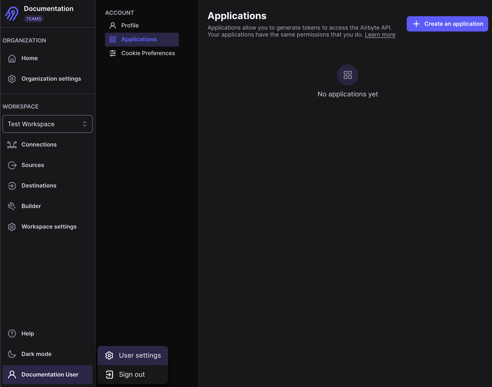

import Tabs from "@theme/Tabs";
import TabItem from "@theme/TabItem";

# Get an API access token

Most programmatic interactions with Airbyte require an access token. An access token represents an individual Airbyte user, and it has the same permissions as that Airbyte user.

:::tip
Using a service account for this purpose is helpful. If you rely on making requests to the Airbyte API using personal credentials, your apps and scripts could break if someone leaves your organization.
:::

The process to generate an access token involves two steps.

1. Create an application in Airbyte.
2. Use that application to get an access token.

## Prerequisites

You need access to either of the following:

- An Airbyte Cloud organization
- A self-managed deployment of Airbyte that exposes the `airbyte-server` service

## Step 1: Create an application

An Airbyte application represents an individual user using a client ID and client secret.

<Tabs>
<TabItem value="cloud" label="Cloud">

1. In Airbyte's UI, click your name > **User settings** > **Applications**.

    

2. Click **Create an application**.

3. Give your application a descriptive name and click **Submit**.

    

4. Click the <svg fill="none" data-icon="eye" role="img" viewBox="0 0 24 24" class="inline-svg"><path fill="currentColor" d="M21.92 11.6C19.9 6.91 16.1 4 12 4s-7.9 2.91-9.92 7.6a1 1 0 0 0 0 .8C4.1 17.09 7.9 20 12 20s7.9-2.91 9.92-7.6a1 1 0 0 0 0-.8M12 18c-3.17 0-6.17-2.29-7.9-6C5.83 8.29 8.83 6 12 6s6.17 2.29 7.9 6c-1.73 3.71-4.73 6-7.9 6m0-10a4 4 0 1 0 0 8 4 4 0 0 0 0-8m0 6a2 2 0 1 1 0-4 2 2 0 0 1 0 4"></path></svg> icon to expose your client secret.

    

</TabItem>
<TabItem value="oss" label="Core">

Since Airbyte Core only has a single user, Airbyte already provides an application with a client ID and client secret for you.

In Airbyte's UI, click **User** > **User settings** > **Applications**. Click the <svg fill="none" data-icon="eye" role="img" viewBox="0 0 24 24" class="inline-svg"><path fill="currentColor" d="M21.92 11.6C19.9 6.91 16.1 4 12 4s-7.9 2.91-9.92 7.6a1 1 0 0 0 0 .8C4.1 17.09 7.9 20 12 20s7.9-2.91 9.92-7.6a1 1 0 0 0 0-.8M12 18c-3.17 0-6.17-2.29-7.9-6C5.83 8.29 8.83 6 12 6s6.17 2.29 7.9 6c-1.73 3.71-4.73 6-7.9 6m0-10a4 4 0 1 0 0 8 4 4 0 0 0 0-8m0 6a2 2 0 1 1 0-4 2 2 0 0 1 0 4"></path></svg> icon to expose your client secret.


If you deploy Airbyte with abctl, you can also [use the command line interface](../deploying-airbyte/abctl/#view-and-change-credentials) to see your client ID and client secret.

</TabItem>
<TabItem value="sme" label="Self-Managed Enterprise">

1. In Airbyte's UI, click your name > **User settings** > **Applications**.

    

2. Click **Create an application**.

3. Give your application a descriptive name and click **Submit**.

    

4. Click the <svg fill="none" data-icon="eye" role="img" viewBox="0 0 24 24" class="inline-svg"><path fill="currentColor" d="M21.92 11.6C19.9 6.91 16.1 4 12 4s-7.9 2.91-9.92 7.6a1 1 0 0 0 0 .8C4.1 17.09 7.9 20 12 20s7.9-2.91 9.92-7.6a1 1 0 0 0 0-.8M12 18c-3.17 0-6.17-2.29-7.9-6C5.83 8.29 8.83 6 12 6s6.17 2.29 7.9 6c-1.73 3.71-4.73 6-7.9 6m0-10a4 4 0 1 0 0 8 4 4 0 0 0 0-8m0 6a2 2 0 1 1 0-4 2 2 0 0 1 0 4"></path></svg> icon to expose your client secret.

    

</TabItem>
</Tabs>

## Step 2: Get an access token

You can exchange your client ID and client secret for an access token. Use this access token to make requests. Access tokens expire in 15 minutes. Each time your access token expires, request a new one.

<Tabs>
<TabItem value="manually" label="Manually">

You can manually generate an access token from Airbyte's UI.

1. Still on the Applications page, hover over the application for which you want to generate an access token.

2. Click **Generate access token**.

3. Click **Copy** or **Download access token**.

4. Close the dialog.

</TabItem>
<TabItem value="cloud" label="Cloud">

Make a POST request to the API, replacing the client ID and client secret placeholders below with your actual client ID and client secret.

```bash title="Request"
curl --request POST \
     --url https://api.airbyte.com/v1/applications/token \
     --header 'accept: application/json' \
     --header 'content-type: application/json' \
     --data '
{
  "client_id": "<YOUR_CLIENT_ID>",
  "client_secret": "<YOUR_CLIENT_SECRET>",
  "grant-type": "client_credentials"
}
'
```

If your request was successful, the API returns your access token with an expiry time.

```bash title="Response"
{
  "access_token": "<YOUR_ACCESS_TOKEN>",
  "token_type": "Bearer",
  "expires_in": 900
}
```

For more examples, see [Get an access token](https://reference.airbyte.com/reference/createaccesstoken#/).

</TabItem>
<TabItem value="self-managed" label="Self-Managed">

Make a POST request to the API, replacing the Airbyte URL, client ID and client secret placeholders below with your actual Airbyte URL, client ID, and client secret. If Airbyte is running locally, your Airbyte URL is probably `http://localhost:8000`.

```bash title="Request"
curl --request POST \
     --url <YOUR_AIRBYTE_URL>/api/public/v1/applications/token \
     --header 'accept: application/json' \
     --header 'content-type: application/json' \
     --data '
{
  "client_id": "<YOUR_CLIENT_ID>",
  "client_secret": "<YOUR_CLIENT_SECRET>",
  "grant-type": "client_credentials"
}
'
```

If your request was successful, the API returns your access token with an expiry time.

```bash title="Response"
{
  "access_token": "<YOUR_ACCESS_TOKEN>",
  "token_type": "Bearer",
  "expires_in": 900
}
```

For more examples, see [Get an access token](https://reference.airbyte.com/reference/createaccesstoken#/).

</TabItem>
<TabItem value="other" label="Terraform and SDKs">

The Terraform Provider and SDKs can handle this for you. Initialize the Provider/SDK with the Client Credentials grant type using your Application's `client_id` and `client_secret`.

</TabItem>
</Tabs>

## Step 3: Use your access token

Once you have an application and/or access token, use it to make requests from your source code. [Learn more in the Developers section](/developers).
