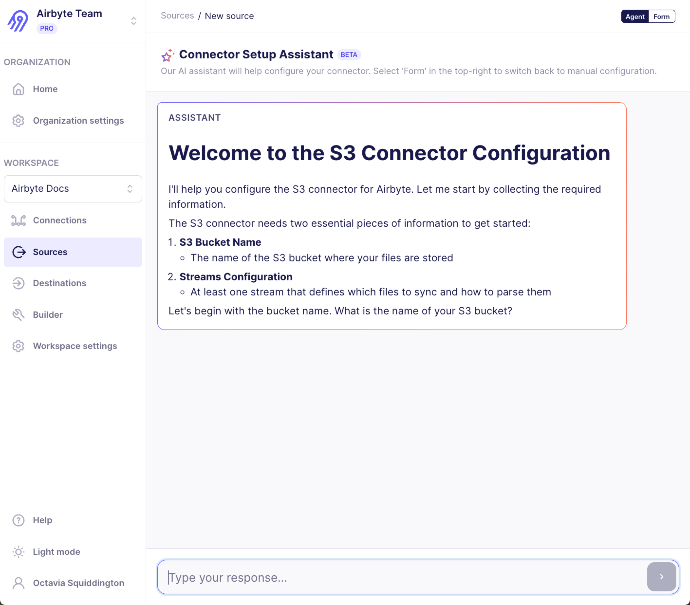

You can set up connectors with help from an AI agent, the Connector Setup Assistant. This feature is currently in beta and may experience minor issues.

### Handle secrets securely

Occasionally the Connector Setup Assistant asks you to provide a secret, like a password or API key. In these situations, the chat enters secret mode and stores your response without exposing it to the agent. You know you're in this mode because a message banner appears above the input field indicating that your credentials will be stored securely and not sent to the AI. The input field also masks your text like a password field.

In this mode, don't type anything other than your secret. If you need to ask the AI a question, click **Cancel** to exit secret mode, then continue your conversation in normal mode.

Never provide a secret when secret mode is off. If you accidentally expose a secret to the agent this way, rotate that secret immediately.

### Handle OAuth authentication

For connectors that use OAuth authentication, the Connector Setup Assistant guides you through the OAuth flow. When the agent determines that OAuth authentication is needed, it displays a button to start the authentication process. Click the button to open a popup window where you can authorize access to your account. After you complete the authorization, the agent automatically receives the credentials and continues with the setup.

### Switch between agent and form modes

To switch between agent and form mode, click **Agent** or **Form** in the top right corner of the screen.

If you're partway through a conversation with the agent and switch to form mode, the form reflects the agent's progress. It's safe to switch back and forth between modes. However, the agent doesn't have access to your secrets. If you provide a secret to the agent, then revise that secret in form mode, and then return to the agent, the agent continues to use its previously stored secret because it's unaware that the secret has changed.

### Tips for conversing with the AI agent

The Connector Setup Assistant guides you through configuration by asking questions and explaining what each setting does. Here are some tips for working with it effectively.

- When the agent asks for information, respond in natural language. You don't need to format your answers in any special way. For example, if the agent asks for your S3 bucket name, you can simply type the bucket name and press Enter.

- Be specific and direct when answering questions. If you don't know a value the agent is asking for, say so rather than guessing. The agent can often help you find the information you need or explain where to locate it in your source system.

- If the agent asks a question you don't understand, ask for clarification. The agent can explain what each configuration option does and why it's needed.

- For connectors with many configuration options, the agent typically asks about required fields first.

### Completing the setup

After you provide all the required configuration, the agent signals that setup is complete and Airbyte runs a connection test. If the test succeeds, Airbyte takes you to the New Connection page where you can start syncing data.

If the connection test fails, the agent explains the error and suggests how to fix it. You can update your configuration through the conversation or switch to form mode to make changes directly.

### Limitations

The Connector Setup Assistant is currently in beta. Keep these limitations in mind:

- The agent may not have information about very recent changes to a connector's API or configuration options.
- For complex edge cases, you may need to switch to form mode to complete the configuration.

### Troubleshooting

- If the agent doesn't understand your response, try rephrasing it or providing more context. You can also switch to form mode at any time to see your current progress and complete the configuration manually.

- If you're unsure where to find a credential or configuration value the agent is asking for, ask the agent clarifying questions. The agent can often help you find the information you need or explain where to locate it in your source system.
