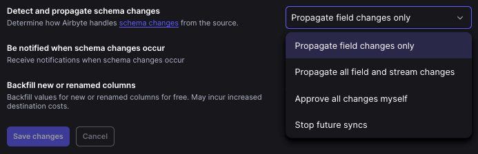

# Schema Change Management

You can specify for each connection how Airbyte should handle any change of schema in the source. This process helps ensure accurate and efficient data syncs, minimizing errors and saving you time and effort in managing your data pipelines.

To set or edit this setting, navigate to a connection's Settings tab. You'll see the following available options:

## Detecting Schema Changes

For Cloud users, Airbyte automatically checks for any changes in your source schema immediately before syncing, at a maximum of every 15 minutes per source. If it is requested within 15 minutes, it will use the previous result.

For self-managed users, Airbyte checks for any changes in your source schema immediately before syncing, at most every 24 hours. This means your source schema changes may not be automatically propagated if it has been less than 24 hours since the previous schema check.

You may also manually refresh the schema at any time.

The following describes the types of schema changes that are detected.

| Type of Schema Change    | Propagation Behavior  | Breaking Schema Change? |
| ------------------------ | --------------------- | ----------------------- |
| New Column/Field               | The new field will be created in the destination. Values for the field will be filled in for the updated rows. If you are missing values for rows not updated, a backfill can be done by manually triggering a refresh or through the `Backfill new or renamed columns` option (see below)                                                                         |
| Removal of column/field        | The old field will be retained in the destination, but stop updating with updated values. If the connection is ever cleared or refreshed, the field and its historical data will be removed entirely. || 
| New stream               | The first sync will create the new stream in the destination and fill all data in as if it is an initial sync.    ||
| Removal of stream        | The stream will stop updating, and any existing data in the destination will remain.    ||
| Column data type changes | The data in the destination will remain the same. For those syncing on a Destinations V2 destination, any new or updated rows with incompatible data types will result in a row error in the destination tables and show an error in the `airbyte_meta` field. You will need to refresh the schema and refresh the stream to ensure the data types are consistent. ||
| Cursor is removed | The connection will be paused immediately for manual review to prevent future syncs from failing.  | X |
| Primary key is removed | The connection will be paused immediately for manual review to prevent future syncs from failing.  | X |

## Detect and Propagate Schema Changes connection setting

Airbyte offers a few options for how it should detect and propagate schema changes. Depending on how you configure it, Airbyte can automatically sync any detected schema changes or ignore them. The following options are available:

| Connection Setting    | Definition  |
| --------------------- | ----------- |
| Propagate field changes only              | Only column changes will be propagated. New or removed streams will be ignored.            |
| Propagate all field and stream changes | All new streams and column changes from the source will automatically be propagated and reflected in the destination. This includes stream changes (additions or deletions), column changes (additions or deletions) and data type changes |
| Approve all changes myself         | This allows you to detect and manually approve changes. Schema changes will be detected, but not propagated. Syncs will continue running with the schema you've set up. To propagate the detected schema changes, you will need to approve the changes manually                                    |
| Stop future syncs         | Connections will be automatically paused as soon as any schema changes are detected             |

### Automatic propagation of detected schema changes
If your connection setting is set to `Propagate field changes only` or `Propagate all field and stream changes`, schema changes except for breaking changes are automatically applied to the ensuing sync and the data in the destination will automatically shift as schema changes are applied. 

When `Propagate field changes only` is selected, only field changes will be propagated. New or removed streams will be ignored. 

When `Propagate all field and stream changes` is selected, both field and stream changes will be automatically propagated.

### Review detected non-breaking schema changes

If the connection is set to **Detect any changes and manually approve** schema changes, Airbyte continues syncing according to your last saved schema. You need to manually approve any detected schema changes for the schema in the destination to change.

1. In the Airbyte UI, click **Connections**. Select a connection and navigate to the **Schema** tab. If schema changes have been detected, you'll see a blue "i" icon next to the `Schema` tab.

2. Click **Review changes**.

3. The **Refreshed source schema** dialog displays the changes detected.

4. Review the changes and click **OK** to close the dialog.

5. Click **Save changes** to ensure the schema changes are applied to the next sync.

### Review detected breaking schema changes

Regardless of your `Detect and Propagate Schema Changes` setting preference, if a breaking schema change is detected, the connection will be paused immediately for manual review to prevent future syncs from failing. Breaking changes require your attention to resolve.

Breaking schema changes occur when:

- An existing primary key is removed from the source
- An existing cursor is removed from the source

To re-enable the streams:

1. In the Airbyte UI, click **Connections**. Select a connection and navigate to the **Schema** tab. If schema changes have been detected, you'll see a red "i" icon next to the `Schema` tab.

2. Click the stream to open the field details for that stream. Ensure your cursor and primary key are selected. 

3. Exit the field selection pane and click **Save changes** to ensure the schema changes are applied to the next sync. You will be prompted to refresh or clear the affected streams so that Airbyte can ensure future syncs are successful. Airbyte highly recommends refreshing or clearing streams and sync all historical data again.

## Backfill new or renamed columns connection setting

To further automate the propagation of schema changes, Airbyte also offers the option to backfill new or renamed columns as a part of the sync. This means that anytime a new column is detected through the auto-propagation of schema changes, Airbyte will sync the entire stream again so that all values in the new columns will be completely filled, even if the row was not updated. If this option is not enabled, only rows that are updated as a part of the regular sync will be populated with a value.

This feature will only perform the backfill when `Detect and propagate schema changes` is set to `Propagate all changes` or `Propagate columns changes only` and Airbyte detects the schema change as a part of a sync. Refreshing the schema manually and applying schema changes will not allow the backfill to occur.

:::tip
Enabling automatic backfills may incur increased destination costs from refreshing the entire stream.
:::

For Cloud users, any stream that contains a new or renamed column will not be billed and the free usage will be noted on the billing page. Streams that are synced in the same sync and do not contain a new or renamed column will be billed as usual.

## Manually refresh the source schema

In addition to Airbyte's automatic schema change detection, you can manually refresh the source schema at any time to stay up to date with changes in your schema. To manually refresh the source schema:

1.  In the Airbyte UI, click **Connections** and then click the connection you want to refresh. Click the **Schema** tab.

2.  In the **Select streams** table, click **Refresh source schema** to fetch the schema of your data source.

3.  If there are changes to the schema, you can review them in the **Refreshed source schema** dialog.

## Major Connector Version Upgrades
For Cloud users, connectors are generally shipped to you with enhancements and improvements without any action needed from you. 

However, connectors may periodically require your approval to upgrade to a new major version. Airbyte will alert you of the new version and give you a window to manually upgrade yourself to preview and prepare for any changes. 

:::tip
It is **highly recommended** to upgrade before the cutoff date to ensure you understand the upcoming changes to your data, as it may affect downstream services and data models. After the window has closed, connections will be automatically upgraded to the new version.
:::

When publishing a new version of a connector, Airbyte only considers the following scenarios as reasons as significant enough for a major version release:

| Type of Change | Description    |
| -------------- | -------------- |
| Schema Change                | A field or stream was renamed, or the data type of a field has changed.       |
| Stream or Property Removal      | Data that was previously being synced is no longer going to be synced                                               |
| Addition of a new sync mode      | Airbyte now offers a new, more efficient way to sync data.                                               |
| Modifications to a source-defined primary key      | The primary key has been added or modified to improve sync accuracy.                                               |
| Connector Configuration (Specification) Change    | The configuration has  changed and may require re-authentication or a new configuration input.      |
| Destination Format / Normalization Change | The way the destination writes the final data or how Airbyte cleans that data is changing in a way that requires a full refresh |
| State Changes                             | The format of the source’s state has changed, and the full dataset will need to be re-synced                                    |

We expect that most users will gracefully continue syncing successfully with most major version updates. However, users using a destination that does not utilize [Typing & Deduping](/using-airbyte/core-concepts/typing-deduping) will experience sync failures if the major version includes a data type change. 

### Upgrading your connector
To review major connector version changes and upgrade your connector: 

1. In the Airbyte UI, click **Connections** and select the connection with a major version change.

2. Review the description of what has changed in the new version. The major version change will require you to upgrade your source or destination to a new version by a specific cutoff date.

3. Update the source or destination to the new version to continue syncing. Follow the connector-specific migration guide to ensure your connections continue syncing successfully.
