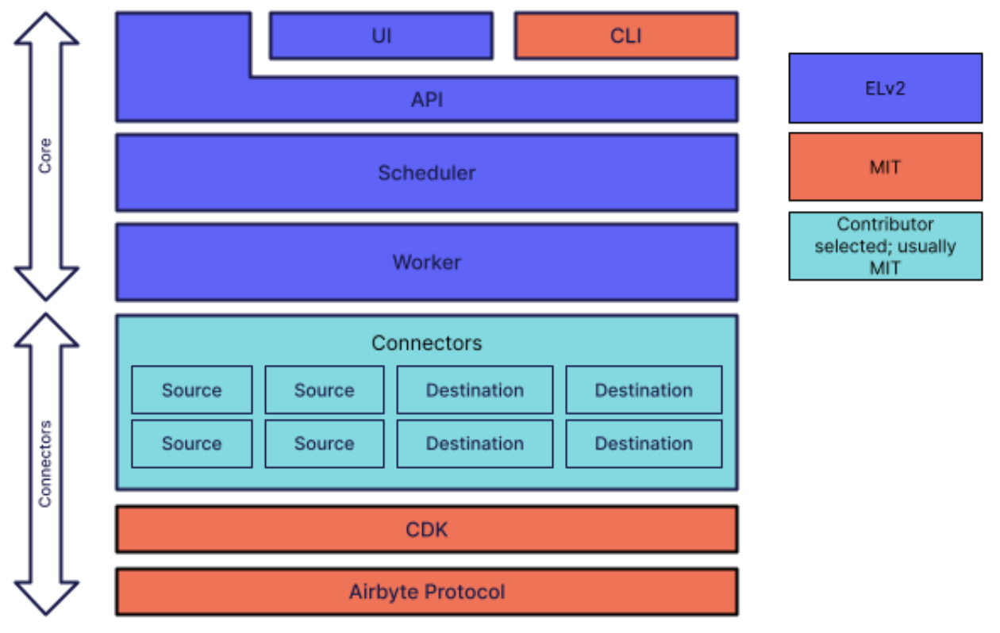

# License FAQ

## Airbyte Licensing Overview
* **Airbyte Connectors** are open sourced and available under the MIT License.
* **Airbyte Protocol** is open sourced and available under the MIT License.
* **Airbyte CDK** (Connector Development Kit) is open sourced and available under the MIT License.
* **Airbyte Core** is licensed under the Elastic License 2.0 (ELv2).
* **Airbyte Cloud & Airbyte Enterprise** are both closed source and require a commercial license from Airbyte.

## About Elastic License 2.0 (ELv2)
ELv2 is a simple, non-copyleft license, allowing for the right to “use, copy, distribute, make available, and prepare derivative works of the software”. Anyone can use Airbyte, free of charge. You can run the software at scale on your infrastructure. There are only three high-level limitations. You cannot:
1. Provide the products to others as a managed service ([read more](#what-is-the-managed-service-use-case-that-is-not-allowed-under-elv2));
2. Circumvent the license key functionality or remove/obscure features protected by license keys; or
3. Remove or obscure any licensing, copyright, or other notices.

In case you want to work with Airbyte without these limitations, we offer alternative licenses. These licenses include maintenance, support, and customary commercial terms. If you need a different license, please get in touch with us at: contact@airbyte.io.

[View License](elv2-license.md)

## FAQ
### What limitations does ELv2 impose on my use of Airbyte?
If you are an Airbyte Cloud customer, nothing changes for you.

For open-source users, everyone can continue to use Airbyte as they are doing today: no limitations on volume, number of users, number of connections…

There are only a few high-level limitations. You cannot:
1. Provide the products to others as a managed service. For example, you cannot sell a cloud service that provides users with direct access to Airbyte. You can sell access to applications built and run using Airbyte ([read more](#what-is-the-managed-service-use-case-that-is-not-allowed-under-elv2)).
2. Circumvent the license key functionality or remove/obscure features protected by license keys. For example, our code may contain watermarks or keys to unlock proprietary functionality. Those elements of our code will be marked in our source code. You can’t remove or change them.

### Why did Airbyte adopt ELv2?
We are releasing Airbyte Cloud, a managed version of Airbyte that will offer alternatives to how our users operate Airbyte, including additional features and new execution models. We want to find a great way to execute our mission to commoditize data integration with open source and our ambition to create a sustainable business.

ELv2 gives us the best of both worlds. 

On one hand, our users can continue to use Airbyte freely, and on the other hand, we can safely create a sustainable business and continue to invest in our community, project and product. We don’t have to worry about other large companies taking the product to monetize it for themselves, thus hurting our community.

### Will Airbyte connectors continue to be open source?
Our own connectors remain open-source, and our contributors can also develop their own connectors and continue to choose whichever license they prefer. This is our way to accomplish Airbyte’s vision of commoditizing data integration: access to data shouldn’t be behind a paywall. Also, we want Airbyte’s licensing to work well with applications that are integrated using connectors.

We are continuously investing in Airbyte's data protocol and all the tooling around it. The Connector Development Kit (CDK), which helps our community and our team build and maintain connectors at scale, is a cornerstone of our commoditization strategy and also remains open-source.

### How do I continue to contribute to Airbyte under ELv2?
Airbyte’s projects are available here. Anyone can contribute to any of these projects (including those licensed with ELv2). We are introducing a Contributor License Agreement that you will have to sign with your first contribution.

### When will ELv2 be effective?
ELv2 will apply from the following Airbyte core version as of September 27, 2021: version 0.30.0.

### What is the “managed service” use case that is not allowed under ELv2?
We chose ELv2 because it is very permissive with what you can do with the software. 

You can basically build ANY product on top of Airbyte as long as you don’t:
* Host Airbyte yourself and sell it as an ELT/ETL tool, or a replacement for the Airbyte solution.
* Sell a product that directly exposes Airbyte’s UI or API.

Here is a non-exhaustive list of what you can do (without providing your customers direct access to Airbyte functionality):
* I am creating an analytics platform and I want to use Airbyte to bring data in on behalf of my customers.
* I am building my internal data stack and I want my team to be able to interact with Airbyte to configure the pipelines through the UI or the API.
* ...

### My company has a policy against using code that restricts commercial use – can I still use Airbyte under ELv2?
You can use software under ELv2 for your commercial business, you simply cannot offer it as a managed service. 

### As a Data Agency, I currently use Airbyte to fulfill my customer needs. How does ELv2 affect me?
You can continue to use Airbyte, as long as you don’t offer it as a managed service.

### I started to use Airbyte to ingest my customer’s data. What should I do?
You can continue to use Airbyte, as long as you don’t offer it as a managed service.

### Can I customize ELv2 software?
Yes, you can customize ELv2 software. ELv2 is similar in this sense to permissive open-source licenses. You can modify the software, integrate the variant into your application, and operate the modified application, as long as you don’t go against any of the limitations.

### Why didn’t you use a closed-source license for Airbyte Core?
We want to provide developers with free access to our Airbyte Core source code — including rights to modify it. Since this wouldn’t be possible with a closed-source license, we decided to use the more permissive ELv2.

### Is there any revenue sharing for those who create Airbyte connectors?
We will be introducing a new participative model in the next few months. There are still a lot of details to figure out, but the general idea is that maintainers of connectors would have the option to obtain a share of revenue when the connectors are being used in the paid version of Airbyte. In exchange, maintainers would be responsible for SLAs, new features, and bug fixes for the said connector.

