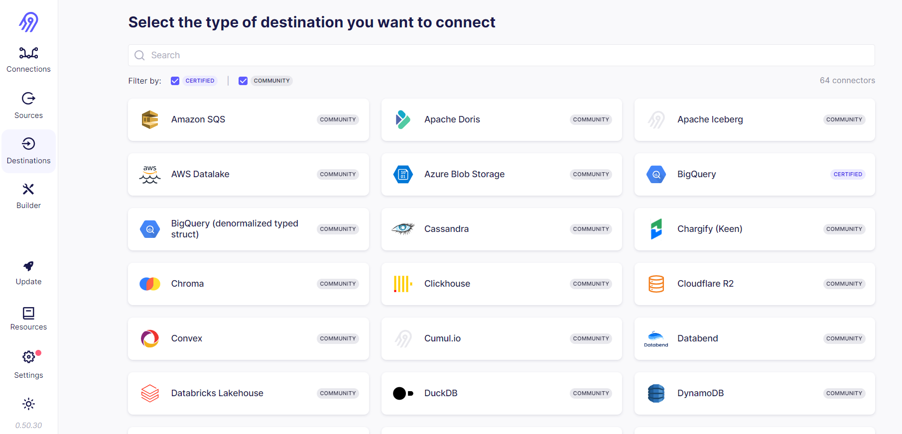
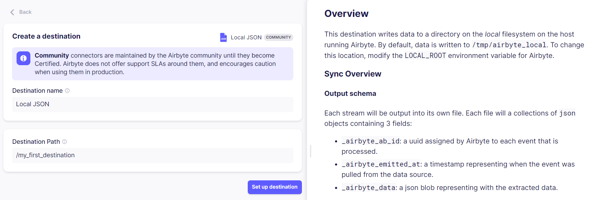

# Add a Destination

Destinations are the data warehouses, data lakes, databases and analytics tools where you will load the data from your chosen source(s). The steps to setting up your first destination are very similar to those for [setting up a source](https://docs.airbyte.com/quickstart/add-a-source).

Once you've logged in to your Airbyte Open Source deployment, click on the **Destinations** tab in the navigation bar found on the left side of the dashboard. This will take you to the list of available destinations.

You can use the provided search bar at the top of the page, or scroll down the list to find the destination you want to replicate data from.

:::tip
You can filter the list of destinations by support level. Airbyte connectors are categorized in two support levels, Certified and Community. See our [Product Support Levels](https://docs.airbyte.com/project-overview/product-support-levels) page for more information on this topic.
:::

As an example, we'll be setting up a simple JSON file that will be saved on our local system as the destination. Select **Local JSON** from the list of destinations. This will take you to the destination setup page.

The left half of the page contains a set of fields that you will have to fill out. In the **Destination name** field, you can enter a name of your choosing to help you identify this instance of the connector. By default, this will be set to the name of the destination (i.e., `Local JSON`).

Because this is a simple JSON file, there is only one more required field, **Destination Path**. This is the path in your local filesystem where the JSON file containing your data will be saved. In our example, if we set the path to `/my_first_destination`, the file will be saved in `/tmp/airbyte_local/my_first_destination`. 

Each destination will have its own set of required fields to configure during setup. You can refer to your destination's provided setup guide on the right side of the page for specific details on the nature of each field.

:::info
Some destinations will also have an **Optional Fields** tab located beneath the required fields. You can open this tab to view and configure any additional optional parameters that exist for the source. These fields generally grant you more fine-grained control over your data replication, but you can safely ignore them.
:::

Once you've filled out the required fields, select **Set up destination**. A connection check will run to verify that a successful connection can be established. Now you're ready to [set up your first connection](https://docs.airbyte.com/quickstart/set-up-a-connection)!
