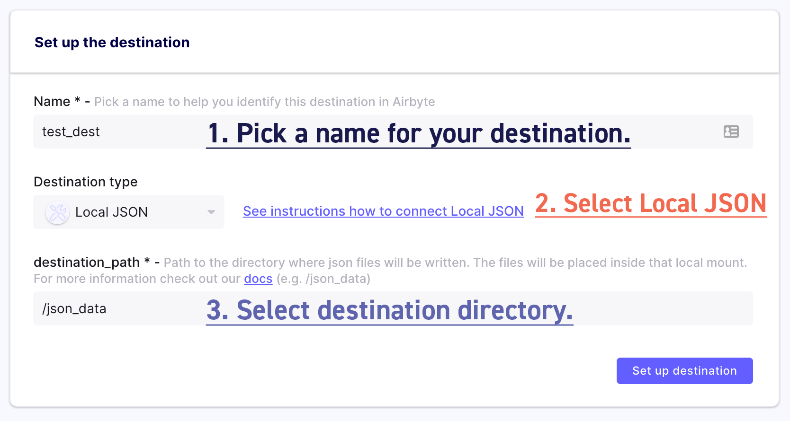

# Add a Destination

The destination we are creating is a simple JSON line file, meaning that it will contain one JSON object per line. Each objects will represent data extracted from the source.

The resulting files will be located in `/tmp/airbyte_local/json_data`

To set it up, just follow the instructions on the screenshot below.

:::info

You might have to wait ~30 seconds before the fields show up because it is the first time you're using Airbyte.

:::

