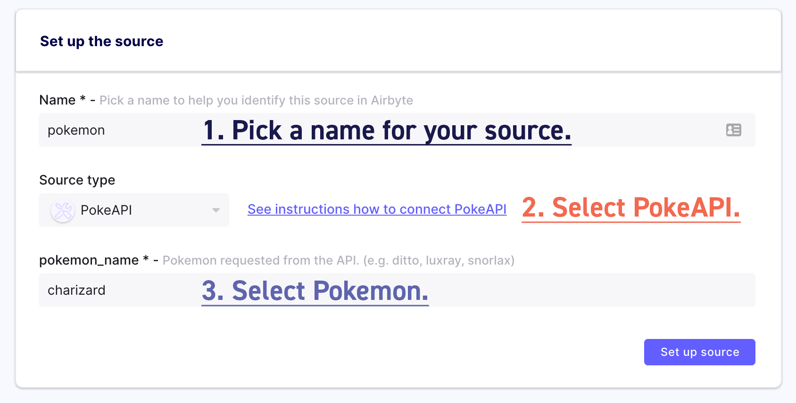

# Add a Source

You can either follow this tutorial from the onboarding or through the UI, where you can first navigate to the `Sources` tab on the left bar.

Our demo source will pull data from an external API, which will pull down the information on one specified Pokémon.

To set it up, just follow the instructions on the screenshot below.

:::info

You might have to wait ~30 seconds before the fields show up because it is the first time you're using Airbyte.

:::

Can't find the connectors that you want? Try your hand at easily building one yourself using our [Python CDK for HTTP API sources!](../connector-development/cdk-python/)

