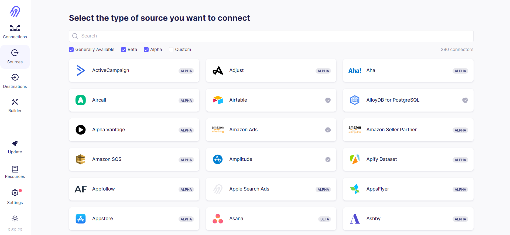
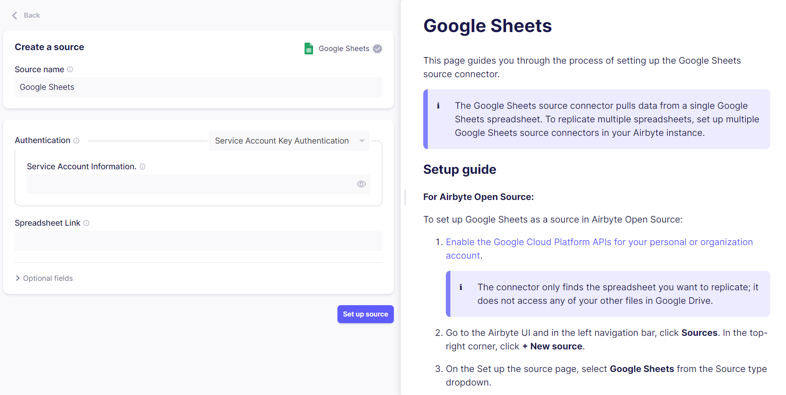

# Add a Source

Setting up a new source in Airbyte is a quick and simple process! When viewing the Airbyte UI, you'll see the main navigation bar on the left side of your screen. Click the `Sources` tab to bring up a list of all available sources.

You can use the provided search bar, or simply scroll down the list to find the source you want to replicate data from. Let's use Google Sheets as an example. Clicking on the Google Sheets card will bring us to its setup page.

The left half of the page contains a set of fields that you will have to fill out. In the **Source name** field, you can enter a name of your choosing to help you identify this instance of the connector. By default, this will be set to the name of the source (ie, `Google Sheets`).

Each connector in Airbyte will have its own set of authentication methods and configurable parameters. In the case of Google Sheets, you are given a couple options for authenticating the connection, and must provide the link to the Google Sheet you want to replicate. You can always refer to your source's provided setup guide for specific instructions on filling out each field. Once you've entered all the required fields, click on the **Set up source** button and Airbyte will run a check to verify the connection. Happy replicating!

Can't find the connectors that you want? Try your hand at easily building one yourself using our [Python CDK for HTTP API sources!](../connector-development/cdk-python/)

