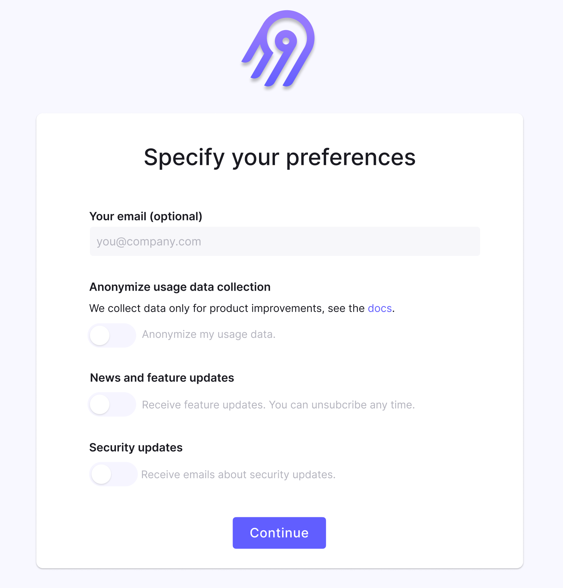

# Getting Started

## Goal

During this getting started tutorial, we are going to replicate currencies closing price into a JSON file.

## Start Airbyte

First of all, make sure you have Docker and Docker Compose installed. Then run the following commands:

```text
git clone https://github.com/airbytehq/airbyte.git
cd airbyte
./run-ab-platform.sh
```

Once you see an Airbyte banner, the UI is ready to go at [http://localhost:8000/](http://localhost:8000/).

## Set up your preferences

You should see an onboarding page. Enter your email if you want updates about Airbyte and continue.



## Set up your first connection

### Create a source

The source we are creating will pull data from an external API. It will replicate the closing price of currencies compared to USD since the specified start date.

To set it up, just follow the instructions on the screenshot below.

:::info

You might have to wait ~30 seconds before the fields show up because it is the first time you're using Airbyte.

:::


### Create a destination

The destination we are creating is a simple JSON line file, meaning that it will contain one JSON object per line. Each objects will represent data extracted from the source.

The resulting files will be located in `/tmp/airbyte_local/json_data`

:::caution

Please make sure that Docker Desktop has access to `/tmp` (and `/private` on a MacOS, as /tmp has a symlink that points to /private. It will not work otherwise). You allow it with "File sharing" in `Settings -> Resources -> File sharing -> add the one or two above folder` and hit the "Apply & restart" button.

:::

To set it up, just follow the instructions on the screenshot below.

:::info

You might have to wait ~30 seconds before the fields show up because it is the first time you're using Airbyte.

:::


### Create connection

When we create the connection, we can select which data stream we want to replicate. We can also select if we want an incremental replication. The replication will run at the specified sync frequency.

To set it up, just follow the instructions on the screenshot below.


## Check the logs of your first sync

After you've completed the onboarding, you will be redirected to the source list and will see the source you just added. Click on it to find more information about it. You will now see all the destinations connected to that source. Click on it and you will see the sync history.

From there, you can look at the logs, download them, force a sync and adjust the configuration of your connection.


## Check the data of your first sync

Now let's verify that this worked:

```bash
cat /tmp/airbyte_local/json_data/_airbyte_raw_exchange_rate.jsonl
```

You should see one line for each day that was replicated.

If you have [`jq`](https://stedolan.github.io/jq/) installed, let's look at the evolution of `EUR`.

```bash
cat /tmp/airbyte_local/test_json/_airbyte_raw_exchange_rate.jsonl | 
jq -c '.data | {date: .date, EUR: .EUR }'
```

And there you have it. You've pulled data from an API directly into a file and all of the actual configuration for this replication only took place in the UI.

## That's it!

This is just the beginning of using Airbyte. We support a large collection of sources and destinations. You can even contribute your own.

If you have any questions at all, please reach out to us on [Slack](https://slack.airbyte.io/). We’re still in alpha, so if you see any rough edges or want to request a connector you need, please create an issue on our [Github](https://github.com/airbytehq/airbyte) or leave a thumbs up on an existing issue.

Thank you and we hope you enjoy using Airbyte.

