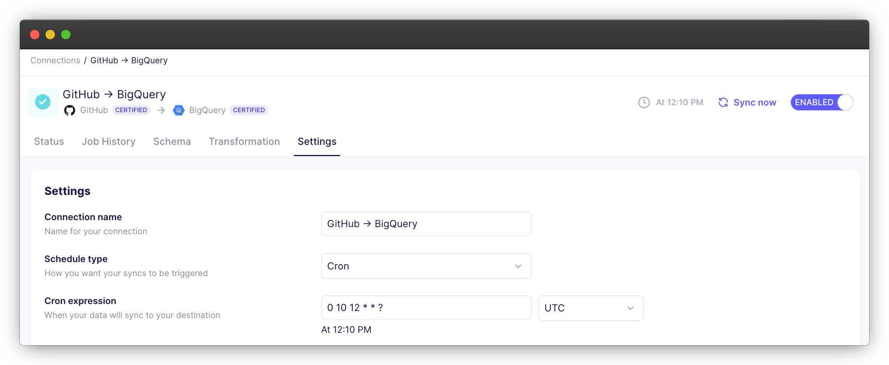

# April 2024
## airbyte v0.57.0 to v0.58.0

This page includes new features and improvements to the Airbyte Cloud and Airbyte Open Source platforms.

## ✨ Highlights

Airbyte has made improvements to our certified database sources to ensure they stay resilient when incoming data is inconsistent. Previously, syncs could fail if one record had mistyped data. Rather than fail the sync, we'll continue syncing and inform you of the record-level error in the destination field `_airbyte_meta.errrors`. Read more in our [typing & deduping documentation](/using-airbyte/core-concepts/typing-deduping#_airbyte_meta-errors).

We've also improved our schema discovery to ensure you can sync more data within a single connection. The new [environment variable](/operator-guides/configuring-airbyte#connections) `MAX_FIELDS_PER_CONNECTION` controls the maximum allowable fields per connection per deployment and can be configured at runtime. By default, the platform defaults to 20,000 fields across enabled streams. When using Airbyte Cloud, our Technical Support team can assist with modifying your configuration.

## Platform Releases

In addition to our improved schema discovery, we also released: 

- A header redesign for our connection pages. We've moved key actions to the top and made the sync schedule more visible.

- `Clear` as a replacement to `Reset` to reduce confusion about the functionality. Previously, a `Reset` would remove a connection's state and sometimes trigger a sync afterwards. `Clear` performs the same removal of the state, but does not trigger a sync afterwards. 
Read more in our [Clear documentation](/operator-guides/reset).

- Reduced friction for large records. Airbyte's platform no longer limits how large a record from the source can be. Instead, each destination has their own unique limit constraints. When a destination receives a large record, the primary key and cursor will be retained, but all other data in the record will be nulled. Any modifications to the record will be stored within `airbyte_meta.changes` for your review within the destination.

- A new OSS [Quickstart](/deploying-airbyte/quickstart) that automatically manages all install steps for you. Mac users can also use Brew to install the `abctl` command.

- (Self-Managed Enterprise only) Improvements to connection migrations. Any changes to authentication or ingress URL configurations can be saved without deleting state. The improvement also includes a backwards-compatible alternative to setting the webapp-url property through the airbyte.yml file. 

## Connector Improvements

In addition to our database source improvements, we also released a few notable connector improvements:

- Migrated [Zendesk Chat](https://github.com/airbytehq/airbyte/pull/35867), [Iterable](https://github.com/airbytehq/airbyte/pull/36231), [Slack](https://github.com/airbytehq/airbyte/pull/35477), [Notion](https://github.com/airbytehq/airbyte/pull/35974), [Harvest](https://github.com/airbytehq/airbyte/pull/35863), [Sendgrid](https://github.com/airbytehq/airbyte/pull/35776), [Klaviyo](https://github.com/airbytehq/airbyte/pull/36264), [SurveyMonkey](https://github.com/airbytehq/airbyte/pull/35561), [Mailchimp](https://github.com/airbytehq/airbyte/pull/35281), [GitLab](https://github.com/airbytehq/airbyte/pull/35989), [Marketo](https://github.com/airbytehq/airbyte/pull/36854) and [My Hours](https://github.com/airbytehq/airbyte/pull/36947) to low-code to make enhancements and maintenance faster.

- Added support for [JWT authentication](https://github.com/airbytehq/airbyte/pull/37005) in the low-code CDK, which opens up access to connectors that require this type of authentication.

- Improved the [Connector Builder](/connector-development/connector-builder-ui/overview) experience around user inputs. Auto-created inputs now always use a unique ID. IDs and titles can now be edited independently to avoid breaking changes. Extra validations on user inputs are now enforced when loading a YAML manifest in the UI to ensure that all of the desired properties for auto-created inputs are properly set on the imported spec. The UI also now supports importing user input references using dot-notation, e.g. `{{ config.id }}`, instead of only supporting bracket notation like`{{ config['id'] }}`

- Improved the performance of destination [DuckDB](https://github.com/airbytehq/airbyte/pull/36715) to move data 100x faster. Thanks to DuckDB for contributing the enhancement!

## Community Contribution Releases
We've also been improving the contribution experience to Airbyte, and released: 

- [CI for community contributions](https://github.com/airbytehq/airbyte/pull/37404), a new community_ci.yml workflow to run connector tests and format on fork PRs.

- A faster review process for Community PRs, which skips noisy checks, allows workflows to run on every commmit, and adds strong format and lint checks. Our `/format-fix` command will also apply `airbyte-ci format fix all` and commit the result back to the PR.

## Deprecated features
As of v0.57.0, custom dbt transformations have been deprecated in Open Source. For more information, see our [discussion](https://github.com/airbytehq/airbyte/discussions/34860). 