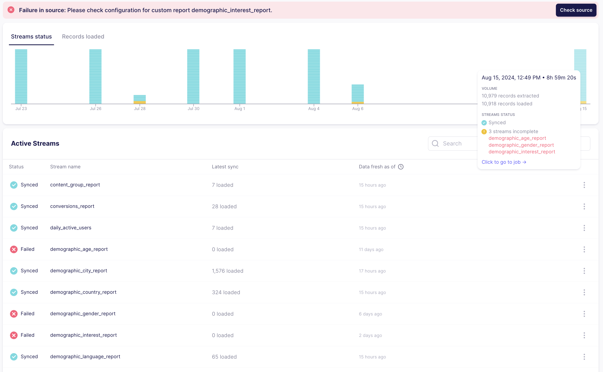

# August 2024

## airbyte v0.63.14 to v0.64.0

This page includes new features and improvements to the Airbyte Cloud and Airbyte Open Source platforms.

## ✨ Highlights
Destination S3 ([v1.0.0](https://github.com/airbytehq/airbyte/pull/42409)) was released! Experience faster sync speeds, checkpointing, and modernization to our Destinations V2 framework, along with many bug fixes around Avro and Parquet file formats.

Databricks destination ([v3.1.0](https://github.com/airbytehq/airbyte/pull/40692)) was also released with several new features, including typing & deduping, refreshes, and resumable full refresh! We are actively looking for beta testers. Please reach out to us [here](https://github.com/airbytehq/airbyte/discussions/43997) with your feedback.

## Platform Releases

- `abctl` (v0.11.0) now also supports basic authentication. Flags for both non-secure and low resource environments were also added to enable migration paths.
- Introduced an additional sync mode for those looking to deduplicate records called [`Full Refresh | Overwrite + Dedup`](https://docs.airbyte.com/using-airbyte/core-concepts/sync-modes/full-refresh-overwrite-deduped). This is helpful for those experiencing duplicates during Full Refresh syncs, which can happen when using resumable full refresh.
- Updated the Airbyte Airflow Operator to introduce the usage of `client_id` and `client_secret` to authenticate to the Airbyte API. It also uses the `airbyte-api-sdk` to improve long-term maintenance.
- Updated the Connection status page to include: historical sync results, actionable tooltips, and individual stream statuses for faster drill-downs. Historical graphs are available for Cloud, Teams and Enterprise.

## Connector Improvements

We also released a few notable improvements for our connectors:

- Our users and our developers can now contribute new connectors from the builder! This allows you to add a new connector directly to Airbyte's Marketplace.

- Our Postgres destination ([v2.3.0](https://github.com/airbytehq/airbyte/pull/41954)) also now supports refreshes and resumable full refresh. Note the Airbyte platform v0.63.7 is required to use this connector version.

- We now share SBOM for our connectors in our connector registry to enable vulnerability scanning and supply chain attack prevention.

- PyAirbyte now supports writing to destination connectors and the latest version contains significant performance improvements for record processing and Snowflake-based cache loads. PyAirbyte has been updated to support Python 3.9 in the latest v0.17.0 release. This allows us to move faster by reducing support footprint, and it allows us to keep up with the latest version of the Python CDK.

## Announcements

- To ensure adherence to security best practices, Airbyte is migrating all connectors to [non-root versions](https://github.com/airbytehq/airbyte/discussions/44924). It is highly recommended that you upgrade your platform version to [v0.63.9](https://github.com/airbytehq/airbyte-platform/releases/tag/v0.63.9) or later before October 2024 to ensure your syncs continue to succeed. 

- As we prepare to deprecate Docker Compose, we published a [migration guide](../../using-airbyte/getting-started/oss-quickstart#migrating-from-docker-compose-optional) for those migrating from Docker Compose to abctl.