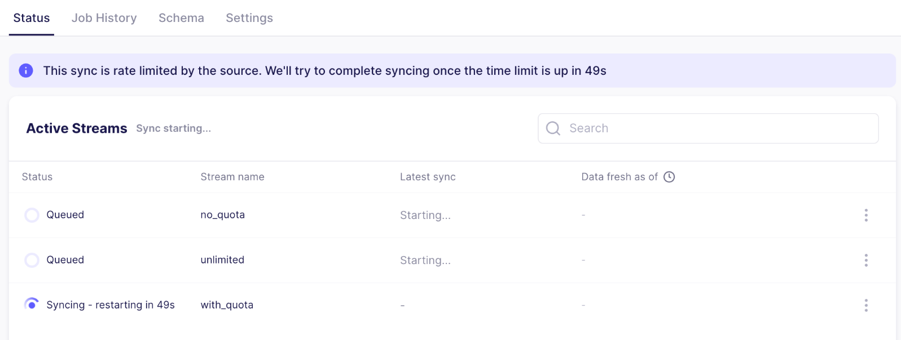

# July 2024

## airbyte v0.63.5 to v0.63.13

This page includes new features and improvements to the Airbyte Cloud and Airbyte Open Source platforms.

## ✨ Highlights

[Native authentication](https://github.com/airbytehq/airbyte/issues/41634) by email and password is available in Airbyte OSS so that any instance of Airbyte is secure by default. The newest version of `abctl` (v0.11.0) now generates the credentials randomly and you can use `abctl local credentials` to retrieve them. See our [quickstart docs](using-airbyte/getting-started/oss-quickstart#2-run-airbyte) for more details. For more detailed documentation about authentication, see our docs [here](/deploying-airbyte/integrations/authentication).

We have also released rate limited messaging, providing users more transparency into what's going on with their syncs. When a source is rate limited, it can not only tell the platform but also include a timestamp when the API is expected to be available again to resume extracting records. This is used to tell users the connection is being rate limited, and if the timestamp is provided we include a countdown to when Airbyte will start syncing again.

## Platform Releases

- [Workloads](https://github.com/airbytehq/airbyte/discussions/42947) have been released with Airbyte Helm Chart `0.390.0`, which provides a more scalable and reliable architecture to run sync jobs by separating scheduling and orchestration from data movement tasks. This improvement unlocks more automated management of workloads by managing job spikes and enables horizonal scaling (for Cloud and Enterprise users). Read more about the Workloads feature in our [docs](understanding-airbyte/jobs#workloads) or [blog post](https://airbyte.com/blog/introducing-workloads-how-airbyte-1-0-orchestrates-data-movement-jobs).
  
- Managing and obtaining API keys is now consistent across all our products. We have brought our API portal in-house and API keys can now be generated and found in the “Applications” page of our UI. Along with this, the Terraform provider and Java/Python SDKs have been updated to automatically retrieve tokens between each action, so that users don’t need to worry about fetching tokens themselves.

- The progress of active syncs is now reported every 10 seconds for increased visibility and tracking (available in OSS v.0.63.5)

- Schema discovery is now always run as a part of the sync for Airbyte Cloud. This ensures we always run the sync with the latest schema, which ensures the auto-propagation and backfill features works as expected. This will be released to Self-Managed users in the coming weeks.

- Community Connectors are now found in the Marketplace. In the UI, we now show three tabs on the source/destination selection page: Airbyte Connectors (formerly "certified"), Marketplace (formerly "community"), and Custom. Connectors in the Marketplace tab now also contain success rate and usage metric info to help users understand how the connector is used. 

## Connector Improvements

We also released a few notable improvements for our connectors:

- MySQL has been enhanced to ensure large historical syncs are successful. During an initial sync, Airbyte now gracefully consumes WAL and acknowledges logs periodically to ensure disk space is freed in a timely manner.

- Source S3 has become faster! With CDK 2.0, the protocol now uses Pydantic V2 and removes the serialization of each record. As connectors are updated to the new CDK version, additional connectors will see varying levels of speed improvements. 

- Destination Redshift (v3.3.0) and Snowflake (v3.11.0) support [Refreshes](operator-guides/refreshes), which reduces data downtime when resyncing historical data. They join BigQuery in also supporting [Resumable Full Refresh](https://airbyte.com/blog/resumable-full-refresh-building-resilient-systems-for-syncing-data), which ensures the success of large Full Refresh syncs.

- Connector Builder has added support for `regex_search` to ease filtering for substrings

- Connector Builder has improved warnings to help with testing & validation while building. We’ve made clearer warnings to indicate when API requests fail, no response is received from the API, no records could be found, or issues are found with the primary key. We’ll also indicate exactly which streams are affected.

- For OSS users, the Airbyte platform will notify users in the UI when upgrading a connector requires a specific corresponding platform version. This is helpful when a connector version upgrade relies on a platform feature to be available for the sync to succeed.

- pyAirbyte now integrates with Apache Arrow and supports Pydantic 2.0 and CDK 2.0! Pydantic 2.0 support was a frequently-requested feature for PyAirbyte users and the benefit for users is (1) improved performance, and (2) improved compatibility with modern Python tools.

## Announcements

- As we prepare to deprecate Docker Compose, we published a [migration guide](using-airbyte/getting-started/oss-quickstart#migrating-from-docker-compose-optional) for those migrating from Docker Compose to abctl.
