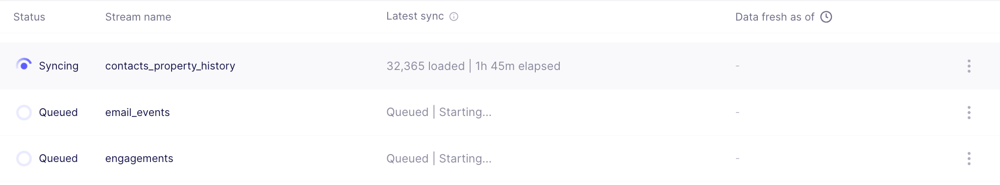
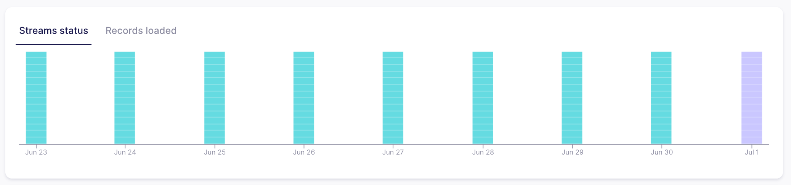

# June 2024

## airbyte v0.62.3 to v0.63.4

This page includes new features and improvements to the Airbyte Cloud and Airbyte Open Source platforms.

## ✨ Highlights

Airbyte added [Refresh](/operator-guides/workload-scheduling) support for our BigQuery destination, which brings an improved experience to resyncing all of your data again. This enables data to never be deleted from final tables during a historical resyncing of data. More certified destinations will support Refresh in the coming weeks. 

Users can now monitor the incremental progress of syncs on the Connection Status page. The sync progress feature displays record counts and sync duration for each stream during a sync, as well as which streams are syncing and when a connection sync is actively running. The Connection Status Page also now shows counts from the last time each enabled stream synced. Lastly, each stream individually displays stream status, which helps users troubleshoot by indicating exactly which streams are erroring.

## Platform Releases

- (Cloud, Cloud Teams, and Self-Managed Enterprise only) Connections now display both per stream status and tracking of records moved for recent syncs to aid with troubleshooting. 

- (Cloud Teams and Self-Managed Enterprise only) RBAC (Role Based Access Control) now available! New roles have been released to support more defined access for larger teams. Editors (for Workspaces) and Readers (both Organization and Workspace) are now available. Read more in our [docs](/access-management/rbac).

## Connector Improvements

We also released a few notable improvements for our connectors:

- In the Connector Builder, `Undo` and `Redo` have been added, which can also be accessed through cmd-z / cmd-shift-z hotkeys. This allows users to test without fear of losing their previous state within the same session. The Connector Builder is also now a full-screen experience with an improved header menu. Additionally, the `Test` button can now also be triggered by pressing cmd-enter, so users no longer need to manually click on `Test` while actively developing.

- PyAirbyte now runs YAML sources with no additional installation needed, opening up more ways to sync data.

- With CDK version 1.5.0, all low-code connectors will have a standardized way of reporting errors. The CDK automatically categorizes errors as config, system, or transient based on a default error mapping.

- Python (and low-code) [CDK 2.0 updated Pydantic to 2.7](https://github.com/airbytehq/airbyte/pull/39524), which makes it 2x faster for small records. Source-S3 is the first source to benefit from this.

- Our connector docs now contain Connector Quality Metric indicators. Icons display additional information targeted to help users understand the health of a connector. Sync Success Rate and Usage Rate are now scored 1-3 to better curate the Connector Catalog experience. We’ve also added how recently the connector and its CDK dependency have been updated.

## Announcements
We announced we will formally deprecate support for Docker Compose deployments in favor of Kubernetes, and welcome beta testers [here](https://github.com/airbytehq/airbyte/discussions/40599) who want migration assistance. You can use [`abctl`](https://github.com/airbytehq/abctl) for local deployments starting today.

Airbyte is planning to deprecate the Configuration API later this year, and we are looking for feedback on endpoints or data enhancements to improve the Airbyte API [here](https://github.com/airbytehq/airbyte/discussions/39433).

