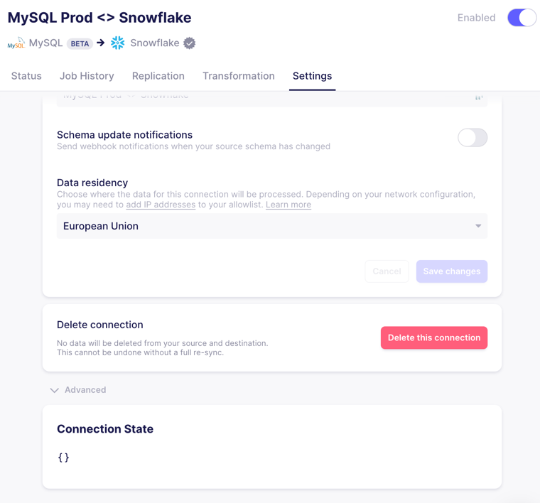

# Upgrading to Destinations V2

## What is Destinations V2?

At launch, Airbyte Destinations V2 provides:
* One-to-one mapping: Data from one stream (endpoint or table) will now create one table in the destination, making it simpler and more efficient.
* Improved error handling: Typing errors will no longer fail your sync, ensuring smoother data integration processes.
* Auditable typing errors: Typing errors will now be easily visible in a new _airbyte_meta column, allowing for better tracking of inconsistencies and resolution of issues.
* Incremental data loading: Data will become visible in the destination as it is loaded.

## Destinations V2 Example

Consider the following [source schema](https://docs.airbyte.com/integrations/sources/faker) for stream `users`:

```json
{
  "id": "number",
  "first_name": "string",
  "age": "number",
  "address": {
    "city": "string",
    "zip": "string"
  }
}
```

The data from one stream will now be mapped to one table in your schema as below. Highlights:
* Improved error handling with `_airbyte_meta`: Airbyte will populate typing errors in the `_airbyte_meta` column instead of failing your sync. You can query these results to audit misformatted or unexpected data.
* Internal Airbyte tables in the `airbyte` schema: Airbyte will now generate all raw tables in the `airbyte` schema. You can use these tables to investigate raw data, but please note the format of the tables in `airbyte` may change at any time.

#### Destination Table Name: *public.users*

| *(note, not in actual table)*                   	| _airbyte_raw_id 	| _airbyte_extracted_at    	| _airbyte_meta                                                            	| id 	| first_name 	| age  	| address                                     	|
|-----------------------------------------------	|-----------------	|---------------------	|--------------------------------------------------------------------------	|----	|------------	|------	|---------------------------------------------	|
| Successful typing and de-duping ⟶        	| xxx-xxx-xxx     	| 2022-01-01 12:00:00 	| {}                                                                       	| 1  	| sarah      	| 39   	| {   city: “San Francisco”,   zip: “94131” } 	|
| Failed typing that didn’t break other rows ⟶  	| yyy-yyy-yyy     	| 2022-01-01 12:00:00 	| { errors: {   age:     “fish” is not a valid integer for column “age” }} 	| 2  	| evan       	| NULL 	| {   city: “Menlo Park”,   zip: “94002” }    	|
| Not-yet-typed ⟶            	|                 	|                     	|                                                                          	|    	|            	|      	|                                             	|

In legacy normalization, columns of [Airbyte type](https://docs.airbyte.com/understanding-airbyte/supported-data-types/#the-types) `Object` in the Destination were "unnested" into separate tables. In this example, with Destinations V2, the previously unnested `public.users_address` table with columns `city` and `zip` will no longer be generated.

#### Destination Table Name: *airbyte.raw_public_users* (`airbyte.{namespace}_{stream}`)

| *(note, not in actual table)*                   	| _airbyte_raw_id 	| _airbyte_data                                                                                               	| _airbyte_loaded_at    	| _airbyte_extracted_at    	|
|-----------------------------------------------	|-----------------	|-------------------------------------------------------------------------------------------------------------	|----------------------	|---------------------	|
| Successful typing and de-duping ⟶             	| xxx-xxx-xxx     	| {   id: 1,   first_name: “sarah”,   age: 39,   address: {     city: “San Francisco”,     zip: “94131”   } } 	| 2022-01-01 12:00:001 	| 2022-01-01 12:00:00 	|
| Failed typing that didn’t break other rows ⟶  	| yyy-yyy-yyy     	| {   id: 2,   first_name: “evan”,   age: “fish”,   address: {     city: “Menlo Park”,     zip: “94002”   } } 	| 2022-01-01 12:00:001 	| 2022-01-01 12:00:00 	|
| Not-yet-typed ⟶                               	| zzz-zzz-zzz     	| {   id: 3,   first_name: “edward”,   age: 35,   address: {     city: “Sunnyvale”,     zip: “94003”   } }    	| NULL                 	| 2022-01-01 13:00:00 	|

## Deprecating Legacy Normalization

The upgrade to Destinations V2 is handled by moving your connections to use [updated versions of Airbyte destinations](#destinations-v2-compatible-versions). Existing normalization options, both `Raw data (JSON)` and `Normalized tabular data` will be unsupported starting **Oct 1, 2023**.


As a Cloud user, existing connections using legacy normalization will be paused on **Oct 1, 2023**. As an Open Source user, you may choose to upgrade at your convenience. However, destination connector versions prior to Destinations V2 will no longer be supported as of **Oct 1, 2023**.

<!--- See [here]() to learn more about Airbyte's breaking change rollout requirements. -->

### Breakdown of Breaking Changes

The following table details the delivered data modified by Destinations V2:

| Current Normalization Setting   	 | Source Type                           	| Impacted Data (Breaking Changes)                         	                     |
|-----------------------------------|---------------------------------------	|--------------------------------------------------------------------------------|
| Raw JSON                	         | All                                   	| `_airbyte` metadata columns, raw table location                              	 |
| Normalized tabular data 	         | API Source                            	| Unnested tables, `_airbyte` metadata columns, SCD tables 	                     |
| Normalized tabular data 	         | Tabular Source (database, file, etc.) 	| `_airbyte` metadata columns, SCD tables                  	                     |

Whenever possible, we've taken this opportunity to use the best data type for storing JSON for your querying convenience.  For example, `destination-bigquery` now loads `JSON` blobs as type `JSON` in BigQuery (introduced last [year](https://cloud.google.com/blog/products/data-analytics/bigquery-now-natively-supports-semi-structured-data)), instead of type `string`.

## Quick Start to Upgrading

The quickest path to upgrading is to click upgrade on any out-of-date connection in the UI:


After upgrading the out-of-date destination to a [Destinations V2 compatible version](#destinations-v2-effective-versions), the following will occur at the next sync **for each connection** sending data to the updated destination:
1. Existing raw tables replicated to this destination will be copied to a new `airbyte` schema. 
2. The new raw tables will be updated to the new Destinations V2 format.
3. The new raw tables will be updated with any new data since the last sync, like normal.
4. The new raw tables will be typed and de-duplicated according to the Destinations V2 format.
5. Once typing and de-duplication has completed successfully, your previous final table will be replaced with the updated data.

Pre-existing raw tables, SCD tables and "unnested" tables will always be left untouched. You can delete these at your convenience, but these tables will no longer be kept up-to-date by Airbyte syncs.
Each destination version is managed separately, so if you have multiple destinations, they all need to be upgraded one by one.

Versions are tied to the destination. When you update the destination, **all connections tied to that destination will be sending data in the Destinations V2 format**. For upgrade paths that will minimize disruption to existing dashboards, see:
* [Upgrading Connections One by One with Dual-Writing](#upgrading-connections-one-by-one-with-dual-writing)
* [Testing Destinations V2 on a Single Connection](#testing-destinations-v2-for-a-single-connection)
* [Upgrading Connections One by One Using CDC](#upgrade-paths-for-connections-using-cdc)
* [Upgrading as a User of Raw Tables](#upgrading-as-a-user-of-raw-tables)
* [Rolling back to Legacy Normalization](#oss-only-rolling-back-to-legacy-normalization)
 
## Advanced Upgrade Paths

### Upgrading Connections One by One with Dual-Writing

Dual writing is a method employed during upgrades where new incoming data is written simultaneously to both the old and new systems, facilitating a smooth transition between versions. We recommend this approach for connections where you are especially worried about breaking changes or downtime in downstream systems.

#### Steps to Follow for All Sync Modes

1. **[Open Source]** Update the default destination version for your workspace to a [Destinations V2 compatible version](#destinations-v2-effective-versions). This sets the default version for any newly created destination.  All existing syncs will remain on their current version.


2. Create and configure a new destination connecting to the same database as your existing destination except for `Default Schema`, which you should update to a new value to avoid collisions.


3. Create a new connection leveraging your existing source and the newly created destination. Match the settings of your pre-existing connection.
4. If the streams you are looking to replicate are in **full refresh** mode, enabling the connection will now provide a parallel copy of the data in the updated format for testing. If any of the streams in the connection are in an **incremental** sync mode, follow the steps below before enabling the connection.

#### Additional Steps for Incremental Sync Modes

These steps allow you to dual-write for connections incrementally syncing data without re-syncing historical data you've already replicated:

1. Copy the raw data you've already replicated to the new schema being used by your newly created connection. You need to do this for every stream in the connection with an incremental sync mode. Sample SQL you can run in your data warehouse:

```mysql
CREATE TABLE {new_schema}.raw_{stream_name} AS 
SELECT * 
FROM {old_schema}.raw_{stream_name};
```

2. Go to your newly created connection, and navigate to the `Settings` tab.
3. Open the `Advanced` settings to see the connection state (which manages incremental syncs). Select the existing connection you are duplicating, then click `Inherit State`. This will ensure historical data is not replicated again.



4. Enabling the connection will now provide a parallel copy of all streams in the updated format. 
5. You can move your dashboards to rely on the new tables, then pause the out-of-date connection.

### Testing Destinations V2 for a Single Connection

You may want to verify the format of updated data for a single connection. To do this:
1. If all of the streams you are looking to test with are in **full refresh mode**, follow the [steps for upgrading connections one by one](#steps-to-follow-for-all-sync-modes). Ensure any connections you create have a `Manual` replication frequency.
2. For any streams in **incremental** sync modes, follow the [steps for upgrading incremental syncs](#additional-steps-for-incremental-sync-modes). For testing, you do not need to copy pre-existing raw data. By solely inheriting state from a pre-existing connection, enabling a sync will provide a sample of the most recent data in the updated format for testing.

When you are done testing, you can disable or delete this testing connection, and [upgrade your pre-existing connections in place](#quick-start-to-upgrading) or [upgrade one-by-one with dual writing](#upgrading-connections-one-by-one-with-dual-writing).

### Upgrading as a User of Raw Tables

If you have written downstream transformations directly from the output of raw tables, or use the "Raw JSON" normalization setting, you should know that:
* Multiple column names are being updated (from `airbyte_ab_id` to `airbyte_raw_id`, and `airbyte_emitted_at` to `airbyte_extracted_at`).
* The location of raw tables will from now on default to an `airbyte` schema in your destination. 
* When you upgrade to a [Destinations V2 compatible version](#destinations-v2-effective-versions) of your destination, we will never alter your existing raw data. Although existing downstream dashboards will go stale, they will never be broken.
* You can dual write by following the [steps above](#upgrading-connections-one-by-one-with-dual-writing) and copying your raw data to the schema of your newly created connection.

We may make further changes to raw tables in the future, as these tables are intended to be a staging ground for Airbyte to optimize the performance of your syncs. We cannot guarantee the same level of stability as for final tables in your destination schema.

### Upgrade Paths for Connections using CDC

For each [CDC-supported](https://docs.airbyte.com/understanding-airbyte/cdc) source connector, we recommend the following:

| CDC Source 	| Recommendation              	                                  | Notes                                                                                                                                                                                               	                                                              |
|------------	|----------------------------------------------------------------|--------------------------------------------------------------------------------------------------------------------------------------------------------------------------------------------------------------------------------------------------------------------|
| Postgres   	| [Upgrade connection in place](#quick-start-to-upgrading)	      | You can optionally dual write, but this requires resyncing historical data from the source. You must create a new Postgres source with a different replication slot than your existing source to preserve the integrity of your existing connection.             	 |
| MySQL      	| [All above upgrade paths supported](#advanced-upgrade-paths) 	 | You can upgrade the connection in place, or dual write. When dual writing, Airbyte can leverage the state of an existing, active connection to ensure historical data is not re-replicated from MySQL. 	                                                           |
| SQL Server 	| [Upgrade connection in place](#quick-start-to-upgrading)	 | You can optionally dual write, but this requires resyncing historical data from the SQL Server source.                                                                                                                                                             |

### Rolling back to Legacy Normalization

If you are an Airbyte Cloud customer, and have an urgent need to temporarily roll back to legacy normalization, you can reach out to in-app support (Support -> In-App Support, in Airbyte Cloud) for assistance.

If you are an Airbyte Open Source user, we have published a [rollback version for each destination](#destinations-v2-compatible-versions) that will re-create the final tables with normalization using raw tables in the new format if they are available, and otherwise default to pre-existing raw tables used by legacy normalization.

## Destinations V2 Compatible Versions

For each destination connector, Destinations V2 is effective as of the following versions:

| Destination Connector 	| Safe Rollback Version 	| Destinations V2 Compatible 	 |
|-----------------------	|-----------------------	|------------------------------|
| BigQuery              	| 1.4.4                 	| 2.0.0+                   	   |
| Snowflake             	| 0.4.1                 	| 2.0.0+                   	   |
| Redshift              	| 0.4.8                 	| 2.0.0+                   	   |
| MSSQL                 	| 0.1.24                	| 2.0.0+                   	   |
| MySQL                 	| 0.1.20                	| 2.0.0+                   	   |
| Oracle                	| 0.1.19                	| 2.0.0+                   	   |
| TiDB                  	| 0.1.3                 	| 2.0.0+                   	   |
| DuckDB                	| 0.1.0                 	| 2.0.0+                   	   |
| Clickhouse            	| 0.2.3                 	| 2.0.0+                   	   |