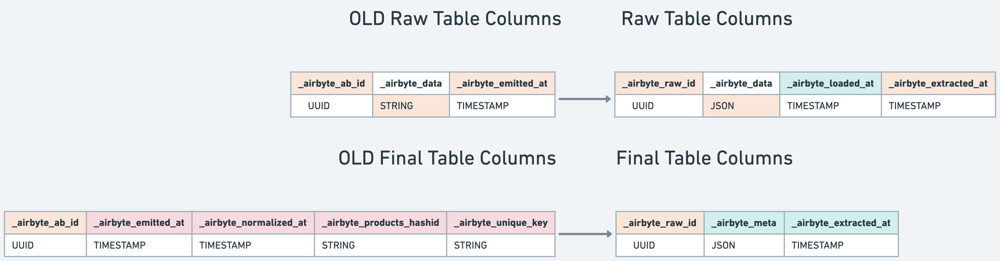

import Tabs from '@theme/Tabs';
import TabItem from '@theme/TabItem';
import {SnowflakeMigrationGenerator, BigQueryMigrationGenerator, RedshiftMigrationGenerator, PostgresMigrationGenerator} from './destinations_v2.js'

# Upgrading to Destinations V2

## What is Destinations V2?

Airbyte Destinations V2 provides you with:

- One-to-one table mapping: Data in one stream will always be mapped to one table in your data warehouse. No more sub-tables.
- Improved error handling with `_airbyte_meta`: Airbyte will now populate typing errors in the `_airbyte_meta` column instead of failing your sync. You can query these results to audit misformatted or unexpected data.
- Internal Airbyte tables in the `airbyte_internal` schema: Airbyte will now generate all raw tables in the `airbyte_internal` schema. We no longer clutter your destination schema with raw data tables.
- Incremental delivery for large syncs: Data will be incrementally delivered to your final tables. No more waiting hours to see the first rows in your destination table.

To see more details and examples on the contents of the Destinations V2 release, see this [guide](../using-airbyte/core-concepts/typing-deduping.md). The remainder of this page will walk you through upgrading connectors from legacy normalization to Destinations V2.

Destinations V2 were in preview for Snowflake and BigQuery during August 2023, and launched on August 29th, 2023. Other destinations will be transitioned to Destinations V2 in early 2024.

## Deprecating Legacy Normalization

The upgrade to Destinations V2 is handled by moving your connections to use [updated versions of Airbyte destinations](#destinations-v2-compatible-versions). Existing normalization options, both `Raw data (JSON)` and `Normalized tabular data`, will be unsupported starting the upgrade deadline.


As a Cloud user, existing connections using legacy normalization will be paused on the upgrade deadline. As an Open Source user, you may choose to upgrade at your convenience. However, destination connector versions prior to Destinations V2 will no longer be supported starting the upgrade deadline.

Note that Destinations V2 also removes the option to _only_ replicate raw data. The vast majority of Airbyte users prefer typed final tables, and our future feature development will rely on this implementation. Learn more [below](#upgrading-as-a-user-of-raw-tables).

### Breakdown of Breaking Changes

The following table details the delivered data modified by Destinations V2:

| Current Normalization Setting | Source Type                           | Impacted Data (Breaking Changes)                         |
| ----------------------------- | ------------------------------------- | -------------------------------------------------------- |
| Raw JSON                      | All                                   | `_airbyte` metadata columns, raw table location          |
| Normalized tabular data       | API Source                            | Unnested tables, `_airbyte` metadata columns, SCD tables |
| Normalized tabular data       | Tabular Source (database, file, etc.) | `_airbyte` metadata columns, SCD tables                  |



Whenever possible, we've taken this opportunity to use the best data type for storing JSON for your querying convenience. For example, `destination-bigquery` now loads `JSON` blobs as type `JSON` in BigQuery (introduced last [year](https://cloud.google.com/blog/products/data-analytics/bigquery-now-natively-supports-semi-structured-data)), instead of type `string`.

## Quick Start to Upgrading

**The quickest path to upgrading is to click upgrade on any out-of-date connection in the UI**. The advanced options later in this document will allow you to test out the upgrade in more detail if you choose.

:::caution

**[Airbyte Open Source Only]** You should upgrade to 0.50.24+ of the Airbyte Platform _before_ updating to Destinations V2. Failure to do so may cause upgraded connections to fail.

:::


:::caution Upgrade Warning

- The upgrading process entails hydrating the v2 format raw table by querying the v1 raw table through a standard query, such as "INSERT INTO v2_raw_table SELECT \* FROM v1_raw_table."
  The duration of this process can vary significantly based on the data size and may encounter failures contingent on the Destination's capacity to execute the query.
  In some cases, creating a new Airbyte connection, rather than migrating your existing connection, may be faster. Note that in these cases, all data will be re-imported.
- Following the successful migration of v1 raw tables to v2, the v1 raw tables will be dropped. However, it is essential to note that if there are any derived objects (materialized views) or referential
  constraints (foreign keys) linked to the old raw table, this operation may encounter failure, resulting in an unsuccessful upgrade or broken derived objects (like materialized views etc).

If any of the above concerns are applicable to your existing setup, we recommend [Upgrading Connections One by One with Dual-Writing](#upgrading-connections-one-by-one-with-dual-writing) for a more controlled upgrade process
:::

After upgrading the out-of-date destination to a [Destinations V2 compatible version](#destinations-v2-effective-versions), the following will occur at the next sync **for each connection** sending data to the updated destination:

1. Existing raw tables replicated to this destination will be copied to a new `airbyte_internal` schema.
2. The new raw tables will be updated to the new Destinations V2 format.
3. The new raw tables will be updated with any new data since the last sync, like normal.
4. The new raw tables will be typed and de-duplicated according to the Destinations V2 format.
5. Once typing and de-duplication has completed successfully, your previous final table will be replaced with the updated data.

Due to the amount of operations to be completed, the first sync after upgrading to Destination V2 **will be longer than normal**. Once your first sync has completed successfully, you may need to make changes to downstream models (dbt, sql, etc.) transforming data. See this [walkthrough of top changes to expect for more details](#updating-downstream-transformations).

Pre-existing raw tables, SCD tables and "unnested" tables will always be left untouched. You can delete these at your convenience, but these tables will no longer be kept up-to-date by Airbyte syncs.
Each destination version is managed separately, so if you have multiple destinations, they all need to be upgraded one by one.

Versions are tied to the destination. When you update the destination, **all connections tied to that destination will be sending data in the Destinations V2 format**. For upgrade paths that will minimize disruption to existing dashboards, see:

- [Upgrading Connections One by One with Dual-Writing](#upgrading-connections-one-by-one-with-dual-writing)
- [Testing Destinations V2 on a Single Connection](#testing-destinations-v2-for-a-single-connection)
- [Upgrading Connections One by One Using CDC](#upgrade-paths-for-connections-using-cdc)
- [Upgrading as a User of Raw Tables](#upgrading-as-a-user-of-raw-tables)
- [Rolling back to Legacy Normalization](#open-source-only-rolling-back-to-legacy-normalization)

## Advanced Upgrade Paths

### Upgrading Connections One by One with Dual-Writing

Dual writing is a method employed during upgrades where new incoming data is written simultaneously to both the old and new systems, facilitating a smooth transition between versions. We recommend this approach for connections where you are especially worried about breaking changes or downtime in downstream systems.

#### Steps to Follow for All Sync Modes

1. **[Open Source]** Update the default destination version for your workspace to a [Destinations V2 compatible version](#destinations-v2-effective-versions). This sets the default version for any newly created destination. All existing syncs will remain on their current version.


2. Create and configure a new destination connecting to the same database as your existing destination except for `Default Schema`, which you should update to a new value to avoid collisions.


3. Create a new connection leveraging your existing source and the newly created destination. Match the settings of your pre-existing connection.
4. If the streams you are looking to replicate are in **full refresh** mode, enabling the connection will now provide a parallel copy of the data in the updated format for testing. If any of the streams in the connection are in an **incremental** sync mode, follow the steps below before enabling the connection.

#### Additional Steps for Incremental Sync Modes

These steps allow you to dual-write for connections incrementally syncing data without re-syncing historical data you've already replicated:

1. Copy the raw data you've already replicated to the new schema being used by your newly created connection. You need to do this for every stream in the connection with an incremental sync mode. Sample SQL you can run in your data warehouse:

<Tabs>
  <TabItem value="bigquery" label="BigQuery" default>
    <BigQueryMigrationGenerator />
  </TabItem>
  <TabItem value="snowflake" label="Snowflake">
    <SnowflakeMigrationGenerator />
  </TabItem>
  <TabItem value="redshift" label="Redshift">
    <RedshiftMigrationGenerator />
  </TabItem>
  <TabItem value="postgres" label="Postgres">
    <PostgresMigrationGenerator />
  </TabItem>
</Tabs>

2. Navigate to the existing connection you are duplicating, and navigate to the `Settings` tab. Open the `Advanced` settings to see the connection state (which manages incremental syncs). Copy the state to your clipboard.


3. Go to your newly created connection, replace the state with the copied contents in the previous step, then click `Update State`. This will ensure historical data is not replicated again.
4. Enabling the connection will now provide a parallel copy of all streams in the updated format.
5. You can move your dashboards to rely on the new tables, then pause the out-of-date connection.

### Testing Destinations V2 for a Single Connection

You may want to verify the format of updated data for a single connection. To do this:

1. If all of the streams you are looking to test with are in **full refresh mode**, follow the [steps for upgrading connections one by one](#steps-to-follow-for-all-sync-modes). Ensure any connections you create have a `Manual` replication frequency.
2. For any streams in **incremental** sync modes, follow the [steps for upgrading incremental syncs](#additional-steps-for-incremental-sync-modes). For testing, you do not need to copy pre-existing raw data. By solely inheriting state from a pre-existing connection, enabling a sync will provide a sample of the most recent data in the updated format for testing.

When you are done testing, you can disable or delete this testing connection, and [upgrade your pre-existing connections in place](#quick-start-to-upgrading) or [upgrade one-by-one with dual writing](#upgrading-connections-one-by-one-with-dual-writing).

### Upgrading as a User of Raw Tables

If you have written downstream transformations directly from the output of raw tables, or use the "Raw JSON" normalization setting, you should know that:

- Multiple column names are being updated (from `airbyte_ab_id` to `airbyte_raw_id`, and `airbyte_emitted_at` to `airbyte_extracted_at`).
- The location of raw tables will from now on default to an `airbyte_internal` schema in your destination.
- When you upgrade to a [Destinations V2 compatible version](#destinations-v2-effective-versions) of your destination, we will leave a copy of your existing raw tables as they are, and new syncs will work from a new copy we make in the new `airbyte_internal` schema. Although existing downstream dashboards will go stale, they will not be broken.
- You can dual write by following the [steps above](#upgrading-connections-one-by-one-with-dual-writing) and copying your raw data to the schema of your newly created connection.

We may make further changes to raw tables in the future, as these tables are intended to be a staging ground for Airbyte to optimize the performance of your syncs. We cannot guarantee the same level of stability as for final tables in your destination schema, nor will features like error handling be implemented in the raw tables.

As a user previously not running Normalization, Upgrading to Destinations V2 will increase the compute costs in your destination data warehouse. This is because Destinations V2 will now be performing the operations to generate a final typed table. Some destinations may provide an option to disable this - check your connectors's settings.

### Upgrade Paths for Connections using CDC

For each [CDC-supported](https://docs.airbyte.com/understanding-airbyte/cdc) source connector, we recommend the following:

| CDC Source | Recommendation                                               | Notes                                                                                                                                                                                                                                                |
| ---------- | ------------------------------------------------------------ | ---------------------------------------------------------------------------------------------------------------------------------------------------------------------------------------------------------------------------------------------------- |
| Postgres   | [Upgrade connection in place](#quick-start-to-upgrading)     | You can optionally dual write, but this requires resyncing historical data from the source. You must create a new Postgres source with a different replication slot than your existing source to preserve the integrity of your existing connection. |
| MySQL      | [All above upgrade paths supported](#advanced-upgrade-paths) | You can upgrade the connection in place, or dual write. When dual writing, Airbyte can leverage the state of an existing, active connection to ensure historical data is not re-replicated from MySQL.                                               |

## Destinations V2 Compatible Versions

For each destination connector, Destinations V2 is effective as of the following versions:

| Destination Connector | Safe Rollback Version | Destinations V2 Compatible | Upgrade Deadline         |
| --------------------- | --------------------- | -------------------------- | ------------------------ |
| BigQuery              | 1.10.2                | 2.0.6+                     | November 7, 2023         |
| Snowflake             | 2.1.7                 | 3.1.0+                     | November 7, 2023         |
| Redshift              | 0.8.0                 | 2.0.0+                     | March 15, 2024           |
| Postgres              | 0.6.3                 | 2.0.0+                     | May 31, 2024             |
| MySQL                 | 0.2.0                 | [coming soon] 2.0.0+       | [coming soon] early 2024 |

Note that legacy normalization will be deprecated for ClickHouse, DuckDB, MSSQL, TiDB, and Oracle DB in early 2024. If you wish to add Destinations V2 capability to these destinations, please reference our implementation guide (coming soon).

### [Open Source Only] Rolling Back to Legacy Normalization

If you upgrade to Destinations V2 and start encountering issues, as an Open Source user you can optionally roll back. If you are running an outdated Airbyte Platform version (prior to `v0.50.24`), this may occur more frequently by accidentally upgrading to Destinations V2. However:

- Rolling back will require clearing each of your upgraded connections.
- If you are hoping to receive support from the Airbyte team, you will need to re-upgrade to Destinations V2 by the upgrade deadline.

To roll back, follow these steps:

1. In the Airbyte UI, go to the 'Settings page, then to 'Destinations'.
2. Manually type in the previous destination version you were running, or one of the versions listed in the table above.
3. Enter this older version to roll back to the previous connector version.
4. Clear all connections which synced at least once to a previously upgraded destination. To be safe, you may clear all connections sending data to a previously upgraded destination.

If you are an Airbyte Cloud customer, and encounter errors while upgrading from a V1 to a V2 destination, please reach out to support. We do not always recommend doing a full clear of your entire connection, depending on the type of error.

## Destinations V2 Implementation Differences

In addition to the changes which apply for all destinations described above, there are some per-destination fixes and updates included in Destinations V2:

### BigQuery

#### [Object and array properties](https://docs.airbyte.com/understanding-airbyte/supported-data-types/#the-types) are properly stored as JSON columns

Previously, we had used TEXT, which made querying sub-properties more difficult.
In certain cases, numbers within sub-properties with long decimal values will need to be converted to float representations due to a _quirk_ of Bigquery. Learn more [here](https://github.com/airbytehq/airbyte/issues/29594).

### Snowflake

#### Explicitly uppercase column names in Final Tables

Snowflake will implicitly uppercase column names if they are not quoted. Airbyte needs to quote the column names because a variety of sources have column/field names which contain special characters that require quoting in Snowflake.
However, when you quote a column name in Snowflake, it also preserves lowercase naming. During the Snowflake V2 beta, most customers found this behavior unexpected and expected column selection to be case-insensitive for columns without special characters.
As a result of this feedback, we decided to explicitly uppercase column names in the final tables, which does mean that columns which previous required quoting, now also require you to convert to the upper case version.

For example:

```sql
-- Snowflake will implicitly uppercase column names which are not quoted
-- These three queries are equivalent
SELECT my_column from my_table;
SELECT MY_COLUMN from MY_TABLE;
SELECT "MY_COLUMN" from MY_TABLE;

-- However, this query is different, and requires a lowercase column name
SELECT "my_column" from my_table;

-- Because we are explicitly upper-casing column names, column names containing special characters (like a space)
-- should now also be uppercase

-- Before v2
SELECT "my column" from my_table;
-- After v2
SELECT "MY COLUMN" from my_table;
```

### Postgres

#### Preserving mixed case column names in Final Tables

Postgres will implicitly lower case column names with mixed case characters when using unquoted identifiers. Based on feedback, we chose to replace any special
characters like spaces with underscores and use quoted identifiers to preserve mixed case column names.

## Updating Downstream Transformations

_This section is targeted towards analysts updating downstream models after you've successfully upgraded to Destinations V2._

See here for a [breakdown of changes](#breakdown-of-breaking-changes). Your models will often require updates for the following changes:

#### Column Name Changes

1. `_airbyte_emitted_at_` and `_airbyte_extracted_at` are exactly the same, only the column name changed. You can replace all instances of `_airbyte_emitted_at` with `_airbyte_extracted_at`.
2. `_airbyte_ab_id` and `_airbyte_raw_id` are exactly the same, only the column name changed. You can replace all instances of `_airbyte_ab_id` with `_airbyte_raw_id`.
3. Since `_airbyte_normalized_at` is no longer in the final table. We now recommend using `_airbyte_extracted_at` instead.

#### Data Type Changes

You'll get data type errors in downstream models where previously `string` columns are now JSON. In BigQuery, nested JSON values originating from API sources were previously delivered in type `string`. These are now delivered in type `JSON`.

Example: In dbt, you may now get errors with functions such as `regexp_replace`. You can attempt prepending these with `json_extract_array(...)` or `to_json_string(...)` where appropriate.

#### Stale Tables

Unnested tables (e.g. `public.users_address`) do not get deleted during the migration, and are no longer updated. Your downstream models will not throw errors until you drop these tables. Until then, dashboards reliant on these tables will be stale.
