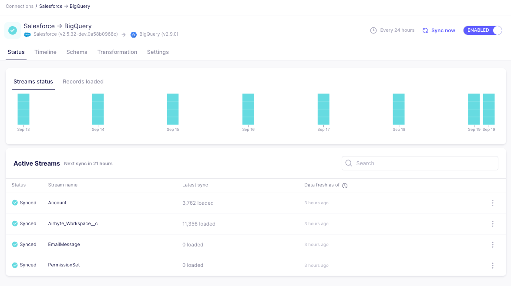

# Airbyte 1.0

## airbyte v1.0.0

This page includes new features and improvements to the Airbyte products we're excited to share as a part of the 1.0 release. Airbyte v1.0 contains many improvements and additions to enhance the reliability, scalability, and uses of Airbyte.

Moving forward, Airbyte will release official new platform versions on a monthly cadence, with the associated [changelog](https://github.com/airbytehq/airbyte/releases).

## Ease of deployment

- [`abctl`](https://github.com/airbytehq/abctl/releases) is the easiest, quickest way to get started with Airbyte Self-managed. See our [quickstart docs](../../using-airbyte/getting-started/oss-quickstart) for more details. 

- [Native authentication](../../deploying-airbyte/integrations/authentication) by email and password is available so that any instance of Airbyte is secure by default. 

## Proven Reliability

- [Automatic detection of dropped records](https://airbyte.com/blog/automatic-detection-of-dropped-records) ensures data is passed without fail through the Airbyte platform. 

- Enhanced our [notification suite](https://airbyte.com/blog/airbyte-notifications-and-webhooks-effortless-etl-jobs-monitoring) to enable webhook integrations and added more contextual information about sync failures or schema changes.

- Connections now offer rate limited messaging, improved error handling, and live monitoring of ongoing syncs.

- Many sources, in particular S3, have become faster. With CDK 2.0, the protocol now uses Pydantic V2 and removes the serialization of each record. We also improved Databricks and S3 destinations to enable faster sync speeds, checkpointing, and modernization to our Destinations V2 framework.

## Resiliency at Scale

- [Refreshes](../../operator-guides/refreshes) bring an improved experience to resyncing all of your data again. This enables data to never be deleted from final tables during a historical resyncing of data. 

- [Resumable Full Refresh](https://airbyte.com/blog/resumable-full-refresh-building-resilient-systems-for-syncing-data) allows for large streams syncing in Full Refresh to sync without failures.

- Our database sources added [resumability](../../operator-guides/refreshes#resumability) to reduce failures and stay resilient when incoming data is inconsistent. We gracefully handle record-level error in the destination field `_airbyte_meta.errrors` for large records or mistyped data. Read more in our [typing & deduping documentation](../../using-airbyte/core-concepts/typing-deduping#_airbyte_meta-errors).

- [Large initial CDC syncs](https://airbyte.com/blog/supporting-very-large-cdc-syncs-with-wass) are gracefully handled by consuming WAL and acknowledges logs periodically to ensure disk space is freed in a timely manner.

- [Workloads](../../understanding-airbyte/jobs#workloads) provide a more scalable and reliable architecture to run sync jobs by separating scheduling and orchestration from data movement tasks. This [improvement](https://airbyte.com/blog/introducing-workloads-how-airbyte-1-0-orchestrates-data-movement-jobs) unlocks more automated management of workloads by managing job spikes and enables horizontal scaling (for Cloud and Enterprise users).

## Tackling the long-tail of connectors
- We launched our connector Marketplace for our community-maintained connectors. [Automated testing](https://airbyte.com/blog/how-we-test-airbyte-and-marketplace-connectors) ensures our connectors stay high quality, and most connectors have been migrated to low/no-code. 

- The [Connector Builder](https://airbyte.com/blog/maintaining-hundreds-of-api-connectors-with-the-low-code-cdk-and-connector-builder) seamlessly switches between UI and YAML modes, supports custom components, and contains extensive testing and error handling.

- AI Assist now builds connectors from scratch for you with just a link to the API docs. 

- Anyone can now contribute new connectors directly from the builder to add a new connector directly to Airbyte's Marketplace. Additionally, connectors can be forked directly from the UI for faster edits, ensuring our connectors stay up-to-date.

- Airbyte supports writing to several vector store destinations, including pgVector, Pinecone, and Snowflake Cortex.

## Self-Managed Enterprise

Self-Managed Enterprise extends on Airbyte 1.0 by introducing new classes of functionality: multitenancy and access management, enterprise source connectors , sensitive data masking and enterprise support – all while data never leaves your infrastructure.

- Support for Okta and OpenID Connect (OIDC) SSO
- Availability of [Role-based Access Control](../../access-management/rbac) and multitenancy
- Columns can now be hashed to protect sensitive data

## Announcements

- To ensure adherence to security best practices, Airbyte is migrating all connectors to [non-root versions](https://github.com/airbytehq/airbyte/discussions/44924). It is highly recommended that you upgrade your platform version to [v0.63.9](https://github.com/airbytehq/airbyte-platform/releases/tag/v0.63.9) or later before October 2024 to ensure your syncs continue to succeed. 

- As we prepare to deprecate Docker Compose, we published a [migration guide](../../using-airbyte/getting-started/oss-quickstart#migrating-from-docker-compose-optional) for those migrating from Docker Compose to abctl.