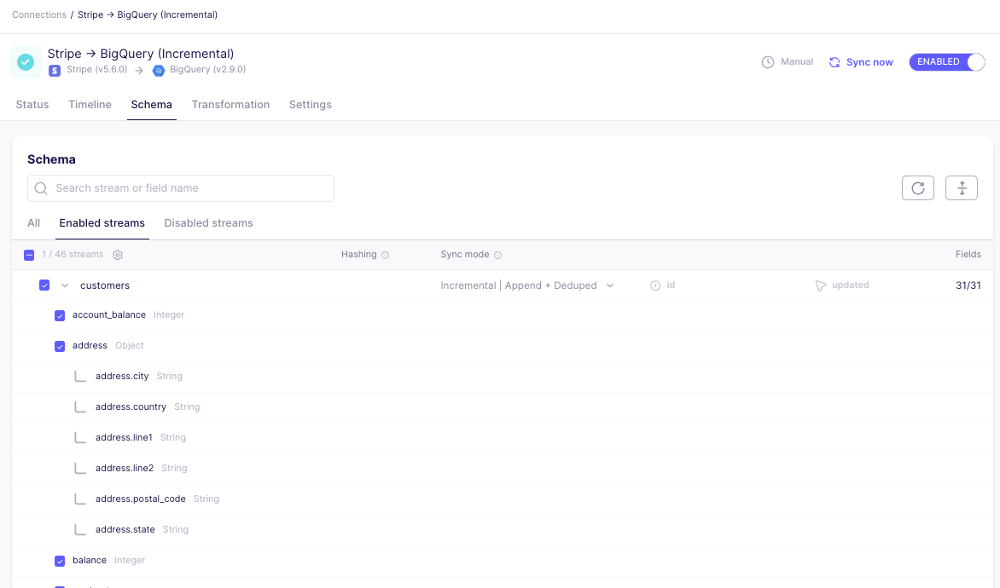

# Airbyte 1.1.0

The 1.1.0 release includes the following enhancements and bug fixes.

## 🚀 Features

## Platform Releases
- Adds field hashing for Self-Managed Enterprise
- Adds the [Connection Timeline](../../cloud/managing-airbyte-cloud/review-connection-timeline), replacing the Job History for a connection. For assistance with the migration of existing jobs to the new timeline events, follow our [guide](https://github.com/airbytehq/airbyte/discussions/46319). 

- Redesigned the schema tab to improve the selection & deselection of streams and fields. Sync modes, cursor fields, and primary keys are also selected here.

- Custom Docker-based connectors can now be renamed and deleted 

## Support Experience
- Diagnostics can be downloaded through the Organization Settings page, which will export a JSON file to facilitate sharing with Support. This JSON file includes relevant infrastructure and connection information.  (Self-Managed Enterprise only) 

## Billing & Licenses
- Self-Managed Enterprise users can now view directly in the UI when the license is expiring.

## Changelog
See the [Full Changelog](https://github.com/airbytehq/airbyte/releases)