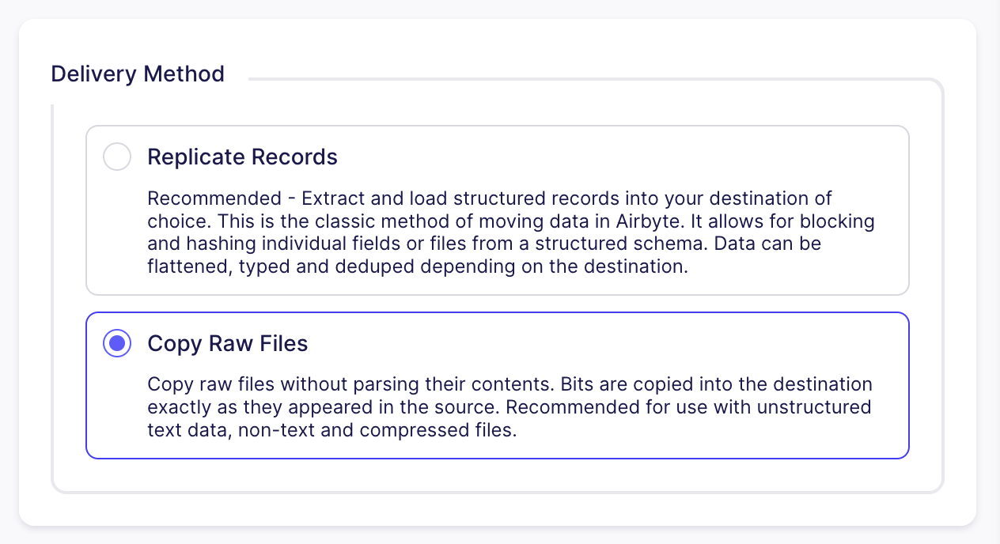
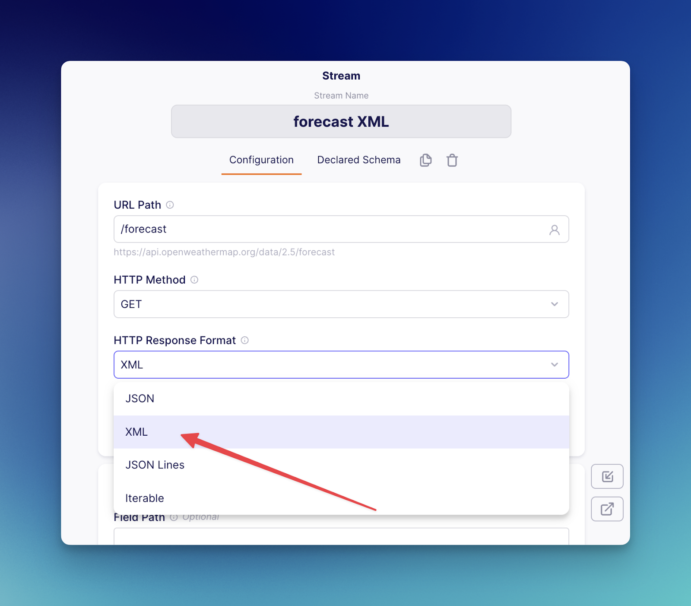
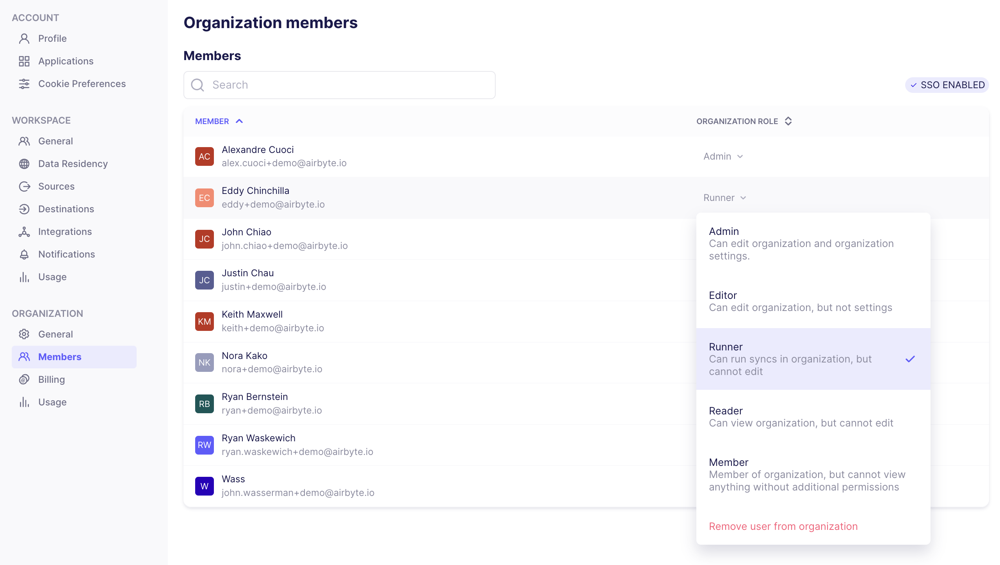

# Airbyte 1.2

Happy Halloween! We are excited to release the following set of improvements and changes.

## 🚀 Platform Changes

- **File Transfers**: Airbyte now supports transfering unstructured text data, non-text data and compressed files. This capability is in early access, and currently only available for moving data from the "SFTP Bulk" source to the "S3" destination. Support in the "S3" source is coming soon. File transfers allow you to copy raw files in Airbyte without parsing their contents. Bits are copied into the destination exactly as they appeared in the source. This is recommended for use with unstructured text data, non-text and compressed files. This is an entirely new way of moving data through Airbyte, as all pre-existing data movement methods involved parsing individual records.



- **Custom Image Registry Support**: Introduces support for specifying a custom Docker registry from which all platform images are pulled. This should simplify helm chart configurations for users who require images to be pulled from internally approved image repositories. Configuring the following will prefix all docker images with `my-registry.foo.com`. The value provided in the `registry` field must have a trailing slash:

```yaml
global:
  image:
    registry: my-registry.foo.com/
```

- **XML Support in the Connector Builder**: Airbyte now supports custom API connectors built via the Airbyte Connector Builder which return responses as XML format. 



## 🚀 Self-Managed Enterprise Changes

- **Runner RBAC Role**: Users provisioned with the 'Runner' role are able to start or stop syncs,  and run backfills for individual connections (in the workspaces where they've been granted Runner permissions). Outside of these explicit tasks, users with the 'Runner' role have an entirely read-only experience (Self-Managed Enterprise only).



- **Self-Managed Diagnostics**: Diagnostics have been expanded to include deployment statistics. Diagnostics can be downloaded through the Organization Settings page. This exports a .zip file which can be easily shared with Airbyte Support (Self-Managed Enterprise only).
- **Removing SSO Users**: You may now remove SSO users from your Airbyte Organization. This removes them from the list of Organization Members.
