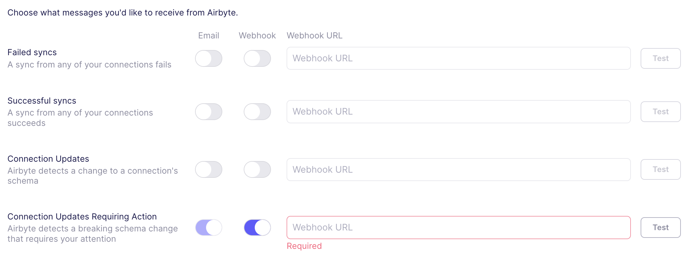

# Airbyte 1.3.0

It's already December! We are excited to release the following set of improvements and changes.

## 🚀 Platform Changes

- **Improved Log Viewer and Filtering**: You can now quickly filter to error or warning logs when needed, as well as by log source - such as the source connector, destination connector, or platform. Together, this allows you to quickly diagnose issues with Airbyte connections if they arise, reducing time to resolution on issues.


- **OpenShift Support**: Starting today, Airbyte now supports deployments to OpenShift. This is the culmination of a journey over much of the past year: we've updated our platform and connectors to be rootless, we've improved pod to pod communication within our platform, and made a wide number of security improvements. 

- **Improved Notifications for Schema Changes**: Airbyte has extended webhook  support to include notifications for breaking schema changes requiring your attention. 



## 🚀 Self-Managed Enterprise Changes

- **Compliance Mappers in Airbyte API**: Airbyte now supports field hashing, field encryption (with self-managed encryption keys), field renaming and row filtering for connections from a common interface available in the Airbyte API. This functionality is coming soon to the Airbyte UI. 

Example Encryption Mapper:
```yaml

```
