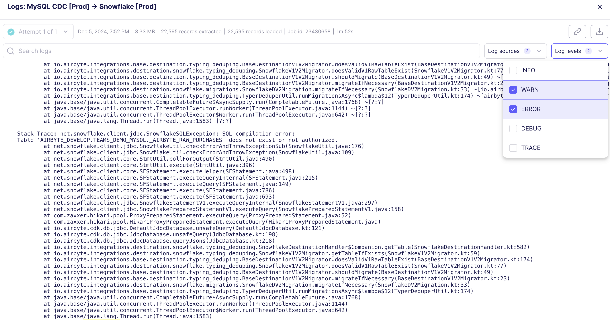
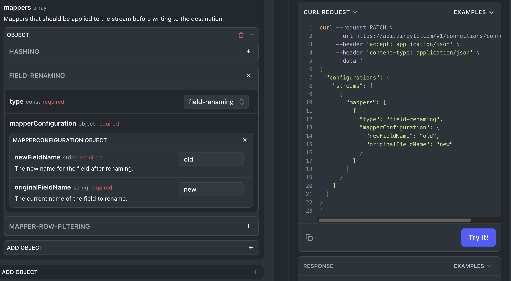

# Airbyte 1.3.0

It's already December! We are excited to release the following set of improvements and changes.

## 🚀 Platform Changes

- **Improved Log Viewer and Filtering**: You can now quickly filter to error or warning logs when needed, as well as by log source - such as the source connector, destination connector, or platform. Together, this allows you to quickly diagnose issues with Airbyte connections if they arise, reducing time to resolution on issues.



- **OpenShift Support**: Starting today, Airbyte supports deployments to OpenShift. This is the culmination of a journey over much of the past year: we've updated our platform and connectors to be rootless, we've improved pod to pod communication within our platform, and made a wide number of security improvements. To succeed, the user running helm deployment commands needs to be a `cluster-admin` user. Your Kubernetes namespace will also require the following annotations to ensure that all of the Airbyte resources run as UID 1000 and GID 1000. If you run into any edge cases or issues deploying to OpenShift, as always, please let us know by opening a GitHub issue.

```yaml
openshift.io/sa.scc.supplemental-groups: 1000/1
openshift.io/sa.scc.uid-range: 1000/1
```

## 🚀 Self-Managed Enterprise Changes

- **Compliance Mappers in Airbyte API**: Airbyte Self-Managed Enterprise now supports field hashing, field encryption (with self-managed encryption keys), field renaming and row filtering for connections from a common interface available in the Airbyte API. This functionality is coming soon to the Airbyte UI. To get started, see our [API documentation](https://reference.airbyte.com/reference/patchconnection).


