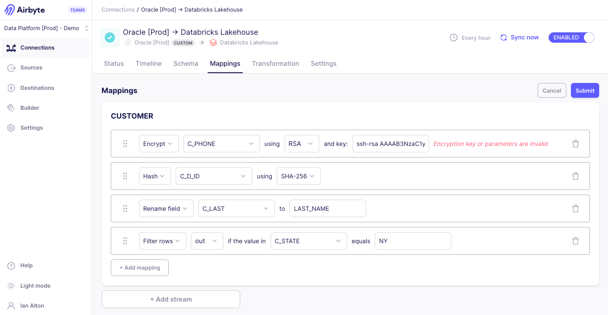

# Airbyte 1.5.0

Punxsutawney Phil `[did/didn't]` see his shadow. `[Spring is coming!/Looks like winter's here to stay]`, but the latest Airbyte release is `[even more/something]` to look forward to. Airbyte 1.5.0 was released on Febraury 6, 2025. We’re excited to share new improvements and changes to the Airbyte platform.

## 🚀 Self-Managed Enterprise Changes

These changes bring new capabilities to Airbyte's Self-Managed Enterprise customers.

### Mappings in the UI

We introduced mappings into the API in version 1.3, and it's now available in Airbyte's user interface, too.

It’s often the case that you want to move data from a source to a destination in a non-literal way, obscuring sensitive information and improving the consistency and usability of that data in its final destination. Mapping allows you to match a field from your source to your destination and sync data in a way that is still accurate, but also more meaningful and appropriate for your needs. Use mappings to hash, encrypt, and rename fields, and filter rows. You set up mappings on each stream, ensuring your source data arrives in your destination exactly as you want it. [Learn more >](../using-airbyte/mappings)

## 🚀 Platform Changes

These changes improve Airbyte for all Self-Managed users.

### OAuth 2.0 in the connector builder

If you're building a connector to an API and want to authenticate with OAuth, you can now authenticate directly in the Connector Builder. You no longer need to write code to authenticate yourself and then provide Airbyte with your tokens. This simplified flow ensures you can start building connectors to APIs that support OAuth immediately and without technical hurdles. For more complex needs, OAuth 2.0 is also supported in the low-code connector development kit (CDK). 

To learn more, see the authentication documentation: [Connector Builder](#) | [Low-code CDK](#).

### New API capabilities

### Changes to public metrics?

## 🔒 Security improvements

### Customizable service accounts

## 🐛 Bug fixes
