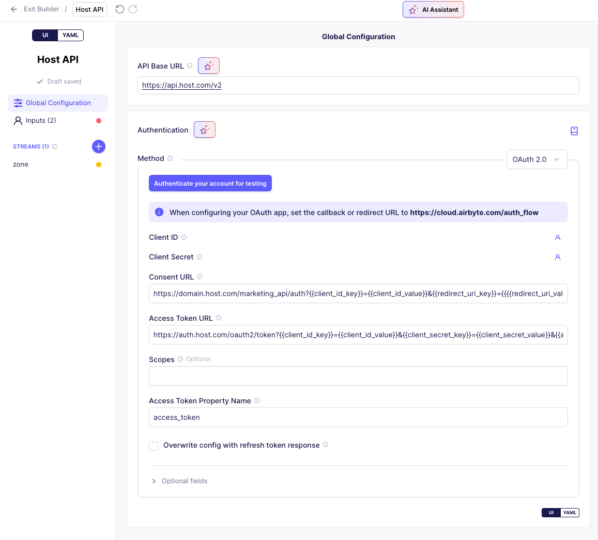
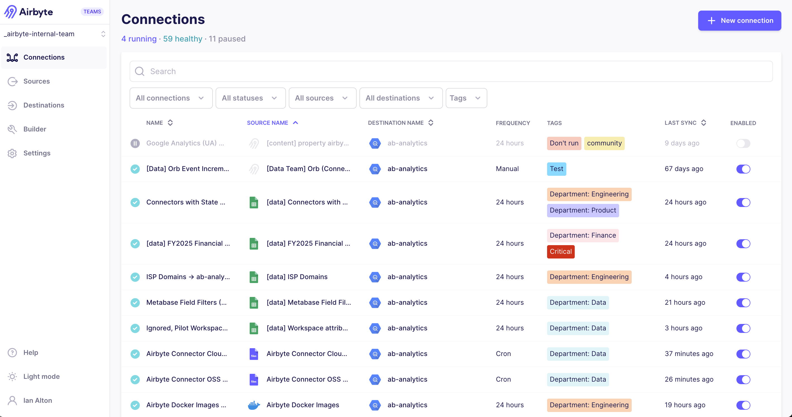
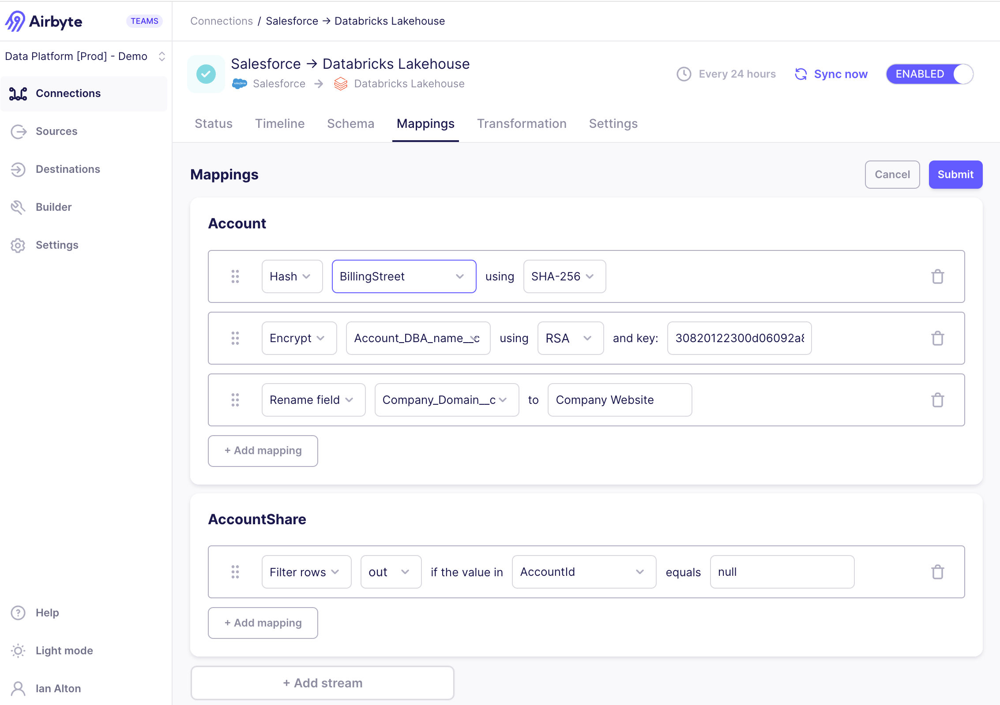
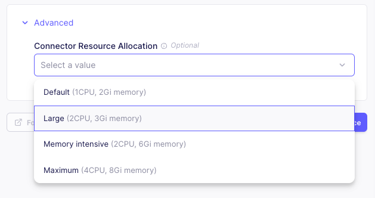

# Airbyte 1.5.0

Valentine's Day let you down? That's OK. You'll love this. Airbyte 1.5.0 was released on February 20, 2025. We’re excited to share new improvements and changes to the Airbyte platform.

## 🚀 Platform Changes

These changes improve Airbyte for all Self-Managed users.

### Declarative OAuth 2.0 in the connector builder

If you're building a connector to an API and want to authenticate with OAuth, you can now authenticate directly in the Connector Builder. This simplified flow ensures you can start building connectors to APIs that support OAuth without writing code to authenticate yourself and provide Airbyte with tokens. OAuth 2.0 is also supported in the low-code connector development kit (CDK), where you can define your authentication using YAML.

To learn more, see the authentication documentation: [No-code Connector Builder](../connector-development/connector-builder-ui/authentication#oauth) | [Low-code CDK](../connector-development/config-based/advanced-topics/oauth).



### Connection tags

You can now classify your connections with tags. As time goes on, your number of connections tends to increase. This popular classification tool gives you the power to organize connections based on any set of criteria you like, then filter for the ones you want to see. [**Learn more >**](../using-airbyte/tagging)



### Configure workspace notifications in the API

Use the Airbyte API to view and change email and webhook notification settings in your workspace. Previously, this was only available in Airbyte's user interface.

- [List workspaces](https://reference.airbyte.com/reference/listworkspaces) returns a notifications object with details about each workspace's notification settings.
- [Get workspace details](https://reference.airbyte.com/reference/getworkspace) returns a notifications object with details about that workspace's notification settings.
- [Create a workspace](https://reference.airbyte.com/reference/createworkspace) has a notifications object parameter so you can configure notifications when you create the workspace.
- [Update a workspace](https://reference.airbyte.com/reference/updateworkspace) has a notifications object parameter so you can configure notifications later.

Use notifications if you want to be alerted to important events in Airbyte, like failed syncs, schema changes, and mandatory connector upgrades. [**Learn more about notifications >**](../cloud/managing-airbyte-cloud/manage-airbyte-cloud-notifications)

### Full Refresh - Overwrite + Deduped in the API

Use the API to set "Full Refresh - Overwrite + Deduped" as your [sync mode](../using-airbyte/core-concepts/sync-modes/) when [creating](https://reference.airbyte.com/reference/createconnection) and [updating](https://reference.airbyte.com/reference/patchconnection) a connection. Previously, this sync mode was only available in Airbyte's user interface.

## 🚀 Self-Managed Enterprise Changes

These changes bring new capabilities to Airbyte's Self-Managed Enterprise customers.

### Mappings in the UI

We introduced mappings in the API in version 1.3, and it's now available in Airbyte's user interface, too. Use mappings to hash, encrypt, and rename fields, and filter rows. You set up mappings on each stream, ensuring your source data arrives in your destination in a more meaningful way. [**Learn more >**](../using-airbyte/mappings)



### OpenTelemetry (OTel) metrics monitoring

Self-Managed Enterprise now generates a number of crucial metrics about syncs and volumes of data moved. You can configure Airbyte to send telemetry data to an OTel collector endpoint so you can consume these metrics in your downstream monitoring tool of choice. The following metrics are available:

- Sync details
- Sync duration
- Volume of data moved
- API requests

To start sending metrics, update your `values.yaml` file with the following configurations. [**Learn more >**](../operator-guides/collecting-metrics)

```yaml title="values.yaml"
global:
    edition: enterprise # This is an enterprise-only feature
    metrics:
        enabled: true
        otlp:
            enabled: true
            collectorEndpoint: "YOUR_ENDPOINT" # The OTel collector endpoint Airbyte sends metrics to. You configure this endpoint outside of Airbyte as part of your OTel deployment.
```

### Resource allocation on connectors

In Self-Managed Enterprise, you can now define resource allocations for individual connectors as part of that connector's configuration, both in the user interface and the API. 

Airbyte's default CPU and memory allocations aren't always appropriate for every situation, and different connectors have different resource requirements. This can make it challenging to run a large number of concurrent syncs. Historically, you had to tweak a number of variables to configure this. Now, you can set CPU and memory allocation when you set up a source or destination, and it applies to all connections using that connector. [**Learn more >**](../operator-guides/configuring-connector-resources)



:::note
Resource allocation can still be set on specific connections, on all connectors of a type using `resourceRequirements`, and using environment variables. In cases where resource allocation is defined multiple times, there is an order of precedence. Narrower definitions have higher precedence. From highest to lowest: **Connection** > **Connector** > **Connector yaml definition** > **environment variables**. See [the documentation](../operator-guides/configuring-connector-resources) to learn more about precedence.
:::

## 🐛 Bug fixes

- [Fixed issue #46097](https://github.com/airbytehq/airbyte/issues/46097). When using AWS Secrets Manager, updating a connector that used secrets caused its secrets to be deleted. For connectors with secrets that were deleted because of the bug, upgrade to 1.5 and then update your connector's secrets. They will persist correctly. For sources/destinations that were not affected, upgrading to 1.5 prevents the issue.

## Other Changes

Docusaurus is upgraded to version 3.7. Local docs site builds are a bit faster.
