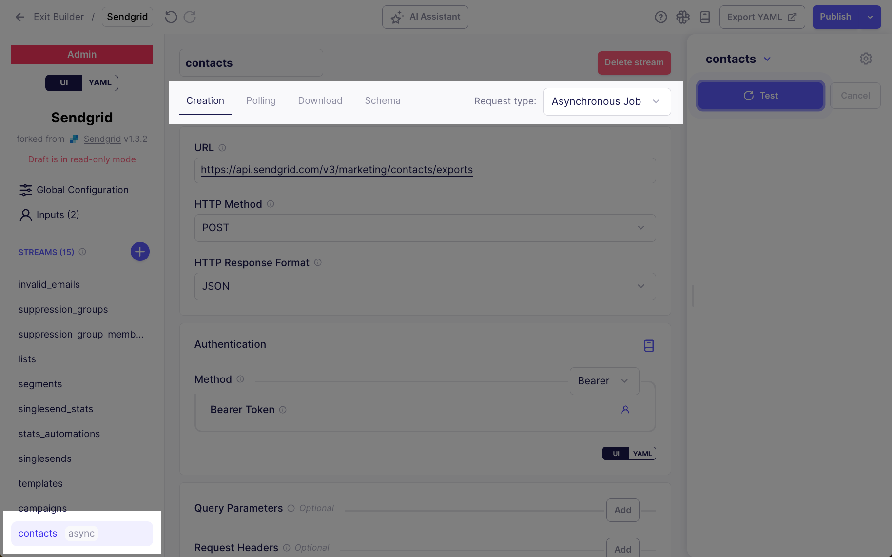

# Airbyte 1.6

The Easter Bunny reports a shortage of eggs this year, but there are plenty of new features in Airbyte. We're cracking 🐣 open a new version just for you. Airbyte 1.6 was released on April 8, 2025. We're excited to share new improvements and changes to the Airbyte platform.

## 🚀 Platform changes

These changes improve Airbyte for everyone.

### Connection page dashboard

Connection pages now include a dashboard that visualizes sync successes and failures. This high-level view gives you quick insight into the health of your syncs over hours, days, and weeks. Track down intermittent failures, even after a connection becomes healthy again. With one click, you can get more information about a point in time, and fast access to any problematic sync in your workspace. [**Learn more >**](../cloud/managing-airbyte-cloud/review-connection-status)

<Arcade id="u3EEEqQoPRA4aoAAFFLO" title="Use the Connection Dashboard to diagnose unhealthy syncs" paddingBottom="calc(60% + 0px)" />

### Schema configuration updates in the connection Timeline

When someone makes a change to a connection's schema, Airbyte now logs an event in the connection's Timeline page. This data can help you understand why sync behaviors or record volumes suddenly changed. [**Learn more >**](../cloud/managing-airbyte-cloud/review-connection-timeline)


### Copy JSON from connectors

All connectors now have a **Copy JSON** button in the Airbyte UI. This button generates a JSON object matching the configuration of that connector. It's ready for use in Airbyte's API and Terraform provider. [**Learn more >**](../terraform-documentation#weakly-typed-json-configurations)

```json title="Airbyte source connector example"
{
  "name": "Airbyte",
  "workspaceId": "c0e5b294-2c71-475b-ae9c-6d70b36ff4f4",
  "definitionId": "284f6466-3004-4d83-a9b2-e4b36cbbbd41",
  "configuration": {
    "client_id": "******", // Replace this with your real client ID.
    "start_date": "2024-01-01T00:00:00Z",
    "client_secret": "******" // Replace this with your real client secret.
  }
}
```

### Connector Builder improvements

Airbyte's Connector Builder has new features to target more advanced and complex API sources: asynchronous endpoints, non-REST APIs, new response formats, and more.

#### Asynchronous streams

The Connector Builder UI now supports asynchronous streams, allowing you to handle scenarios where data extraction happens over multiple steps. Some APIs that handle large datasets or perform resource-intensive operations do not support synchronous requests. By setting up a stream as asynchronous, you can separate creating a request, polling for a response, and downloading the response into distinct steps. [**Learn more >**](../connector-development/connector-builder-ui/async-streams)



#### GraphQL request body

You can write request bodies as free form GraphQL queries with built-in syntax validation.


#### Handle CSV, gzip, and ZIP response formats

Airbyte has two new ways to handle API responses in the Connector Builder.

- **CSV decoding**: Make requests to sources that respond in CSV format and set expected delimiter and encoding options.

- **Nested decoding**. Make requests to sources that respond with compressed `gzip` or `zip` files, then set a nested decoding option to handle the unzipped contents within.

[**Learn More >**](../connector-development/connector-builder-ui/record-processing/#response-decoding)


### Create custom connectors from YAML or Docker images

You can now create and update custom connectors using a Connector Builder YAML manifest or Docker image. The following endpoints are available. 

For YAML source definitions:

- `GET/POST` - /workspaces/`{workspaceId}`/definitions/declarative_sources - List/Create YAML source definitions
- `GET/PUT/DELETE` - /workspaces/`{workspaceId}`/definitions/declarative_sources/`{definitionId}` - Get/Update/Delete a specific YAML source definition

For source definitions:

- `GET/POST` - /workspaces/`{workspaceId}`/definitions/sources - List/Create source definitions
- `GET/PUT/DELETE` - /workspaces/`{workspaceId}`/definitions/sources/`{definitionId}` - Get/Update/Delete a specific source definition

For destination definitions:

- `GET/POST` /workspaces/`{workspaceId}`/definitions/destinations - List/Create destination definitions
- `GET/PUT/DELETE` /workspaces/`{workspaceId}`/definitions/destinations/``{definitionId}`` - Get/Update/Delete a specific destination definition

You can't use these endpoints to modify Airbyte's public connector definitions. If you're using the Cloud version of Airbyte, you can only create or modify custom connectors using a YAML manifest.

[**API reference docs >**](https://reference.airbyte.com/reference/getting-started#/)

## 🚀 Self-Managed Enterprise changes

These changes bring new capabilities to Airbyte's Self-Managed Enterprise customers.

:::danger Breaking Change
Before upgrading from version 1.5.1 or earlier to version 1.6 or later, you must upgrade your service account permissions. If you don't, Airbyte doesn't permit you to begin the upgrade. [Learn more](../enterprise-setup/upgrade-service-account.md).
:::

### Multi-region Airbyte deployments

Data residency is here! Self-Managed Enterprise customers can now use the public API to define regions and create self-registering data planes to operate in those regions. You tie each Airbyte workspace to one region, ensuring your workspaces move data in the region of your choice. You can use the API or the Organization Settings in Airbyte's UI to identify the region associated with each of your workspaces, ensuring you're satisfying your data residency and governance requirements. <!--[**Learn more >**](#)--> 

## Unique stream prefixes or namespaces are now mandatory

Airbyte now requires that stream identifiers be unique across Airbyte connections that share a destination. You can no longer set multiple connections to sync to the same destination stream.

A common scenario looks like this: you have multiple source accounts and want to sync all this data to a single table in your destination. Although convenient, doing this carried a risk of data loss as multiple connections clashed with each other while writing to the same table.

After careful consideration, Airbyte has stopped supporting this. You must use a unique prefix for each stream or use unique namespaces in each connection. Then, you can combine your tables downstream of Airbyte. [Learn more >](../using-airbyte/configuring-schema#stream-uniqueness)

## Full changelog

<details>
  <summary>Full changelog</summary>

This is the full list of changes this version. Some changes improve internal tools or are milestones toward future releases, so not every change results in a noticeable change to Airbyte.

[1] - The Connections Graph feature is now available in the Open Source edition, allowing you to visualize the relationships between your sources and destinations for better data flow management.

[2] - Added support for secret references in jobs, enabling more secure credential management by referencing secrets stored in your environment rather than embedding them directly in configurations.

[3] - Introduced Config Templates with new endpoints to create, update, list, and get configuration templates, making it easier to standardize and reuse connection configurations across your organization.

[4] - Enhanced the platform with AI-powered sync job failure explanations in the UI, helping you troubleshoot failed syncs more efficiently with clear, actionable insights.

[5] - Added the ability to extract information for embedded iframes from query parameters, improving the integration capabilities of Airbyte within other applications.

[6] - Introduced an initial version of the Data Plane chart for Helm, providing better deployment options for Kubernetes users with improved scalability and resource management.

[7] - Added data plane authentication configurations to enhance security between control and data planes in distributed deployments.

[8] - Added Google Service Account annotations to Kubernetes service accounts, enabling better integration with Google Cloud Platform services.

[9] - Implemented Cloud SQL Proxy support for improved database connection security and performance in cloud environments.

[10] - Fixed an issue with the privatelink setup hash generation to ensure consistent and reliable private network connections.

[11] - Improved error handling for connection issues by properly propagating detailed error information, making troubleshooting more straightforward.

[12] - Enhanced the bootloader to fail early with detailed error messages when secret creation fails, preventing silent failures during deployment.

[13] - Fixed a bug that prevented disabling the connector builder without breaking the webapp, ensuring smoother operation when this feature is not needed.

[14] - Improved handling of secrets for partial user configurations, ensuring secure and proper management of sensitive information.

[15] - Updated the license display to provide clearer information about the software licensing terms.

[16] - Prettified connector builder contribution PR templates to improve the developer experience when contributing new connectors.

[17] - Increased monitor duration from 5 to 15 minutes, providing more time for complex operations to complete successfully.

[18] - Removed the Gradle `--no-daemon` flag to improve build performance for developers working with the codebase.

[19] - Fixed a bug in the end-to-end source testing framework, ensuring more reliable connector testing.

[20] - Improved notification configuration with correct defaults, ensuring users receive appropriate notifications about their data syncs.

</details>
